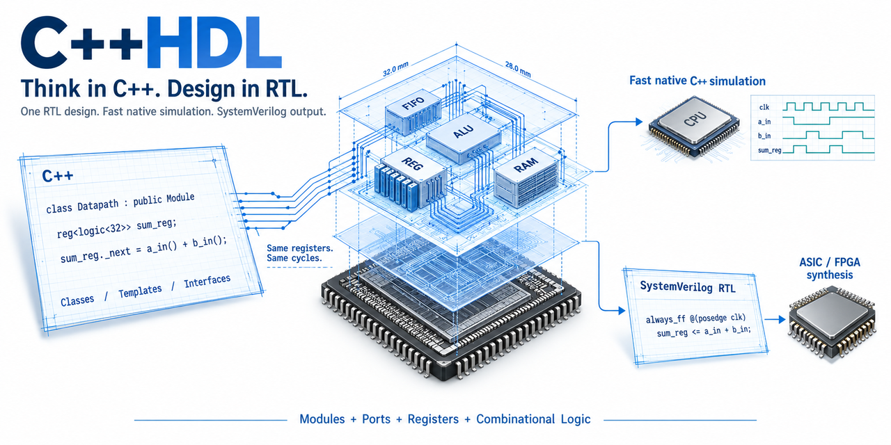
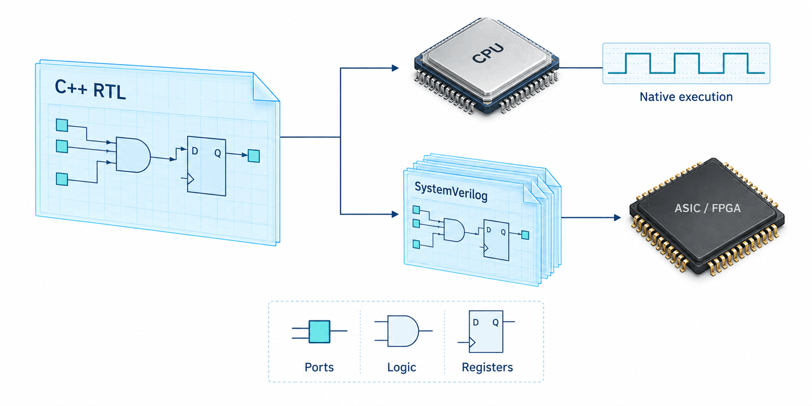
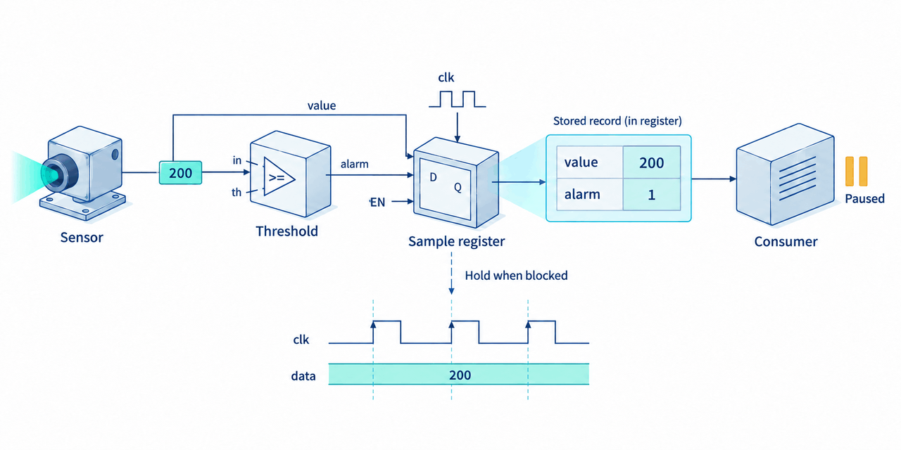
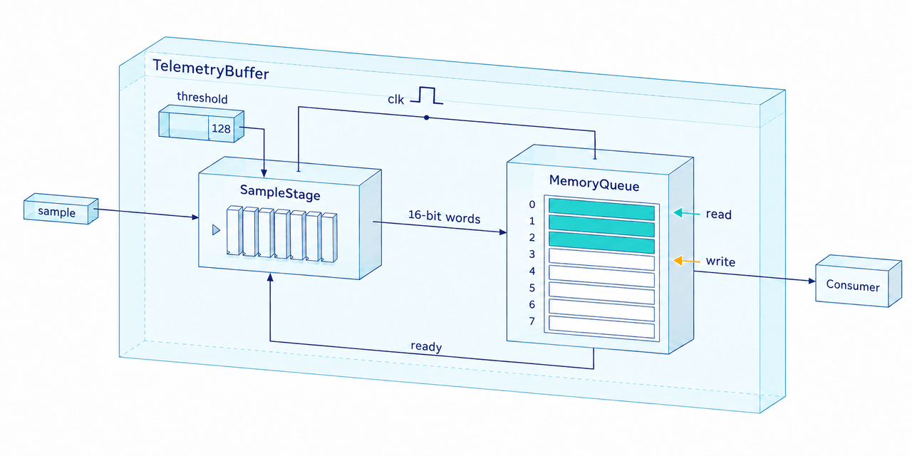
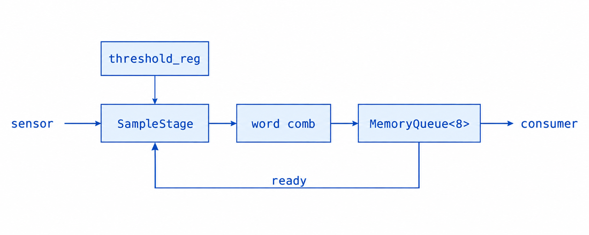
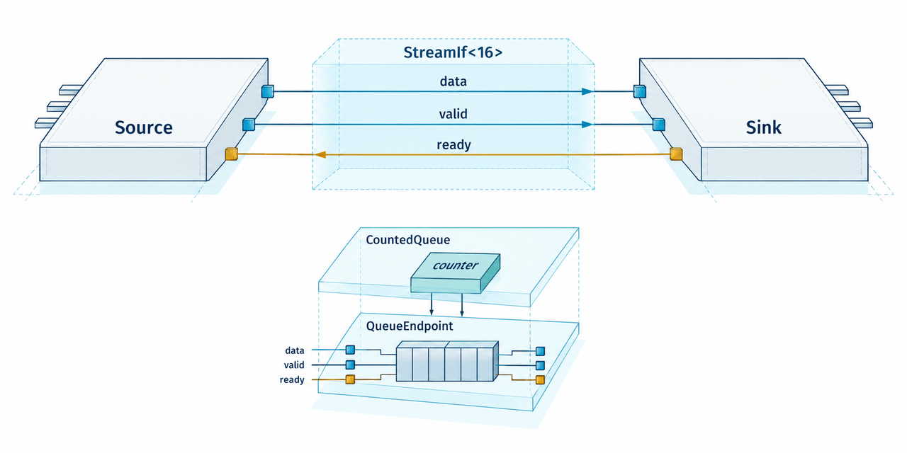
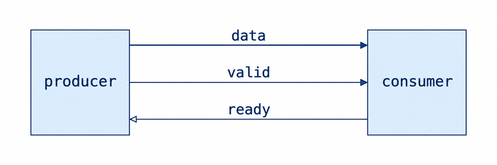
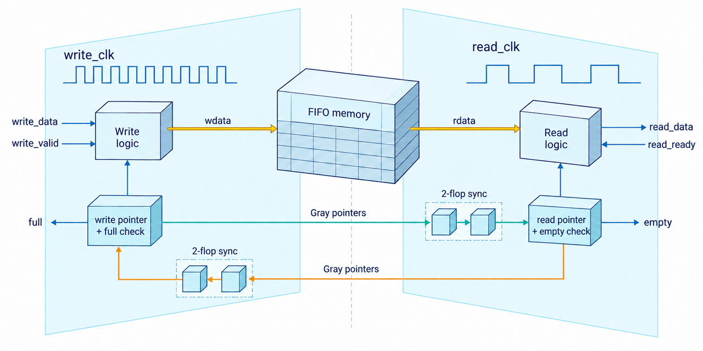
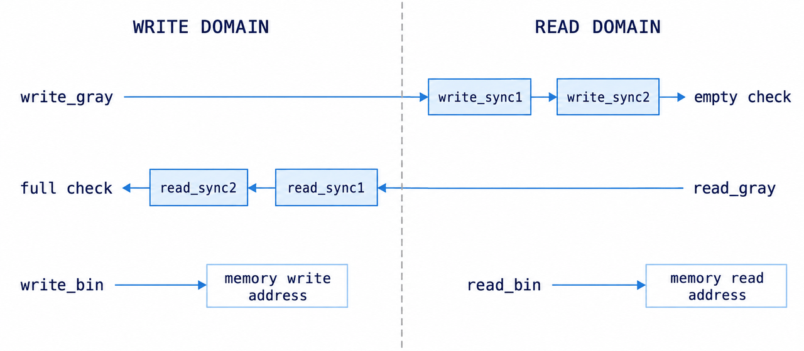
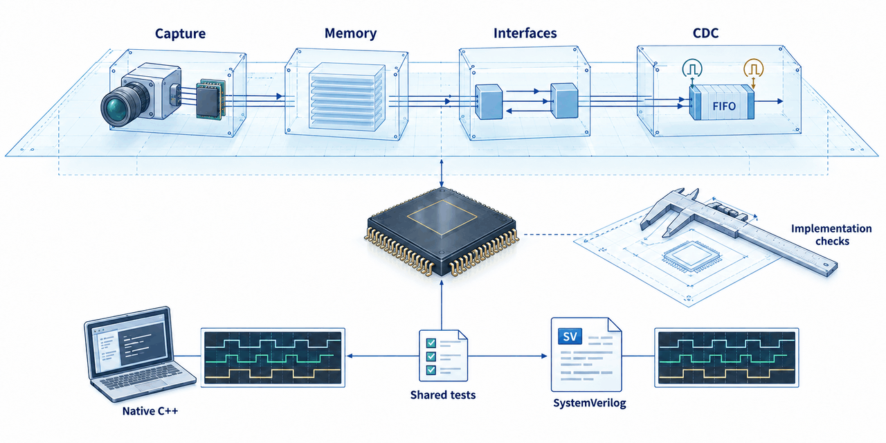

\vfill
\begin{center}
(Not HLS, but a C++ reflection of the SystemVerilog model)
\end{center}

\clearpage



# 1. Introduction

## 1.1 The design we are going to build

A sensor produces one-byte measurements. Its consumer sometimes pauses.
We first use one clock for both, then implement a queue with separate write
and read clocks.

We will implement this familiar RTL task in C++, then run the same description
as a native executable and convert it to SystemVerilog. The four steps introduce
the CppHDL constructs needed for each implementation:

```text
Chapter 2: sensor -> threshold/capture stage -> consumer
Chapter 3: sensor -> capture stage -> memory queue -> consumer
Chapter 4: sensor -> source endpoint <-> queue endpoint <-> consumer endpoint
Chapter 5: write-clock endpoint -> asynchronous memory FIFO -> read-clock endpoint
```

Chapter 5 develops and tests a queue whose input and output use different clocks.
We test this queue separately, then explain how to connect it to the earlier
modules. We do not build a complete two-clock version of the earlier design.

CppHDL describes RTL in C++. A class represents a module, a member object can
represent a child module, a function can represent combinational logic, and a
`reg<T>` object stores a value that changes at a clock edge. The converter
emits SystemVerilog.
The same hardware description can also execute as a native C++ model.

The hardware concepts remain those of SystemVerilog RTL. What changes is how
we express them and execute the model: sequential C++ calls must preserve
concurrent hardware behavior. Much of this book explains that mapping.

This is **not high-level synthesis**. A C++ loop does not automatically become a
multi-cycle accelerator, a method call does not consume a clock, and an ordinary
variable does not become a pipeline register just because it appears inside a
class. We explicitly choose where to place registers and which calculations
happen between clock edges.

## 1.2 Seven reasons to use C++ for RTL

1. **Run the RTL directly as C++.** Compile the design with its testbench and
   use a C++ debugger, sanitizer, or profiler without an intermediate RTL
   conversion. Native execution is still simulation; measure its speed on your
   design rather than assuming a universal speedup.

2. **Generate RTL from C++ type parameters.** `Block<TYPE>` can use the selected
   type's fields, constants, and supported methods; CppHDL generates the corresponding RTL.
   The benefit is using C++ templates and specialization in the executable
   design, not merely parameterizing a width.

3. **Use the C++ ecosystem for verification and analysis.** Link the model into
   existing C++ test systems. Use C++ containers in the testbench to store and
   retrieve debug information as the simulation runs, and check it on each
   call that simulates an edge. Tools that inspect C++ can also analyze the
   design's classes and connections, check project coding rules, or draw diagrams.

4. **Give coding assistants a direct compile-and-test loop.** They can modify
   C++ RTL and run focused native tests without first generating SystemVerilog.
   This can shorten iteration; it does not remove the need for independent review.

5. **Share the implementation with software firmware.** Firmware and system-model
   teams can embed the C++ RTL directly instead of maintaining another
   handwritten peripheral model that may behave differently.

6. **Build large, complex multithreaded or cluster-based RTL simulations.**
   Use C++ threading and communication libraries to distribute model instances
   or independent test runs across CPU/GPU cores and machines. For connected models,
   the simulation framework must coordinate data exchange and simulation time.

7. **Prototype behavior first, then refine it into RTL.** Start with a
   non-synthesizable C++ sketch: use function calls as connections and pass
   objects, complete transactions, or memory buffers, as in transaction-level
   modeling (TLM). Simulate the system's behavior before defining individual
   wires and registers. Then replace the behavioral operations step by step
   with clocked, register-to-register logic, keeping the sketch as a reference
   for tests. This refinement is a design task, not automatic RTL conversion.

These are benefits of the C++ workflow, not claims that structs, interfaces,
parameterization, or verification are new to RTL. Conversion supports a subset
of C++. At the end of development, the generated SystemVerilog still needs
acceptance verification in a timing/event-driven simulator and synthesis
testing with the target synthesis tools.

## 1.3 The six-chapter plan

We will build and test a sample stage, add a memory queue, connect the modules
through interfaces, and finally implement a two-clock FIFO. Each chapter
introduces the CppHDL constructs needed for the next step.

| Chapter | Example | CppHDL focus | Check |
| --- | --- | --- | --- |
| 1. Introduction | The development workflow | Native execution and conversion | Build prerequisites |
| 2. Capture a sample | A one-slot register stage | Ports, comb methods, work/strobe, and native VCD | Capture, hold, and drain |
| 3. Absorb a burst | A stage feeding a memory queue | `memory<>`, deferred writes, and calls to child modules | Ordering under backpressure |
| 4. Connect reusable modules | Interface endpoints and a counter | Direction conventions, `assignIf`, and RTL class inheritance | Reuse the test with another C++ top-level type |
| 5. Cross clocks | A memory-backed asynchronous FIFO | Named clock and reset methods, and a shared C++/RTL test | Ordering, reset, and coincident edges |
| 6. Conclusion | Review the examples | What native C++ execution changes | Remaining RTL checks |

### Five revisions of that plan

The plan was revised to: (1) keep one realistic task, (2) state each example's
transfer rules before its code, (3) demonstrate native execution immediately,
(4) introduce child modules before interface inheritance, and (5) reuse checks
across implementations.

## 1.4 Prerequisites and notation

This book assumes basic SystemVerilog RTL knowledge and familiarity with C++
classes, functions, and references. Explanations focus on CppHDL's syntax and
execution rules; no previous CppHDL experience is required.

The API reference is [spec.md](spec.md); coding guidance is
[best_practice.md](best_practice.md). The repository's
[examples](../examples/) and [tests](../tests/) are useful companions, especially
[the existing two-clock FIFO](../examples/cdc/Fifo2clk.cpp) and
[the CDC regression](../tests/cdc/TwoClocksCdc.cpp).

The complete source listings are labeled by filename and belong in one working
directory. Later chapters include earlier headers; they do not replace them.
Unlabeled fragments illustrate an expression or a method and are not additional
standalone files. The chapter images are conceptual views, not complete port
lists or substitutes for the code.

### Get and build CppHDL

Get the source from [github.com/mirekez/cpphdl](https://github.com/mirekez/cpphdl).
On Linux, with Git and Conda installed, create the supplied dependency
environment and build the converter:

```sh
git clone https://github.com/mirekez/cpphdl.git
cd cpphdl
conda env create --prefix ./.conda --file requirements.yaml
conda activate ./.conda
cmake -S . -B build -DCMAKE_BUILD_TYPE=Release -G "Unix Makefiles"
cmake --build build --target cpphdl --parallel 4
./build/cpphdl --help
```

The result is `build/cpphdl`, the C++-to-SystemVerilog converter. To simulate
natively, include `cpphdl.h` in the model and compile it with your C++
testbench, adding `include/` to the compiler's include path. Run that executable
directly. To generate RTL, pass the model source to `cpphdl`, choose an output
directory with `--generated-dir`, and put compiler options such as `-I` and
`-D` after `--`. The following chapters show both flows with complete commands.

The book's native commands use `g++` with C++17 support. The supplied Conda
environment provides Verilator and Make; a VCD viewer is optional. See the
[README](../README.md) for platform-specific setup details.

### Prepare the book examples

Keep the example files together so later chapters can include earlier headers.
From the repository root, set the working paths:

```sh
# Run this setup from the CppHDL repository root.
export CPPHDL_SRC="$PWD"
export CPPHDL="$CPPHDL_SRC/build/cpphdl"
export BOOK="$CPPHDL_SRC/build/book-check"
mkdir -p "$BOOK"
```

This creates the working directory, not the source files shown below. Build
each test as a separate executable: each defines its own `main()` and, for
the C++ model, its own `_system_clock`. Do not link the tests into one executable.

| Chapter | Source files needed in `$BOOK` | Executable to run |
| --- | --- | --- |
| 2 | `SampleStage.h`, `sample_test.cpp` | `sample_test` |
| 3 | Earlier header plus `MemoryQueue.h`, `TelemetryBuffer.h`, `buffer_test.cpp` | `buffer_test` |
| 4 | Earlier headers plus `InterfaceTelemetry.h`; reuse `buffer_test.cpp` | `interface_test` |
| 5 | `AsyncSamples.h`, `async_test.cpp`; independent of the earlier headers | `async_native`, then `VAsyncSamples` |

There are three different build activities; a successful result from one does
not imply success in the others:

| Activity | Tool and input | Result |
| --- | --- | --- |
| Native simulation | `g++` compiles a test and its C++ RTL headers | An executable that drives and checks the C++ model |
| RTL conversion | `cpphdl` parses the design header | SystemVerilog modules and supporting packages |
| RTL checking/execution | Verilator reads the generated SystemVerilog | Lint diagnostics, or a separately built simulation executable |

The first complete commands appear after the chapter 2 files. Converter options
such as `--generated-dir` go before `--`; parsing options such as `-I` go after
it. `--lint-only` checks generated RTL without running stimulus. Chapter 5 adds
the Verilator build-and-run flow.

CppHDL emits struct definitions in packages and adds `Predef_pkg.sv` for its
supporting declarations. The commands list these before the importing modules.

## 1.5 Three rules for every module and testbench

These three rules say where to connect ports, where to assign register values,
and which methods the test calls. All later examples use them.

### Rule 1: Connect ports during setup

**You MUST connect all ports before the first work call.** A module
defines connections in `_assign()`; output bindings may also appear at member
declarations, as in the listings. The parent connects its immediate children,
and the testbench connects the top-level inputs during setup.

Use `assignIf` for connections between complete interfaces, not separate
assignments for their fields. Each endpoint defines the fields it drives
locally. Connections MUST follow the module hierarchy, one level at a time.

Call the top-level `_assign()` once before simulation. Interface setup may call
an endpoint's `_assign()` more than once, so repeating it MUST only re-establish
the same connections, not reset state or repeatedly allocate resources.
You MUST NOT reconnect ports or call `_assign()` in the simulation loop:
bindings represent fixed RTL wiring. Change the values supplying the inputs
instead. Objects referenced by bindings MUST remain alive while those bindings
are used.

### Rule 2: Assign next register's values in work

For a member `reg<T> r`, **assign `r._next` in `_work(reset)` or a helper it
calls**. Reading `r` still returns the current value. `r.strobe()` copies
`r._next` into `r`. If `_next` has not changed since the last strobe, `r` keeps
its value. You MUST NOT assign `r` directly in the RTL or connect another
module's input to `r._next` instead of `r`.

Call `r.strobe()` only from the module's `_strobe()`. Similarly, assign a
memory row with `storage[index] = value` during work and call
`storage.apply()` during strobe. Comb functions calculate results from inputs
and current register values. They
MUST NOT write registers or memory, call strobe/apply, or connect ports.
Call the required comb function directly; no preparation function is needed.

Assign each register to one clock edge and put its updates in that clock's
work/strobe pair. Put synchronous reset assignments to `_next` in work's reset
branch. Asynchronous reset uses the separate handlers in section 5.7.
C++ construction does not automatically zero registers or memory.

### Rule 3: Call work and strobe methods through all hierarchy to make a clock tick

**To simulate a clock edge in C++, your test MUST call the top module's
`_work(reset)`, then `_strobe()`.** The parent's `_work()` calls its children's
work methods; the parent's `_strobe()` calls their strobe methods. The parent
also passes reset to its children. You MUST NOT run work or strobe from
`_assign()` or a comb function.

The order of children within work or within strobe does not matter. Keep the
two phases separate: work calculates next values; strobe updates current values.
When two clocks have an edge at the same simulation time, call both clocks'
work methods before calling their strobe methods.

Increment `_system_clock` at the end of each simulation step.

Chapter 5 uses clock-specific method names and shows which additional calls
are needed for asynchronous reset.

\clearpage



# 2. Capture a Sample

This example maps a one-slot RTL stage to CppHDL ports, combs, and registers,
then runs a native test and writes VCD without generating SystemVerilog first.

## 2.1 The example's behavior

Suppose a sensor provides an eight-bit measurement. We want to flag values at
or above a threshold and deliver the measurement and flag together.

The combinational decision is small:

```text
alarm = measurement >= threshold
accept = enable AND input_valid AND space_available
```

Capture the measurement and its alarm flag together. `en_in` controls capture,
not the clock signal.

## 2.2 Define when a sample transfers

The example uses rising-edge valid/ready handshakes. In CppHDL, parentheses
read a port's current value:

- The stage accepts an input when `valid_in() && ready_out()` is true.
- The consumer accepts the output when `valid_out() && ready_in()` is true.

The stage can deliver its stored sample and capture the next sample on the
same edge. Setting `en_in` to false blocks new inputs but still lets a stored
sample leave.

The payload is one struct with two byte fields:

| Field | Meaning |
| --- | --- |
| `value` | The measurement accepted on the input edge |
| `alarm` | Zero or one, calculated from the threshold on that same edge |

A byte-sized flag keeps the C++ layout and later 16-bit encoding simple.

## 2.3 Build the module

Derive the class from `Module`; declare public signals with `_PORT(T)` and
direction suffixes `_in` or `_out`. Use `reg<SampleWord>` for the payload and
`reg<u1>` for valid. A comb result variable does not become a hardware register.

The listing uses these types:

| C++ spelling | Meaning here |
| --- | --- |
| `u<8>` | An unsigned eight-bit value |
| `u1` | A one-bit unsigned class type, suitable inside `reg<>` |
| `uint8_t` | A native byte used for each field of the sample struct |
| `SampleWord` | The struct holding the sample; `__PACKED` requests packed C++ layout |
| `_PORT(SampleWord)` | A signal carrying a `SampleWord` value; it does not store that value between edges |

Later, `logic<16>` provides a sixteen-bit value with bit-selection methods.
For RTL values, use types with the intended width rather than a host-dependent
type such as `size_t`.
`reg<T>` requires a class type, so use `u1` rather than native `bool` as its
template argument.

Declare a member variable for each comb result, followed by a method named
`<variable_name>_func()`. For example, `SampleWord sample_comb;` is followed by
`SampleWord& sample_comb_func()`. The method calculates the result on each
direct call and returns a reference to that member variable. Assign every
result field on every path.

Here is a reading key for the remaining syntax in the listing:

| Construct | Purpose |
| --- | --- |
| `port = _ASSIGN(...)` | Install a connection that supplies a value when the port is read |
| `_ASSIGN_REG(...)`, `_ASSIGN_COMB(...)` | Faster alternatives for assigning a register's value or a comb's result |

You can use simple `_ASSIGN()` for any of these port connections if you are
unsure. `_ASSIGN_REG(...)` and `_ASSIGN_COMB(...)` just make native simulation
faster for register values and comb results, respectively.

The execution methods follow section 1.5. Here `_assign()` is empty because
the stage's output bindings are at their declarations and its inputs are
connected by the testbench.

The complete stage follows; section 2.4 then walks through its behavior.

**File: `SampleStage.h`**

```cpp
#pragma once
#include <cpphdl.h>
using namespace cpphdl;

struct SampleWord
{
    uint8_t value;
    uint8_t alarm;
} __PACKED;

class SampleStage : public Module
{
public:
    _PORT(bool) en_in;
    _PORT(bool) valid_in;
    _PORT(u<8>) value_in;
    _PORT(u<8>) threshold_in;
    _PORT(bool) ready_in;
    _PORT(bool) ready_out = _ASSIGN_COMB(ready_comb_func());
    _PORT(bool) valid_out = _ASSIGN((bool)valid_reg);
    _PORT(SampleWord) sample_out = _ASSIGN_REG(sample_reg);

private:
    reg<SampleWord> sample_reg;
    reg<u1> valid_reg;

    SampleWord sample_comb;
    SampleWord& sample_comb_func()
    {
        sample_comb.value = (uint8_t)value_in();
        sample_comb.alarm = value_in() >= threshold_in() ? 1 : 0;
        return sample_comb;
    }

    bool ready_comb;
    bool& ready_comb_func()
    {
        ready_comb = en_in() && (!(bool)valid_reg || ready_in());
        return ready_comb;
    }

public:
    void _assign() {}

    void _work(bool reset)
    {
        if (reset) {
            sample_reg._next = {};
            valid_reg._next = 0;
        }
        else if (!(bool)valid_reg || ready_in()) {
            valid_reg._next = en_in() && valid_in();
            if (en_in() && valid_in()) {
                sample_reg._next = sample_comb_func();
            }
        }
    }

    void _strobe()
    {
        sample_reg.strobe();
        valid_reg.strobe();
    }
};
```

## 2.4 C++ calls and register updates

The two combs answer separate questions:

- `sample_comb_func()` forms a complete payload from the current input.
- `ready_comb_func()` decides whether the stage can accept that payload on the next edge.

`_work` uses `sample_comb_func()` when capturing a sample; the ready output
uses `ready_comb_func()` through its binding.

**You can use `_ASSIGN()` for all these port connections. If you are unsure
whether an expression refers to register storage or a persistent comb result,
use `_ASSIGN()`.** `_ASSIGN_REG()` and `_ASSIGN_COMB()` are optional alternatives
that make native simulation faster for register values and comb results.

| Binding | Appropriate use |
| --- | --- |
| `_ASSIGN(expression)` | General choice, including register values, comb results, casts, and Boolean expressions |
| `_ASSIGN_REG(object)` | Faster binding to persistent register or input storage |
| `_ASSIGN_COMB(function())` | Faster binding to a comb result returned by reference |

The last two bind an **lvalue**, an existing object rather than a copied value.
A temporary such as `u<8>(128)` or a function result returned by value does not
meet their [lifetime requirement](#rule-1-connect-ports-during-setup); use
`_ASSIGN()` for those expressions.

The reset branch assigns zero to `sample_reg._next` and `valid_reg._next`.
When the stage is full and the consumer is not ready, neither non-reset
assignment runs. Both registers keep their values according to
[Rule 2](#rule-2-assign-next-registers-values-in-work).

The conditions produce these results:

| Situation before the edge | Action at the edge |
| --- | --- |
| Reset asserted | Clear the payload and valid bit |
| Full and downstream not ready | Hold payload and valid, regardless of enable |
| Slot available, enabled, input valid | Capture the new payload and set valid |
| Slot available, but no enabled valid input | Clear valid; the old payload bits need not change |

With no clock options, the converter supplies `clk` and an active-high
`reset`. `_work(true)` models synchronous reset; `_strobe()` applies it to
both registers. No explicit C++ clock port is needed in this single-clock mode.

After conversion, expect a struct package, module ports, combinational logic,
and an `always_ff @(posedge clk)` process. The converter may express the body
through generated tasks and temporary variables for the next register values.

## 2.5 Execute one edge correctly

Native simulation uses a global counter to decide when cached port values must be
recalculated:

```cpp
long _system_clock = -1;
```

Define it once per executable. The converter does not emit this counter into
RTL. The single-clock test uses Rule 3 in this order:

```text
set testbench stimulus values, if needed
advance _system_clock
observe transfers that will happen on this edge
call _work(reset)
call _strobe()
advance _system_clock
observe the newly committed outputs
```

In the test, the input variables are members, the constructor connects them,
and `tick(true)` performs reset. Later `tick()` calls default to normal
operation. This test reads outputs immediately after strobe, so it increments
the counter before those reads. It also increments the counter at the next
`tick()` to discard results cached by those checks before evaluating new stimulus.
The checks cover:

| Edge | Input situation | State after the edge |
| --- | --- | --- |
| Reset | No valid sample | Empty |
| Capture | Value 200, threshold 128, downstream blocked | Holds 200 with alarm 1 |
| Stall | Next input is 17, downstream still blocked | Still holds 200 |
| Drain | Input disabled, downstream ready | Empty |
| Capture | Enabled again, input 17 | Holds 17 with alarm 0 |
| Drain | No new valid input | Empty |

## 2.6 Write the first waveform

CppHDL's `VcdFile` reads values from addresses supplied by the testbench.
We copy the three outputs into ordinary testbench variables and
give their addresses to `VcdFile`. We do not pass port objects, comb results,
or whole `reg<T>` objects. A `reg<T>` object also stores the next value, so its
C++ object size is larger than the hardware value we want to display.

The test copies the outputs after calling `_strobe()` and incrementing
`_system_clock`. The variables remain alive until the `VcdFile` destructor
closes the file. The test writes one set of output values every 10 ns;
it does not record intermediate combinational changes.

Each signal entry is `{name, bit_width, address_of_storage}`. The `shown_*`
fields hold these copies in the testbench; they are not additional RTL registers. The
minimal dump includes the stored value, alarm, and valid bit, but does not
include the input signals or a clock lane. The chapter illustration shows the
timing concept; it is not a screenshot of this VCD.

**File: `sample_test.cpp`**

```cpp
#include "SampleStage.h"
#include <cpphdl_vcd.h>
#include <cassert>
#include <cstdio>

long _system_clock = -1;

struct SampleTest
{
    SampleStage dut;
    bool enable = true;
    bool valid = false;
    bool ready = false;
    u<8> value = 0;
    u<8> threshold = 128;
    uint8_t shown_value = 0;
    uint8_t shown_alarm = 0;
    uint8_t shown_valid = 0;
    unsigned time_ns = 0;
    VcdFile trace;

    SampleTest()
    {
        dut.en_in = _ASSIGN(enable);
        dut.valid_in = _ASSIGN(valid);
        dut.ready_in = _ASSIGN(ready);
        dut.value_in = _ASSIGN_REG(value);
        dut.threshold_in = _ASSIGN_REG(threshold);
        dut._assign();
        trace.signals = {
            {"value", 8, &shown_value},
            {"alarm", 8, &shown_alarm},
            {"valid", 1, &shown_valid}
        };
        trace.create("samples.vcd");
    }

    void tick(bool reset = false)
    {
        ++_system_clock;
        dut._work(reset);
        dut._strobe();
        ++_system_clock;
        shown_value = dut.sample_out().value;
        shown_alarm = dut.sample_out().alarm;
        shown_valid = dut.valid_out();
        trace.sample(time_ns);
        time_ns += 10;
    }
};

int main()
{
    SampleTest test;
    test.tick(true);
    assert(!test.dut.valid_out());

    test.valid = true;
    test.value = 200;
    test.tick();
    assert(test.dut.valid_out());
    assert(test.dut.sample_out().value == 200);
    assert(test.dut.sample_out().alarm == 1);

    test.value = 17;
    test.tick();
    assert(!test.dut.ready_out());
    assert(test.dut.sample_out().value == 200);

    test.enable = false;
    test.ready = true;
    test.tick();
    assert(!test.dut.valid_out());

    test.enable = true;
    test.tick();
    assert(test.dut.sample_out().value == 17);
    assert(test.dut.sample_out().alarm == 0);

    test.valid = false;
    test.tick();
    assert(!test.dut.valid_out());
    std::puts("PASS: capture, hold, drain, enable; wrote samples.vcd");
}
```

## 2.7 Build and test the sample stage

Compile and run `sample_test.cpp` to check capture, hold, drain, and enable
behavior and produce a VCD file. Then convert `SampleStage.h` to SystemVerilog
and use Verilator to check the generated RTL without running it.

```sh
g++ -std=c++17 -O2 -I"$CPPHDL_SRC/include" \
    "$BOOK/sample_test.cpp" -o "$BOOK/sample_test"
(cd "$BOOK" && ./sample_test)

"$CPPHDL" "$BOOK/SampleStage.h" --generated-dir="$BOOK/sv_stage" -- \
    -I"$CPPHDL_SRC/include"

verilator --lint-only --top-module SampleStage \
    "$BOOK/sv_stage/Predef_pkg.sv" \
    "$BOOK/sv_stage/SampleWord_pkg.sv" \
    "$BOOK/sv_stage/SampleStage.sv"
```

Keep C++ assertions enabled: do not define `NDEBUG`. In `$BOOK/samples.vcd`,
the output holds 200 at 10 and 20 ns, becomes invalid at 30 ns, and contains
17 at 40 ns. The test drives the inputs, but this VCD traces only outputs.

The native executable should print `PASS: capture, hold, drain, enable; wrote
samples.vcd`. The conversion and lint commands check that the design can also
be represented as RTL. They do not yet run this test against that RTL.

**Check your CppHDL understanding:** Why does changing a bound input require
incrementing `_system_clock`? Why does this test copy outputs into `shown_*`
variables instead of dumping the whole `reg<T>` object?

The next chapter adds a queue so the input can accept several more samples
while the consumer is paused.

\clearpage



# 3. Absorb Bursts with Memory and Child Modules

This chapter adds `memory<>` and child modules. The main CppHDL concern is
preserving simultaneous register and memory updates despite sequential C++ calls.

## 3.1 The queue behavior used here

Add an eight-word queue after the stage. Its behavior is:

| Question | Choice in this chapter |
| --- | --- |
| How much queue storage? | Eight words, in addition to the stage's one slot |
| What is a word? | Sixteen bits: value in bits 7:0, alarm byte in bits 15:8 |
| When is a word visible? | Combinationally from the current head while nonempty |
| What happens when full? | Input ready is low, even if a read occurs on this edge |

Here input ready depends on the stored count, not on output ready. A full
queue therefore cannot accept a replacement on the edge that removes a word.
The example uses show-ahead reads;
`memory<>` does not automatically adapt that behavior to synchronous-read RAM.

## 3.2 Use `memory<>` and width-dependent C++ types

We need to store each measurement and its alarm byte together. Declare a
memory with two bytes per row and use `DEPTH` to select the number of rows:

```cpp
memory<u8, 2, DEPTH> storage;
```

That means `DEPTH` rows, each containing **two byte elements**. The second
argument is not a bit count. This differs from `array<COUNT, TYPE, PACKED>`,
whose first argument is an element count.

Here `u8` is CppHDL's byte class, and `MemoryQueue<8>` selects eight rows.
This example demonstrates a numeric template parameter, not the type-based
specialization discussed in the introduction.

With `memory<>`, assigning a row adds it to a list of pending writes.
`storage.apply()` copies those writes into the stored rows and clears the list.
A normal read still returns the stored row, not the pending write, as required
by [Rule 2](#rule-2-assign-next-registers-values-in-work).

The usual pointer and count widths become C++ type expressions:
`u<clog2(DEPTH)>` and `u<clog2(DEPTH) + 1>`. `static_assert` restricts this
implementation to supported power-of-two depths.

Use `uint32_t` when indexing RTL storage. A host `size_t` may be 64 bits;
unnecessarily wide runtime RTL indices can cause synthesis-tool problems.
Template size parameters can remain `size_t`.

## 3.3 Implement the queue

When the queue is empty, the module returns zero on its data output and false
on its valid output. The data comb reads memory only when the count is nonzero,
so it does not read an uninitialized row after reset.

This queue's reset clears pointers and count without reading or clearing the RAM.

**File: `MemoryQueue.h`**

```cpp
#pragma once
#include <cpphdl.h>
using namespace cpphdl;

template<size_t DEPTH>
class MemoryQueue : public Module
{
public:
    _PORT(bool) valid_in;
    _PORT(logic<16>) data_in;
    _PORT(bool) ready_in;
    _PORT(bool) ready_out = _ASSIGN((uint32_t)count_reg < DEPTH);
    _PORT(bool) valid_out = _ASSIGN((uint32_t)count_reg != 0);
    _PORT(logic<16>) data_out = _ASSIGN_COMB(data_comb_func());

private:
    static_assert(DEPTH >= 2 && (DEPTH & (DEPTH - 1)) == 0,
        "DEPTH must be a power of two, at least two");
    static constexpr size_t ADDR_BITS = clog2(DEPTH);
    memory<u8, 2, DEPTH> storage;
    reg<u<ADDR_BITS>> write_reg;
    reg<u<ADDR_BITS>> read_reg;
    reg<u<ADDR_BITS + 1>> count_reg;

    logic<16> data_comb;
    logic<16>& data_comb_func()
    {
        data_comb = 0;
        if ((uint32_t)count_reg != 0) {
            data_comb = (logic<16>)storage[(uint32_t)read_reg];
        }
        return data_comb;
    }

public:
    void _assign() {}

    void _work(bool reset)
    {
        bool push;
        bool pop;
        if (reset) {
            write_reg._next = 0;
            read_reg._next = 0;
            count_reg._next = 0;
        }
        else {
            push = valid_in() && ready_out();
            pop = valid_out() && ready_in();
            if (push) {
                storage[(uint32_t)write_reg] = data_in();
                write_reg._next = write_reg + 1;
            }
            if (pop) {
                read_reg._next = read_reg + 1;
            }
            if (push && !pop) {
                count_reg._next = count_reg + 1;
            }
            else if (pop && !push) {
                count_reg._next = count_reg - 1;
            }
        }
    }

    void _strobe()
    {
        storage.apply();
        write_reg.strobe();
        read_reg.strobe();
        count_reg.strobe();
    }
};
```

The queue uses the same implicit `clk` and synchronous reset as the sample stage.
`_assign()` is empty because the queue has no children or interface bundles;
its output bindings live in the port declarations.

## 3.4 Add the stage and queue as members of a parent

The parent sets the threshold, converts the measurement and alarm flag into a
16-bit word, and connects the stage to the queue. We can still test either child
module separately.



The parent uses three kinds of connections:

1. A child input can read a **parent input port**, such as the measurement.
2. A child input can read a **parent register**, such as the threshold.
3. A child input can read a **parent comb**, such as the encoded payload.

Use `word_comb.bits(high, low)` for inclusive bit selection, not a
`reinterpret_cast` of the C++ struct. The encoding is value in the low byte
and alarm in the high byte. The threshold register holds 128 after reset.

`value_in()` and the child port getters return references, so `_ASSIGN_COMB`
can bind them too. Its argument must be an lvalue as described in section 2.4.

**File: `TelemetryBuffer.h`**

```cpp
#pragma once
#include "SampleStage.h"
#include "MemoryQueue.h"

class TelemetryBuffer : public Module
{
    SampleStage stage;
    MemoryQueue<8> queue;

public:
    _PORT(bool) en_in;
    _PORT(bool) valid_in;
    _PORT(u<8>) value_in;
    _PORT(bool) ready_in;
    _PORT(bool) ready_out = _ASSIGN(stage.ready_out());
    _PORT(bool) valid_out = _ASSIGN(queue.valid_out());
    _PORT(logic<16>) data_out = _ASSIGN_COMB(queue.data_out());

private:
    reg<u<8>> threshold_reg;

    logic<16> word_comb;
    logic<16>& word_comb_func()
    {
        word_comb = 0;
        word_comb.bits(7, 0) = stage.sample_out().value;
        word_comb.bits(15, 8) = stage.sample_out().alarm;
        return word_comb;
    }

public:
    void _assign()
    {
        stage.en_in = _ASSIGN(en_in());
        stage.valid_in = _ASSIGN(valid_in());
        stage.value_in = _ASSIGN_COMB(value_in());
        stage.threshold_in = _ASSIGN_REG(threshold_reg);
        stage.ready_in = _ASSIGN(queue.ready_out());
        queue.valid_in = _ASSIGN(stage.valid_out());
        queue.data_in = _ASSIGN_COMB(word_comb_func());
        queue.ready_in = _ASSIGN(ready_in());
        stage._assign();
        queue._assign();
    }

    void _work(bool reset)
    {
        if (reset) {
            threshold_reg._next = 128;
        }
        stage._work(reset);
        queue._work(reset);
    }

    void _strobe()
    {
        threshold_reg.strobe();
        stage._strobe();
        queue._strobe();
    }
};
```

## 3.5 Understand hierarchy and latency

`TelemetryBuffer` applies the three rules to a hierarchy: `_assign()` connects
the children, `_work()` calls their work methods, and `_strobe()` calls their
strobes. At E0, the stage captures the first sample while the queue still sees
the stage's previous `valid_out == false`.

Starting empty, with the consumer ready, the first sample moves as follows:

| Edge | Transfers at this edge | State visible after strobe |
| --- | --- | --- |
| E0 | Sensor sample enters the stage | Stage valid, queue empty |
| E1 | Stage sample enters the queue | Queue valid; stage can hold the next sample |
| E2 | Consumer removes the oldest queued sample | Following queued data, if any, becomes the head |

The parent adds no register stage. Total capacity remains nine samples.

## 3.6 Link the model into a C++ test

The test directly instantiates the C++ RTL class and uses `std::deque<uint16_t>`
as its scoreboard. Only RTL headers go to the converter; the host test can use
ordinary C++ libraries without synthesis restrictions.

The test reads the output for its scoreboard before calling `_work()` and
`_strobe()`, as in Rule 3.

The test sends 128 samples. It first holds the consumer's ready input low to
fill the stage and queue, then pauses the consumer periodically. There are
enough transfers for each queue pointer to wrap several times.

Leave `USE_INTERFACES` undefined for this chapter: `Design` then aliases
`TelemetryBuffer`, and the later `InterfaceTelemetry.h` is not required.
Chapter 4 changes that alias while reusing the test.

**File: `buffer_test.cpp`**

```cpp
#ifdef USE_INTERFACES
#include "InterfaceTelemetry.h"
using Design = InterfaceTelemetry;
#else
#include "TelemetryBuffer.h"
using Design = TelemetryBuffer;
#endif
#include <cassert>
#include <cstdio>
#include <deque>

long _system_clock = -1;

int main()
{
    Design dut;
    bool enable = true;
    bool valid = false;
    bool ready = false;
    u<8> value = 0;
    std::deque<uint16_t> expected;
    unsigned sent = 0;
    unsigned received = 0;
    bool stalled = false;

    dut.en_in = _ASSIGN(enable);
    dut.valid_in = _ASSIGN(valid);
    dut.value_in = _ASSIGN_REG(value);
    dut.ready_in = _ASSIGN(ready);
    dut._assign();
    ++_system_clock;
    dut._work(true);
    dut._strobe();
    ++_system_clock;

    for (unsigned cycle = 0; cycle < 2000; ++cycle) {
        valid = sent < 128;
        value = (uint8_t)(sent * 13u);
        ready = cycle >= 30 && cycle % 7 != 0;
        ++_system_clock;

        const bool push = valid && dut.ready_out();
        const bool pop = ready && dut.valid_out();
        if (valid && !dut.ready_out()) stalled = true;
        if (pop) {
            assert(!expected.empty());
            assert((uint16_t)dut.data_out() == expected.front());
            expected.pop_front();
            ++received;
        }
        if (push) {
            const uint16_t byte = (uint8_t)value;
            expected.push_back(byte | ((byte >= 128 ? 1u : 0u) << 8));
            ++sent;
        }
        dut._work(false);
        dut._strobe();
        ++_system_clock;

        if (received == 128) {
            assert(sent == 128 && expected.empty() && stalled);
#ifdef USE_INTERFACES
            assert((uint32_t)dut.sent_out() == received);
#endif
            std::puts("PASS: 128 ordered samples under backpressure");
            return 0;
        }
    }
    std::fputs("FAIL: buffer did not drain\n", stderr);
    return 1;
}
```

## 3.7 Test the buffer and inspect its generated RTL

Run `buffer_test.cpp` to check that the stage and queue deliver samples in
order while the consumer pauses. Then convert `TelemetryBuffer.h` and lint
the generated modules. Inspect the RTL to confirm that the stage, queue, and
memory writes appear as intended.

```sh
g++ -std=c++17 -O2 -I"$CPPHDL_SRC/include" \
    "$BOOK/buffer_test.cpp" -o "$BOOK/buffer_test"
"$BOOK/buffer_test"

"$CPPHDL" "$BOOK/TelemetryBuffer.h" --generated-dir="$BOOK/sv_buffer" -- \
    -I"$CPPHDL_SRC/include" -I"$BOOK"

verilator --lint-only --top-module TelemetryBuffer \
    "$BOOK/sv_buffer/Predef_pkg.sv" \
    "$BOOK/sv_buffer/SampleWord_pkg.sv" \
    "$BOOK/sv_buffer/SampleStage.sv" \
    "$BOOK/sv_buffer/MemoryQueue.sv" \
    "$BOOK/sv_buffer/TelemetryBuffer.sv"
```

In the generated RTL, verify that the `stage` and `queue` members became child instances and that
deferred memory writes became clocked assignments. `memory<>` is not a promise
of a particular FPGA RAM or ASIC SRAM implementation.

The expected native result is `PASS: 128 ordered samples under backpressure`.
The test checks ordering and observes backpressure. It does not assert exact
E0/E1/E2 latency or exhaustively test full/empty transitions.

**Check your CppHDL understanding:** What would change if the parent called
`stage._strobe()` before `queue._work()`? How would you detect that scheduling
bug even if output ordering remained correct?

The hardware structure is now reusable. The connections are still expressed as
individual scalar ports. The next chapter groups those ports into interfaces
so developers can connect and extend modules without handling every wire separately.

\clearpage



# 4. Connect Reusable Interface Endpoints

This chapter replaces scalar connections with CppHDL interfaces and uses
C++ inheritance to extend a synthesizable endpoint. The native test stays the same.

## 4.1 Declare a CppHDL interface

Derive `StreamIf<WIDTH>` from `Interface` and declare its signals with `_PORT`.
It carries the same streaming protocol as before:



CppHDL determines interface directions from the member name's `_in` or `_out`
suffix instead of a SystemVerilog modport. Both endpoints use the same C++ type.

## 4.2 Learn the two direction conventions

Declare `valid_in`, `data_in`, and `ready_out` in the interface type.

A member named `sink_in` keeps each field's declared direction. A member named
`source_out` reverses every field's direction. In the table, direction is
relative to the module containing the interface:

| C++ access | Direction | Driven by |
| --- | --- | --- |
| `sink_in.valid_in` | Input | Producer |
| `sink_in.data_in` | Input | Producer |
| `sink_in.ready_out` | Output | This module |
| `source_out.valid_in` | Output | This module |
| `source_out.data_in` | Output | This module |
| `source_out.ready_out` | Input | Consumer |

The C++ field names do not change. To determine the direction of a generated
SystemVerilog port, read both the containing interface member's name and the
field's name. For example, the `_in` in `data_in` does not by itself mean that
the containing module receives that signal.

Here **flattening** means emitting an individual module signal for each
interface field. For example, the source's C++ `source_out.data_in` becomes
an RTL output named `source_out__data_out`, while `source_out.ready_out`
becomes an RTL input named `source_out__ready_in`.

The important CppHDL detail is that the source binds `source_out.data_in`
despite its `_in` leaf suffix. Interface reuse itself is not a new RTL capability.

## 4.3 Divide work between components and subclasses

We will keep the existing capture and queue behavior:

- `SampleSource` **contains** the chapter 2 stage and exposes a stream output.
- `QueueEndpoint` **contains** the chapter 3 memory queue and exposes two stream
  interfaces.
- `CountedQueue` **inherits** from `QueueEndpoint` and counts the words the consumer accepts.
- `StreamMonitor` adapts the final interface to the scalar ports our testbench
  already knows.

Here C++ inheritance extends a synthesizable module.
`CountedQueue::_work()` calls `QueueEndpoint::_work(reset)` and calculates
the counter's next value. Its `_strobe()` calls `QueueEndpoint::_strobe()` and
`sent_reg.strobe()`. These explicit base calls are necessary because the derived
methods hide the base methods; C++ does not call both automatically.

The derived counter is synthesized hardware. Put it in the host test instead
if it is needed only for simulation analysis.

Two small differences from chapter 3 are intentional. The top binds a constant
threshold of 128 instead of storing 128 in a register that never changes;
the alarm calculation after reset is unchanged. Also, `StreamMonitor` is
only a port adapter despite its name. The host scoreboard, not that adapter,
checks correctness.

## 4.4 Define local signals, then connect interfaces

`QueueEndpoint::_assign()` binds `sink_in.ready_out` to `queue.ready_out()`
and its output data/valid fields to the queue's corresponding outputs.

A parent connects the two complete interfaces using:

```cpp
assignIf(producer, buffer, producer.source_out, buffer.sink_in);
```

This is the interface form of [Rule 1](#rule-1-connect-ports-during-setup).
`assignIf` connects data/valid toward the buffer and ready toward the producer,
and calls their `_assign()` methods.

`CountedQueue` inherits `_assign()` and the `queue` member from `QueueEndpoint`.

**File: `InterfaceTelemetry.h`**

```cpp
#pragma once
#include "SampleStage.h"
#include "MemoryQueue.h"

template<size_t WIDTH>
struct StreamIf : public Interface
{
    _PORT(bool) valid_in;
    _PORT(logic<WIDTH>) data_in;
    _PORT(bool) ready_out;
};

class SampleSource : public Module
{
    SampleStage stage;

public:
    StreamIf<16> source_out;
    _PORT(bool) en_in;
    _PORT(bool) valid_in;
    _PORT(u<8>) value_in;
    _PORT(u<8>) threshold_in;
    _PORT(bool) ready_out = _ASSIGN(stage.ready_out());

private:
    logic<16> word_comb;
    logic<16>& word_comb_func()
    {
        word_comb = 0;
        word_comb.bits(7, 0) = stage.sample_out().value;
        word_comb.bits(15, 8) = stage.sample_out().alarm;
        return word_comb;
    }

public:
    void _assign()
    {
        stage.en_in = _ASSIGN(en_in());
        stage.valid_in = _ASSIGN(valid_in());
        stage.value_in = _ASSIGN_COMB(value_in());
        stage.threshold_in = _ASSIGN_COMB(threshold_in());
        stage.ready_in = _ASSIGN(source_out.ready_out());
        source_out.valid_in = _ASSIGN(stage.valid_out());
        source_out.data_in = _ASSIGN_COMB(word_comb_func());
        stage._assign();
    }

    void _work(bool reset)
    {
        stage._work(reset);
    }

    void _strobe()
    {
        stage._strobe();
    }
};

class QueueEndpoint : public Module
{
    MemoryQueue<8> queue;
public:
    StreamIf<16> sink_in;
    StreamIf<16> source_out;

    void _assign()
    {
        queue.valid_in = _ASSIGN(sink_in.valid_in());
        queue.data_in = _ASSIGN_COMB(sink_in.data_in());
        queue.ready_in = _ASSIGN(source_out.ready_out());
        sink_in.ready_out = _ASSIGN(queue.ready_out());
        source_out.valid_in = _ASSIGN(queue.valid_out());
        source_out.data_in = _ASSIGN_COMB(queue.data_out());
        queue._assign();
    }

    void _work(bool reset)
    {
        queue._work(reset);
    }

    void _strobe()
    {
        queue._strobe();
    }
};

class CountedQueue : public QueueEndpoint
{
public:
    _PORT(u<32>) sent_out = _ASSIGN_REG(sent_reg);

private:
    reg<u<32>> sent_reg;

public:
    void _work(bool reset)
    {
        QueueEndpoint::_work(reset);
        if (reset) {
            sent_reg._next = 0;
        }
        else if (source_out.valid_in() && source_out.ready_out()) {
            sent_reg._next = sent_reg + 1;
        }
    }

    void _strobe()
    {
        QueueEndpoint::_strobe();
        sent_reg.strobe();
    }
};

class StreamMonitor : public Module
{
public:
    StreamIf<16> sink_in;
    _PORT(bool) ready_in;
    _PORT(bool) valid_out = _ASSIGN(sink_in.valid_in());
    _PORT(logic<16>) data_out = _ASSIGN_COMB(sink_in.data_in());

    void _assign()
    {
        sink_in.ready_out = _ASSIGN(ready_in());
    }

    void _work(bool) {}
};

class InterfaceTelemetry : public Module
{
    SampleSource producer;
    CountedQueue buffer;
    StreamMonitor monitor;

public:
    _PORT(bool) en_in;
    _PORT(bool) valid_in;
    _PORT(u<8>) value_in;
    _PORT(bool) ready_in;
    _PORT(bool) ready_out = _ASSIGN(producer.ready_out());
    _PORT(bool) valid_out = _ASSIGN(monitor.valid_out());
    _PORT(logic<16>) data_out = _ASSIGN_COMB(monitor.data_out());
    _PORT(u<32>) sent_out = _ASSIGN_COMB(buffer.sent_out());

    void _assign()
    {
        producer.en_in = _ASSIGN(en_in());
        producer.valid_in = _ASSIGN(valid_in());
        producer.value_in = _ASSIGN_COMB(value_in());
        producer.threshold_in = _ASSIGN(u<8>(128));
        monitor.ready_in = _ASSIGN(ready_in());
        assignIf(producer, buffer, producer.source_out, buffer.sink_in);
        assignIf(buffer, monitor, buffer.source_out, monitor.sink_in);
    }

    void _work(bool reset)
    {
        producer._work(reset);
        buffer._work(reset);
        monitor._work(reset);
    }

    void _strobe()
    {
        producer._strobe();
        buffer._strobe();
        monitor._strobe();
    }
};
```

## 4.5 How the parent connects its three child modules

`InterfaceTelemetry` contains three child modules: `producer`, `buffer`, and
`monitor`. Its `_assign()` connects them with two `assignIf` calls:

- `producer.source_out` to `buffer.sink_in`.
- `buffer.source_out` to `monitor.sink_in`.

In this listing, endpoint `_assign()` methods define their driven outputs;
the parent's two `assignIf` calls connect the interfaces. The direct binding
to `queue.valid_in` is a scalar child-port connection, not an interface-field
connection. Both are covered by Rule 1.

The counter tests the same `valid && ready` condition as the queue's read
operation, so it increments once for each word the consumer accepts.

`StreamMonitor` uses an empty `_work(bool)` and inherits the empty default
strobe. This adapter adds no latency to chapter 3's design.

This example tests `CountedQueue` inheriting interfaces and a child module.
It does not test rebinding inherited scalar ports or accessing template
parameters through several base classes.

### Forwarding through a module boundary

To forward a wrapper's `proxy_in` interface to its child, put this call in the
wrapper's `_assign()`. Here `child` is a direct member of the wrapper, and
`proxy_in` and `child.sink_in` have the same interface type:

```cpp
assignIf(*this, child, proxy_in, child.sink_in);
```

Here both interface names end in `_in`, so their fields have the same directions.
The wrapper forwards its own interface to its child. This differs from connecting
a producer's output interface to a consumer's input interface in sibling modules.
See [AssignIfHierarchyProxy.cpp](../tests/interface/AssignIfHierarchyProxy.cpp)
for a complete example.

## 4.6 Test the interface-based buffer with the existing testbench

We changed the connections and added a counter; sample delivery should still
behave as in chapter 3. Reuse `buffer_test.cpp` to check this without rewriting
its stimulus or scoreboard. Compile it with `-DUSE_INTERFACES` so `Design`
refers to `InterfaceTelemetry` instead of `TelemetryBuffer`. Then convert
the new design and lint its generated SystemVerilog.

```sh
g++ -std=c++17 -O2 -DUSE_INTERFACES -I"$CPPHDL_SRC/include" \
    "$BOOK/buffer_test.cpp" -o "$BOOK/interface_test"
"$BOOK/interface_test"

"$CPPHDL" "$BOOK/InterfaceTelemetry.h" \
    --generated-dir="$BOOK/sv_interfaces" -- \
    -I"$CPPHDL_SRC/include" -I"$BOOK"

verilator --lint-only --top-module InterfaceTelemetry \
    "$BOOK/sv_interfaces/Predef_pkg.sv" \
    "$BOOK/sv_interfaces/SampleWord_pkg.sv" \
    "$BOOK/sv_interfaces/SampleStage.sv" \
    "$BOOK/sv_interfaces/MemoryQueue.sv" \
    "$BOOK/sv_interfaces/SampleSource.sv" \
    "$BOOK/sv_interfaces/QueueEndpoint.sv" \
    "$BOOK/sv_interfaces/CountedQueue.sv" \
    "$BOOK/sv_interfaces/StreamMonitor.sv" \
    "$BOOK/sv_interfaces/InterfaceTelemetry.sv"
```

This build also checks the added counter's final value,
`sent_out == 128`, before printing `PASS: 128 ordered samples under backpressure`.
The Verilator command is still lint-only; chapter 5 adds RTL execution.

For a type-parameter example, see
[TemplateHelperInstantiation.cpp](../tests/templates/TemplateHelperInstantiation.cpp):
an RTL module instantiates a helper as `TemplateInstantiationHelper<TYPE>` and
calls its method, which uses `TYPE::BIAS`. This is the type-dependent C++
generation discussed in the introduction, beyond selecting a numeric width.

**Checkpoint for the reader:** Which class drives
`buffer.source_out.ready_out`? Why does `CountedQueue` call both the base
work and base strobe methods? Which generated instance corresponds to the
inherited queue member?

Next, we add CppHDL's named clock methods and testbench scheduling for CDC.

\clearpage



# 5. Cross Clock Domains and Test Both Flows

The FIFO uses a conventional Gray-pointer CDC architecture. The new material
is how CppHDL assigns methods to clocks, how a native test schedules coincident
edges, and how one C++ test can exercise both native and generated RTL models.
The FIFO is tested separately from chapter 4's adapters.

## 5.1 Separate the architecture from its C++ execution

Use `write_clk` for writes and `read_clk` for reads. Replace chapter 3's shared
occupancy count with local pointers and synchronized remote pointers; retain
16-bit memory words. The two-clock adapter applies Rule 3 to coincident edges.

## 5.2 Scope of this example

The example implements a memory-backed FIFO with two-stage pointer
synchronizers. CppHDL examples for single-bit, toggle, and mailbox crossings
are in [TwoClocksCdc.cpp](../tests/cdc/TwoClocksCdc.cpp). CppHDL does not choose
a CDC architecture for you or simulate analog metastability.

## 5.3 Give every register one clock owner

For 16 rows, use four address bits and five-bit binary/Gray pointers.
The diagram shows which clock updates each pointer and synchronizer:



Each side uses its own clock to update the synchronizers shown next to its check.
In the code, `read_sync1/2` are **write-clocked** registers sampling the read
pointer; `write_sync1/2` are **read-clocked** registers sampling the write
pointer. Their names identify the information being synchronized, not the
clock that drives them.

Use this table to review both the C++ methods and generated edge blocks:

| Clock | What it updates |
| --- | --- |
| Write clock | Write binary/Gray pointers, read-pointer synchronizer stages, write release pipeline, memory write port |
| Read clock | Read binary/Gray pointers, write-pointer synchronizer stages, read release pipeline |
| Neither | Ready, valid, and the oldest word are calculated combinationally; they are not separate registers |


## 5.4 Map the pointer equations to the listing

Each clock domain sends a Gray-coded pointer to the other domain. Calculate
that pointer from the local binary pointer with:

```text
gray = binary XOR (binary >> 1)
```

The empty test compares `read_gray_reg` with `write_sync2_reg`. The full test
compares `write_gray_reg` with `read_sync2_reg` after inverting its top two bits.
The full mask is `0b11000` for this depth and extra-wrap-bit scheme.
These comparisons use current synchronizer values, as specified by Rule 2.

## 5.5 Decide how both sides reset and restart

During reset, the test calls `_work_write_clk(true)` on write-clock edges and
`_work_read_clk(true)` on read-clock edges. Both sides reset their pointers,
which discards the queued data.

Reset takes effect on each side's clock edge. Keep it high long enough for
both clocks to sample it; the test counts no transfers during reset. After
reset goes low, each side uses a two-bit register to delay transfers by two
local edges:

| Local edge after reset goes low | Value read by work | Value after strobe | Result |
| --- | --- | --- | --- |
| First | `00` | `01` | Local pointers remain reset |
| Second | `01` | `11` | Pointers stay at zero; bit 1 now permits transfers on later edges |
| Third | `11` | `11` | A handshake can advance the local pointer |

Work reads the current register value, so it allows transfers starting with
the third edge, subject to ready and valid. This example does not support
resetting only one side. If a clock stops, that side cannot reset until the
clock restarts. Section 5.7 shows handlers for asynchronous reset instead.

## 5.6 Implement the two-clock FIFO

We can now combine the pointer checks, memory access, and reset logic into
`AsyncSamples`. Its write method accepts words on write-clock edges; its read
method removes words on read-clock edges. The test uses these handshake
conditions to decide which transfers to check:

| Local edge | Acceptance expression outside reset |
| --- | --- |
| Write rising edge | `write_valid_in() && write_ready_out()` |
| Read rising edge | `read_valid_out() && read_ready_in()` |


The method suffix selects the clock: `_work_write_clk` and
`_strobe_write_clk` form the write-clock pair; the `_read_clk` pair handles
the read side. Their responsibilities are unchanged from Rules 2 and 3.
Section 5.7 shows how to declare these clocks to the converter.
The write method tests `write_release_reg[1]`; the read method tests
`read_release_reg[1]`. Each keeps its pointers at zero while that bit is zero.

CppHDL passes the `ASYNC_REG` comments into generated RTL attributes, including
those on the release pipelines. They do not change native simulation behavior.

`read_data_comb_func()` reads memory only when `read_valid_comb_func()` returns
true; otherwise it returns zero. These are combinational reads, not
synchronous block-RAM reads.

**File: `AsyncSamples.h`**

```cpp
#pragma once
#include <cpphdl.h>
using namespace cpphdl;

class AsyncSamples : public Module
{
public:
    _PORT(bool) write_valid_in;
    _PORT(logic<16>) write_data_in;
    _PORT(bool) write_ready_out = _ASSIGN_COMB(write_ready_comb_func());
    _PORT(bool) read_ready_in;
    _PORT(bool) read_valid_out = _ASSIGN_COMB(read_valid_comb_func());
    _PORT(logic<16>) read_data_out = _ASSIGN_COMB(read_data_comb_func());

private:
    static constexpr size_t DEPTH = 16;
    static constexpr size_t ADDR_BITS = 4;
    static constexpr size_t PTR_BITS = ADDR_BITS + 1;
    memory<u8, 2, DEPTH> storage;

    reg<u<PTR_BITS>> write_bin_reg;
    reg<u<PTR_BITS>> write_gray_reg;
    // (* ASYNC_REG = "TRUE" *)
    reg<u<PTR_BITS>> read_sync1_reg;
    // (* ASYNC_REG = "TRUE" *)
    reg<u<PTR_BITS>> read_sync2_reg;
    // (* ASYNC_REG = "TRUE" *)
    reg<u<2>> write_release_reg;

    reg<u<PTR_BITS>> read_bin_reg;
    reg<u<PTR_BITS>> read_gray_reg;
    // (* ASYNC_REG = "TRUE" *)
    reg<u<PTR_BITS>> write_sync1_reg;
    // (* ASYNC_REG = "TRUE" *)
    reg<u<PTR_BITS>> write_sync2_reg;
    // (* ASYNC_REG = "TRUE" *)
    reg<u<2>> read_release_reg;

    bool write_ready_comb;
    bool& write_ready_comb_func()
    {
        write_ready_comb = ((uint32_t)write_release_reg & 2u) != 0
            && write_gray_reg !=
                (read_sync2_reg ^ u<PTR_BITS>((1u << ADDR_BITS)
                    | (1u << (ADDR_BITS - 1))));
        return write_ready_comb;
    }

    bool read_valid_comb;
    bool& read_valid_comb_func()
    {
        read_valid_comb = ((uint32_t)read_release_reg & 2u) != 0
            && read_gray_reg != write_sync2_reg;
        return read_valid_comb;
    }

    logic<16> read_data_comb;
    logic<16>& read_data_comb_func()
    {
        read_data_comb = 0;
        if (read_valid_comb_func()) {
            read_data_comb = (logic<16>)storage[
                (uint32_t)read_bin_reg & (uint32_t)(DEPTH - 1)];
        }
        return read_data_comb;
    }

public:
    void _assign() {}

    void _work_write_clk(bool reset)
    {
        u<PTR_BITS> next;
        if (reset) {
            write_release_reg._next = 0;
        }
        else {
            write_release_reg._next = (write_release_reg << 1) | 1;
        }
        if (reset || ((uint32_t)write_release_reg & 2u) == 0) {
            write_bin_reg._next = 0;
            write_gray_reg._next = 0;
            read_sync1_reg._next = 0;
            read_sync2_reg._next = 0;
        }
        else {
            read_sync1_reg._next = read_gray_reg;
            read_sync2_reg._next = read_sync1_reg;
            if (write_valid_in() && write_ready_comb_func()) {
                storage[(uint32_t)write_bin_reg & (uint32_t)(DEPTH - 1)]
                    = write_data_in();
                next = write_bin_reg + 1;
                write_bin_reg._next = next;
                write_gray_reg._next = next ^ (next >> 1);
            }
        }
    }

    void _strobe_write_clk()
    {
        storage.apply();
        write_release_reg.strobe();
        write_bin_reg.strobe();
        write_gray_reg.strobe();
        read_sync1_reg.strobe();
        read_sync2_reg.strobe();
    }

    void _work_read_clk(bool reset)
    {
        u<PTR_BITS> next;
        if (reset) {
            read_release_reg._next = 0;
        }
        else {
            read_release_reg._next = (read_release_reg << 1) | 1;
        }
        if (reset || ((uint32_t)read_release_reg & 2u) == 0) {
            read_bin_reg._next = 0;
            read_gray_reg._next = 0;
            write_sync1_reg._next = 0;
            write_sync2_reg._next = 0;
        }
        else {
            write_sync1_reg._next = write_gray_reg;
            write_sync2_reg._next = write_sync1_reg;
            if (read_ready_in() && read_valid_comb_func()) {
                next = read_bin_reg + 1;
                read_bin_reg._next = next;
                read_gray_reg._next = next ^ (next >> 1);
            }
        }
    }

    void _strobe_read_clk()
    {
        read_release_reg.strobe();
        read_bin_reg.strobe();
        read_gray_reg.strobe();
        write_sync1_reg.strobe();
        write_sync2_reg.strobe();
    }
};
```

## 5.7 Relate the methods to generated RTL

Generate SystemVerilog with separate write-clock and read-clock processes.
Pass both clock names and frequencies to the converter so it can match them
to the methods in `AsyncSamples`:

```sh
"$CPPHDL" "$BOOK/AsyncSamples.h" \
    --generated-dir="$BOOK/sv_async" \
    --primary_clock write_clk 100000000 \
    --secondary_clock read_clk 71428571 -- \
    -I"$CPPHDL_SRC/include"
```

Declare the fastest clock as primary. Declaring any secondary clock also
requires an explicit primary declaration. Frequencies are in Hz; the read
frequency here corresponds approximately to a 14 ns period. The testbench
still determines the exact edge times and reset duration.

For a multi-clock design the positive-edge pair
`_work_<clock>(bool reset)` and `_strobe_<clock>()` is required for each declared
clock. Optional negative-edge pairs use `_work_neg_<clock>` and
`_strobe_neg_<clock>` for registers updated on falling edges.

Inspect `AsyncSamples.sv`. It should have clock ports and separate blocks with
these sensitivities:

```systemverilog
always_ff @(posedge write_clk)
always_ff @(posedge read_clk)
```

These fragments show which edge triggers each block; they are not complete
blocks. Each generated block calls the work task for that clock and applies
the resulting register updates. Only the write-clock process writes to `storage`.

### Integrating the earlier modules

Clock names currently apply to the whole design; the converter does not map
different child clock names to parent clock names. To add the earlier stage
to this design, give it and its descendants methods for both `write_clk` and
`read_clk`.

For a stage that uses only `write_clk`, put its existing calculations and
register updates in the write-clock methods and leave its read-clock methods
empty. Do the reverse for a component that uses only `read_clk`. The parent's
`_work_write_clk()` calls the children's `_work_write_clk()` methods, and so on
for the other three methods, in Rule 3's order.

Use `assignIf` for connections within each clock domain, not to replace the
FIFO between domains. It connects signals but adds no synchronizers.

### When true asynchronous assertion is required

The current FIFO resets only on clock edges. To reset it even when a clock
is stopped, add an asynchronous reset handler for each domain. The write-side
handler assigns the reset values without waiting for a write-clock edge:

```cpp
void _reset_pos_write_clk()
{
    write_bin_reg._next = 0;
    write_gray_reg._next = 0;
    read_sync1_reg._next = 0;
    read_sync2_reg._next = 0;
    write_release_reg._next = 0;
}
```

This is an optional modification, **not part of the tested FIFO listing**.
A corresponding read-domain handler must reset every register updated by the
read clock. The converter adds `posedge reset` to the clocked block's sensitivity
list, so the block also runs when reset rises. It then calls either the reset
handler or the normal work task. The `pos` in the method name describes the
clock edge, not the reset's polarity; the reset signal is active-high.

For asynchronous reset, the C++ test uses these calls:

| Event | What the C++ test calls |
| --- | --- |
| Reset rises, with or without a clock edge | Call all affected reset handlers, then their strobes |
| Clock edge while reset remains high | Call that clock's reset handler instead of work, then strobe |
| Reset falls | No work or strobe call from deassertion alone |

If reset rises for both sides, call both reset handlers, then both strobe
methods, following Rule 3's call order.

The fragment belongs inside `AsyncSamples` and requires the adapter changes
in this table. The complete listings and commands continue to test clocked
reset, not this alternative.

Keep the two-stage release delay on each side and reset both sides together.
Making reset asynchronous does not make it safe to reset only one side. See
[the asynchronous reset tests](../tests/reset/AsyncReset.cpp) and
[the specification](spec.md#asynchronous-reset) for the complete API behavior.

## 5.8 Run the same transfer test against C++ and SystemVerilog

Native execution tests the C++ model. Verilator execution tests the generated
SystemVerilog. Running both is valuable because a working native model alone
does not establish that conversion preserved widths, direction, reset, or
scheduling.

The `TestModel` class below provides the same methods for either implementation:

- For the native model, it changes the C++ variables bound to input ports and reads outputs through port getters.
- For the Verilated model, inputs and outputs are generated class members; `eval()` evaluates the RTL after inputs change.
- The stimulus, expected-data queue, and assertions are shared.

Defining `VERILATOR` selects the generated `VAsyncSamples` class; otherwise,
the adapter instantiates `AsyncSamples` directly. The host scoreboard needs
no simulator-specific code.

The test uses `t % 10 == 0` for write-clock rising edges and `t % 14 == 0`
for read-clock rising edges. Both conditions are true every 70 ns.

`wr` and `rd` select which work methods to call. `wlevel` and `rlevel` hold the
clock levels assigned to the Verilated model. The loop increments `t` by one
nanosecond per iteration. It lowers the Verilator clock inputs between rising
edges; the native model has no falling-edge methods in this example.

`TestModel` implements [Rule 3](#rule-3-call-work-and-strobe-methods-through-all-hierarchy-to-make-a-clock-tick)
for both models:

| Step | Native CppHDL | Verilated RTL |
| --- | --- | --- |
| Drive inputs | Update bound variables and advance `_system_clock` | Assign input members and call `eval()` |
| Observe transfers | Read port getters before work | Read output members before changing clocks |
| Apply edges | Call selected work methods, then selected strobes; advance `_system_clock` | Assign both clock levels, then call `eval()` once |

For example, when `wr` and `rd` are both true, `edges()` calls write work,
read work, write strobe, then read strobe.

Reset is active for `0 <= t < 35` and `1800 <= t < 1835`, covering both clocks.
At the second reset, the test checks that words remain queued, then clears
`expected`, the transfer counts, `saw_full`, and `saw_empty`. Afterward, the
test requires 512 words in order and checks that the FIFO became both full
and empty. It runs these assertions against each model.

When both handshakes occur at one timestamp, the scoreboard checks and removes
its oldest expected word before adding the newly written word. Otherwise, that
new word might incorrectly satisfy a read when the FIFO had actually been empty.

**File: `async_test.cpp`**

```cpp
#include <cassert>
#include <cstdint>
#include <cstdio>
#include <deque>

#ifdef VERILATOR
#include "VAsyncSamples.h"
#else
#include "AsyncSamples.h"
long _system_clock = -1;
#endif

class TestModel
{
#ifdef VERILATOR
    VAsyncSamples dut;
#else
    AsyncSamples dut;
    bool write_valid = false;
    cpphdl::logic<16> write_data = 0;
    bool read_ready = false;
#endif

public:
    TestModel()
    {
#ifdef VERILATOR
        dut.write_clk = 0;
        dut.read_clk = 0;
#else
        dut.write_valid_in = _ASSIGN(write_valid);
        dut.write_data_in = _ASSIGN_REG(write_data);
        dut.read_ready_in = _ASSIGN(read_ready);
        dut._assign();
#endif
    }

    void drive(bool reset, bool valid, uint16_t data, bool ready)
    {
#ifdef VERILATOR
        dut.reset = reset;
        dut.write_valid_in = valid;
        dut.write_data_in = data;
        dut.read_ready_in = ready;
        dut.eval();
#else
        (void)reset;
        write_valid = valid;
        write_data = data;
        read_ready = ready;
        ++_system_clock;
#endif
    }

    bool can_write()
    {
#ifdef VERILATOR
        return dut.write_ready_out;
#else
        return dut.write_ready_out();
#endif
    }

    bool can_read()
    {
#ifdef VERILATOR
        return dut.read_valid_out;
#else
        return dut.read_valid_out();
#endif
    }

    uint16_t data()
    {
#ifdef VERILATOR
        return dut.read_data_out;
#else
        return (uint16_t)dut.read_data_out();
#endif
    }

    void edges(bool reset, bool wr, bool rd, bool wlevel, bool rlevel)
    {
#ifdef VERILATOR
        (void)wr;
        (void)rd;
        dut.write_clk = wlevel;
        dut.read_clk = rlevel;
        dut.eval();
#else
        (void)wlevel;
        (void)rlevel;
        if (wr) dut._work_write_clk(reset);
        if (rd) dut._work_read_clk(reset);
        if (wr) dut._strobe_write_clk();
        if (rd) dut._strobe_read_clk();
        ++_system_clock;
#endif
    }
};

static uint16_t pattern(unsigned n)
{
    return (uint16_t)((n * 73u) ^ 0xa55au);
}

int main()
{
    TestModel model;
    std::deque<uint16_t> expected;
    unsigned sent = 0;
    unsigned received = 0;
    bool saw_full = false;
    bool saw_empty = false;
    bool wlevel = false;
    bool rlevel = false;

    for (unsigned t = 0; t < 30000; ++t) {
        const bool reset = t < 35 || (t >= 1800 && t < 1835);
        const bool wr = t % 10 == 0;
        const bool rd = t % 14 == 0;
        if (t == 1800) {
            assert(!expected.empty());
            expected.clear();
            sent = received = 0;
            saw_full = saw_empty = false;
        }
        const bool valid = !reset && sent < 512;
        const bool ready = !reset && t >= 500 && t % 98 >= 28;
        model.drive(reset, valid, pattern(sent), ready);

        // Observe the old state before either domain commits this timestamp.
        if (!reset) {
            const bool push = wr && valid && model.can_write();
            const bool pop = rd && ready && model.can_read();
            if (wr && valid && !model.can_write() && expected.size() == 16) {
                saw_full = true;
            }
            if (rd && !model.can_read()) saw_empty = true;
            if (pop) {
                assert(!expected.empty());
                assert(model.data() == expected.front());
                expected.pop_front();
                ++received;
            }
            if (push) {
                expected.push_back(pattern(sent));
                ++sent;
            }
        }

        if (wr) wlevel = true;
        else if (t % 10 == 5) wlevel = false;
        if (rd) rlevel = true;
        else if (t % 14 == 7) rlevel = false;
        model.edges(reset, wr, rd, wlevel, rlevel);

        if (t > 1835 && sent == 512 && received == 512) {
            assert(expected.empty() && saw_full && saw_empty);
            std::puts("PASS: 512 ordered words after coordinated reset");
            return 0;
        }
    }
    std::fputs("FAIL: CDC queue did not drain\n", stderr);
    return 1;
}
```

## 5.9 Build and run both flows

First compile and execute the native model:

```sh
g++ -std=c++17 -O2 -I"$CPPHDL_SRC/include" \
    "$BOOK/async_test.cpp" -o "$BOOK/async_native"
"$BOOK/async_native"
```

Then generate RTL with the command in section 5.7 and build the Verilated model:

```sh
verilator --cc --exe --build -j 2 \
    --top-module AsyncSamples --Mdir "$BOOK/obj_async" \
    -Wno-fatal \
    "$BOOK/sv_async/Predef_pkg.sv" \
    "$BOOK/sv_async/AsyncSamples.sv" \
    "$BOOK/async_test.cpp" \
    -CFLAGS "-std=c++17 -DVERILATOR" \
    -MAKEFLAGS "CXX=g++ LINK=g++"
"$BOOK/obj_async/VAsyncSamples"
```

Use an absolute path to the testbench because Make runs the generated build
rules from the object directory. `CXX=g++ LINK=g++` selects the compiler and
linker driver. Omit this override if Verilator is already configured with the correct compiler,
or substitute your supported compiler.

Both successful runs print:

```text
PASS: 512 ordered words after coordinated reset
```

These commands run both models, unlike the lint-only RTL commands in earlier
chapters. For automation, register separate native and RTL CTest entries and
regenerate the RTL and rebuild its executable after changes. Passing both
tests shows that both models satisfy these assertions for these inputs; it
does not prove equivalence for all inputs.

### Read warnings instead of hiding them

During validation with Verilator 5.050, this CDC example produced
`MULTIDRIVEN` diagnostics on converter-generated `*_tmp` next-state variables
assigned in both a work task and the clocked block that calls it. The C++ and
RTL tests passed with `-Wno-fatal`, which allows simulation despite warnings.
That is **not a warning-free lint result or approval of the physical CDC implementation**.

The command keeps diagnostics visible rather than disabling their warning
class. For each reported assignment, check which clock is supposed to update
that register, using the table in section 5.3. If two domains really do write
one register, fix the design. The warnings about these generated temporary
variables are not a reason to ignore other multiple-driver warnings.

## 5.10 What this test checks, and what to add next

Before reusing this FIFO, distinguish what the supplied test checks from what
still needs testing. The table links each covered behavior to its stimulus or
assertion; the suggestions below cover additional cases.

| What we check | How the test checks it |
| --- | --- |
| Edges occurring separately and together | Use 10 ns and 14 ns periods; sample both handshakes before applying coincident edges |
| The writer must wait when full | Write faster than reading; delay and periodically pause reads |
| Reads after starting empty | Resume after reset and wait for the write pointer to reach the read domain |
| Words arrive intact and in order | Compare received words with the expected-data queue |
| Pointers wrap correctly | Transfer hundreds of words through 16 slots |
| Reset discards pending data | Reset both sides while words remain queued, then check the restarted run |
| C++ and RTL pass the same checks | Run the same assertions with each model |

Before using the FIFO in a product, also test a faster reader, clocks that
start at different times, clocks paused around reset, and other supported
depths and widths. Let the source pause between words, and vary the length of
consumer pauses randomly. Add an assertion that output valid stays asserted
and output data stays unchanged while the consumer is blocked.
These are useful extensions, not claims about what the listing already tests.

CppHDL adds no exemption from normal CDC signoff: metastability, placement,
timing constraints, reset safety, and memory implementation still require
the usual physical-design checks.

**Check your CppHDL understanding:** Which methods must run when two clocks
rise together? Which additional testbench calls would asynchronous reset need?
Why does passing the native test not validate the converter output?

\clearpage



# 6. Conclusion

The circuits are conventional RTL. We compiled their C++ descriptions with
testbenches, wrote output values to VCD, added a counter through inheritance,
and ran the same FIFO test against C++ and generated SystemVerilog.

The benefit is access to C++ types, compilers, analysis tools, and software test
environments without maintaining a separate behavioral model. Follow the
work/strobe call order, test the generated RTL, and retain the usual synthesis
and CDC checks.
