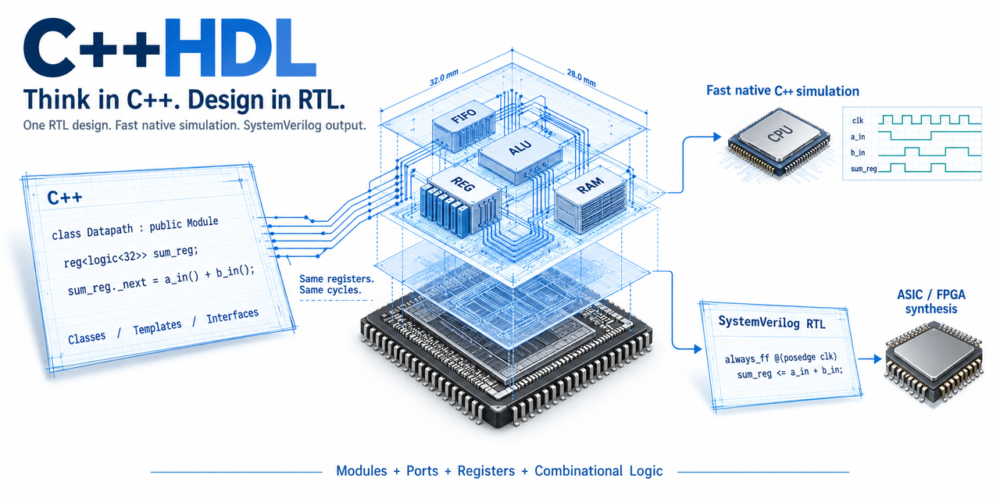

\vfill
\begin{center}
(C++ RTL, with optional HLS and synthesis layers)
\end{center}

\clearpage

# Table of contents {.unnumbered .unlisted}

**Part I. Describe RTL in C++**

- [1. Introduction](#chapter-1)
    - [1.1 The design we are going to build](#section-1-1)
    - [1.2 Seven reasons to use C++ for RTL](#section-1-2)
    - [1.3 The book's two parts](#section-1-3)
    - [1.4 Prerequisites and notation](#section-1-4)
    - [1.5 Three rules for every module and testbench](#section-1-5)
- [2. Capture a Sample](#chapter-2)
    - [2.1 The example's behavior](#section-2-1)
    - [2.2 Define when a sample transfers](#section-2-2)
    - [2.3 Build the module](#section-2-3)
    - [2.4 C++ calls and register updates](#section-2-4)
    - [2.5 Execute one edge correctly](#section-2-5)
    - [2.6 Write the first waveform](#section-2-6)
    - [2.7 Build and test the sample stage](#section-2-7)
- [3. Absorb Bursts with Memory and Child Modules](#chapter-3)
    - [3.1 The queue behavior used here](#section-3-1)
    - [3.2 Use `memory<>` and width-dependent C++ types](#section-3-2)
    - [3.3 Implement the queue](#section-3-3)
    - [3.4 Add the stage and queue as members of a parent](#section-3-4)
    - [3.5 Understand hierarchy and latency](#section-3-5)
    - [3.6 Link the model into a C++ test](#section-3-6)
    - [3.7 Test the buffer and inspect its generated RTL](#section-3-7)
- [4. Connect Reusable Interface Endpoints](#chapter-4)
    - [4.1 Declare a CppHDL interface](#section-4-1)
    - [4.2 Learn the two direction conventions](#section-4-2)
    - [4.3 Divide work between components and subclasses](#section-4-3)
    - [4.4 Define local signals, then connect interfaces](#section-4-4)
    - [4.5 How the parent connects its three child modules](#section-4-5)
    - [4.6 Test the interface-based buffer with the existing testbench](#section-4-6)
- [5. Cross Clock Domains and Test Both Flows](#chapter-5)
    - [5.1 Separate the architecture from its C++ execution](#section-5-1)
    - [5.2 Scope of this example](#section-5-2)
    - [5.3 Give every register one clock owner](#section-5-3)
    - [5.4 Map the pointer equations to the listing](#section-5-4)
    - [5.5 Decide how both sides reset and restart](#section-5-5)
    - [5.6 Implement the two-clock FIFO](#section-5-6)
    - [5.7 Relate the methods to generated RTL](#section-5-7)
    - [5.8 Run the same transfer test against C++ and SystemVerilog](#section-5-8)
    - [5.9 Build and run both flows](#section-5-9)
    - [5.10 What this test checks, and what to add next](#section-5-10)
- [6. Conclusion to Part I](#chapter-6)

**Part II. Schedule C++ Algorithms and Synthesize Hardware**

- [7. HLS Principles](#chapter-7)
    - [7.1. HLS modes](#hls-modes)
    - [7.2. Memory types](#hls-memory-types)
    - [7.3 Follow a word through the HFT example](#section-7-3)
    - [7.4 Keep the algorithm in C++; choose its execution in the wrapper](#section-7-4)
    - [7.5 Pipeline independent words; keep feedback deliberate](#section-7-5)
    - [7.6 Retain quote fields, not whole packets](#section-7-6)
    - [7.7 Use HLS without CppHDL synthesis or retiming](#section-7-7)
- [8. Synthesis and Retiming](#chapter-8)
    - [8.1 Turn the scheduled design into gates](#section-8-1)
    - [8.2 Separate HLS stage placement from timing-driven retiming](#section-8-2)
    - [8.3 Preserve behavior by moving existing boundaries](#section-8-3)
    - [8.4 Add stages when latency may change](#section-8-4)
    - [8.5 Apply timing rules at the intended boundary](#section-8-5)
    - [8.6 Read the HFT result without confusing latency and throughput](#section-8-6)
    - [8.7 Verify the transformed implementation](#section-8-7)
    - [8.8 Take the result back to the C++ design](#section-8-8)
- [9. Developing Hardware-Friendly HLS C++ Design](#chapter-9)
    - [9.1 Start with rates and bounds](#section-9-1)
    - [9.2 Replace whole-packet storage with the state the next step needs](#section-9-2)
    - [9.3 Match the work unit to the interface width](#section-9-3)
    - [9.4 Choose widths from value ranges, including intermediates](#section-9-4)
    - [9.5 Carry only live data through a pipeline](#section-9-5)
    - [9.6 Distinguish storage bits from access logic](#section-9-6)
    - [9.7 Update a field, not a reconstructed store](#section-9-7)
    - [9.8 Make repeated reads and helper reuse visible, then verify sharing](#section-9-8)
    - [9.9 Bound allocations and recursion separately](#section-9-9)
    - [9.10 Separate unpredictable loading from regular computation](#section-9-10)
    - [9.11 Remove hidden cursors from overlapping calls](#section-9-11)
    - [9.12 Measure the implementation, not the prettiness of the source](#section-9-12)
- [Conclusion to Part II](#part-ii-conclusion)
- [Materials and Example Sources](#materials)

\clearpage

# Part I. Describe RTL in C++ {.unnumbered}

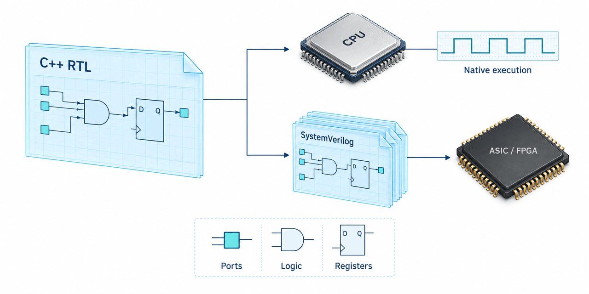

# 1. Introduction {#chapter-1}

## 1.1 The design we are going to build {#section-1-1}

A sensor produces one-byte measurements. Its consumer sometimes pauses.
We first use one clock for both, then implement a queue with separate write
and read clocks.

We will implement this familiar RTL task in C++, then run the same description
as a native executable and convert it to SystemVerilog. The four steps introduce
the CppHDL constructs needed for each implementation:

```text
Chapter 2: sensor -> threshold/capture stage -> consumer
Chapter 3: sensor -> capture stage -> memory queue -> consumer
Chapter 4: sensor -> source endpoint <-> queue endpoint <-> consumer endpoint
Chapter 5: write-clock endpoint -> asynchronous memory FIFO -> read-clock endpoint
```

Chapter 5 develops and tests a queue whose input and output use different clocks.
We test this queue separately, then explain how to connect it to the earlier
modules. We do not build a complete two-clock version of the earlier design.

CppHDL describes RTL in C++. A class represents a module, a member object can
represent a child module, a function can represent combinational logic, and a
`reg<T>` object stores a value that changes at a clock edge. The converter
emits SystemVerilog.
The same hardware description can also execute as a native C++ model.

The hardware concepts remain those of SystemVerilog RTL. What changes is how
we express them and execute the model: sequential C++ calls must preserve
concurrent hardware behavior. Much of this book explains that mapping.

Part I uses **explicit RTL, not high-level synthesis**. A C++ loop does not automatically become a
multi-cycle accelerator, a method call does not consume a clock, and an ordinary
variable does not become a pipeline register just because it appears inside a
class. We explicitly choose where to place registers and which calculations
happen between clock edges.

Part II adds two optional tools above that RTL contract: HLS schedules selected
C++ methods into hardware, and synthesis maps the design to gates, optionally
retiming its register boundaries. We use a streaming packet processor to show
where each tool helps and where the designer still chooses the architecture.

## 1.2 Seven reasons to use C++ for RTL {#section-1-2}

1. **Run the RTL directly as C++.** Compile the design with its testbench and
   use a C++ debugger, sanitizer, or profiler without an intermediate RTL
   conversion. Native execution is still simulation; measure its speed on your
   design rather than assuming a universal speedup.

2. **Generate RTL from C++ type parameters.** `Block<TYPE>` can use the selected
   type's fields, constants, and supported methods; CppHDL generates the corresponding RTL.
   The benefit is using C++ templates and specialization in the executable
   design, not merely parameterizing a width.

3. **Use the C++ ecosystem for verification and analysis.** Link the model into
   existing C++ test systems. Use C++ containers in the testbench to store and
   retrieve debug information as the simulation runs, and check it on each
   call that simulates an edge. Tools that inspect C++ can also analyze the
   design's classes and connections, check project coding rules, or draw diagrams.

4. **Give coding assistants a direct compile-and-test loop.** They can modify
   C++ RTL and run focused native tests without first generating SystemVerilog.
   This can shorten iteration; it does not remove the need for independent review.

5. **Share the implementation with software firmware.** Firmware and system-model
   teams can embed the C++ RTL directly instead of maintaining another
   handwritten peripheral model that may behave differently.

6. **Build large, complex multithreaded or cluster-based RTL simulations.**
   Use C++ threading and communication libraries to distribute model instances
   or independent test runs across CPU/GPU cores and machines. For connected models,
   the simulation framework must coordinate data exchange and simulation time.

7. **Prototype behavior first, then refine it into RTL.** Start with a
   non-synthesizable C++ sketch: use function calls as connections and pass
   objects, complete transactions, or memory buffers, as in transaction-level
   modeling (TLM). Simulate the system's behavior before defining individual
   wires and registers. Then replace the behavioral operations step by step
   with clocked, register-to-register logic, keeping the sketch as a reference
   for tests. This refinement is a design task, not automatic RTL conversion.

These are benefits of the C++ workflow, not claims that structs, interfaces,
parameterization, or verification are new to RTL. Conversion supports a subset
of C++. At the end of development, the generated SystemVerilog still needs
acceptance verification in a timing/event-driven simulator and synthesis
testing with the target synthesis tools.

## 1.3 The book's two parts {#section-1-3}

In Part I we build and test a sample stage, add a memory queue, connect the modules
through interfaces, and finally implement a two-clock FIFO. Each chapter
introduces the CppHDL constructs needed for the next step.

| Chapter | Example | CppHDL focus | Check |
| --- | --- | --- | --- |
| 1. Introduction | The development workflow | Native execution and conversion | Build prerequisites |
| 2. Capture a sample | A one-slot register stage | Ports, comb methods, work/strobe, and native VCD | Capture, hold, and drain |
| 3. Absorb a burst | A stage feeding a memory queue | `memory<>`, deferred writes, and calls to child modules | Ordering under backpressure |
| 4. Connect reusable modules | Interface endpoints and a counter | Direction conventions, `assignIf`, and RTL class inheritance | Reuse the test with another C++ top-level type |
| 5. Cross clocks | A memory-backed asynchronous FIFO | Named clock and reset methods, and a shared C++/RTL test | Ordering, reset, and coincident edges |
| 6. Conclusion | Review the examples | What native C++ execution changes | Remaining RTL checks |

Part II follows a different example through three more chapters:

- **7. HLS Principles:** turn C++ packet-processing methods into delayed
  operations or streaming pipelines; select their memory contracts.
- **8. Synthesis and Retiming:** generate gate-level Verilog, choose whether
  latency may change, and test the retimed packet processor.
- **9. Developing Hardware-Friendly HLS C++ Design:** compare source choices
  that control storage, access logic, arithmetic width, and throughput.

### Five revisions of that plan

The plan was revised to: (1) keep one realistic task, (2) state each example's
transfer rules before its code, (3) demonstrate native execution immediately,
(4) introduce child modules before interface inheritance, and (5) reuse checks
across implementations.

## 1.4 Prerequisites and notation {#section-1-4}

This book assumes basic SystemVerilog RTL knowledge and familiarity with C++
classes, functions, and references. Explanations focus on CppHDL's syntax and
execution rules; no previous CppHDL experience is required.

The API reference is [spec.md](spec.md); coding guidance is
[best_practice.md](best_practice.md). The repository's
[examples](../examples/) and [tests](../tests/) are useful companions, especially
[the existing two-clock FIFO](../examples/cdc/Fifo2clk.cpp) and
[the CDC regression](../tests/cdc/TwoClocksCdc.cpp).

Part I's complete source listings are labeled by filename and belong in one working
directory. Later chapters include earlier headers; they do not replace them.
Unlabeled fragments illustrate an expression or a method and are not additional
standalone files. The chapter images are conceptual views, not complete port
lists or substitutes for the code.

Part II uses short excerpts from the checked-in HFT example and separate small
examples for individual HLS features. Its excerpts are not another complete HFT
implementation. Links identify the full sources and runnable tests.

### Get and build CppHDL

Get the source from [github.com/mirekez/cpphdl](https://github.com/mirekez/cpphdl).
On Linux, with Git and Conda installed, create the supplied dependency
environment and build the converter:

```sh
git clone https://github.com/mirekez/cpphdl.git
cd cpphdl
conda env create --prefix ./.conda --file requirements.yaml
conda activate ./.conda
cmake -S . -B build -DCMAKE_BUILD_TYPE=Release -G "Unix Makefiles"
cmake --build build --target cpphdl --parallel 4
./build/cpphdl --help
```

The result is `build/cpphdl`, the C++-to-SystemVerilog converter. To simulate
natively, include `cpphdl.h` in the model and compile it with your C++
testbench, adding `include/` to the compiler's include path. Run that executable
directly. To generate RTL, pass the model source to `cpphdl`, choose an output
directory with `--generated-dir`, and put compiler options such as `-I` and
`-D` after `--`. The following chapters show both flows with complete commands.

The book's native commands use `g++` with C++17 support. The supplied Conda
environment provides Verilator and Make; a VCD viewer is optional. See the
[README](../README.md) for platform-specific setup details.

### Prepare the book examples

Keep the example files together so later chapters can include earlier headers.
From the repository root, set the working paths:

```sh
# Run this setup from the CppHDL repository root.
export CPPHDL_SRC="$PWD"
export CPPHDL="$CPPHDL_SRC/build/cpphdl"
export BOOK="$CPPHDL_SRC/build/book-check"
mkdir -p "$BOOK"
```

This creates the working directory, not the source files shown below. Build
each test as a separate executable: each defines its own `main()` and, for
the C++ model, its own `_system_clock`. Do not link the tests into one executable.

| Chapter | Source files needed in `$BOOK` | Executable to run |
| --- | --- | --- |
| 2 | `SampleStage.h`, `sample_test.cpp` | `sample_test` |
| 3 | Earlier header plus `MemoryQueue.h`, `TelemetryBuffer.h`, `buffer_test.cpp` | `buffer_test` |
| 4 | Earlier headers plus `InterfaceTelemetry.h`; reuse `buffer_test.cpp` | `interface_test` |
| 5 | `AsyncSamples.h`, `async_test.cpp`; independent of the earlier headers | `async_native`, then `VAsyncSamples` |

There are three different build activities; a successful result from one does
not imply success in the others:

| Activity | Tool and input | Result |
| --- | --- | --- |
| Native simulation | `g++` compiles a test and its C++ RTL headers | An executable that drives and checks the C++ model |
| RTL conversion | `cpphdl` parses the design header | SystemVerilog modules and supporting packages |
| RTL checking/execution | Verilator reads the generated SystemVerilog | Lint diagnostics, or a separately built simulation executable |

The first complete commands appear after the chapter 2 files. Converter options
such as `--generated-dir` go before `--`; parsing options such as `-I` go after
it. `--lint-only` checks generated RTL without running stimulus. Chapter 5 adds
the Verilator build-and-run flow.

CppHDL emits struct definitions in packages and adds `Predef_pkg.sv` for its
supporting declarations. The commands list these before the importing modules.

## 1.5 Three rules for every module and testbench {#section-1-5}

These three rules say where to connect ports, where to assign register values,
and which methods the test calls. All later examples use them.

### Rule 1: Connect ports during setup

**You MUST connect all ports before the first work call.** A module
defines connections in `_assign()`; output bindings may also appear at member
declarations, as in the listings. The parent connects its immediate children,
and the testbench connects the top-level inputs during setup.

Use `assignIf` for connections between complete interfaces, not separate
assignments for their fields. Each endpoint defines the fields it drives
locally. Connections MUST follow the module hierarchy, one level at a time.

Call the top-level `_assign()` once before simulation. Interface setup may call
an endpoint's `_assign()` more than once, so repeating it MUST only re-establish
the same connections, not reset state or repeatedly allocate resources.
You MUST NOT reconnect ports or call `_assign()` in the simulation loop:
bindings represent fixed RTL wiring. Change the values supplying the inputs
instead. Objects referenced by bindings MUST remain alive while those bindings
are used.

### Rule 2: Assign next register's values in work

For a member `reg<T> r`, **assign `r._next` in `_work(reset)` or a helper it
calls**. Reading `r` still returns the current value. `r.strobe()` copies
`r._next` into `r`. If `_next` has not changed since the last strobe, `r` keeps
its value. You MUST NOT assign `r` directly in the RTL or connect another
module's input to `r._next` instead of `r`.

Call `r.strobe()` only from the module's `_strobe()`. Similarly, assign a
memory row with `storage[index] = value` during work and call
`storage.apply()` during strobe. Comb functions calculate results from inputs
and current register values. They
MUST NOT write registers or memory, call strobe/apply, or connect ports.
Call the required comb function directly; no preparation function is needed.

Assign each register to one clock edge and put its updates in that clock's
work/strobe pair. Put synchronous reset assignments to `_next` in work's reset
branch. Asynchronous reset uses the separate handlers in section 5.7.
C++ construction does not automatically zero registers or memory.

### Rule 3: Call work and strobe methods through all hierarchy to make a clock tick

**To simulate a clock edge in C++, your test MUST call the top module's
`_work(reset)`, then `_strobe()`.** The parent's `_work()` calls its children's
work methods; the parent's `_strobe()` calls their strobe methods. The parent
also passes reset to its children. You MUST NOT run work or strobe from
`_assign()` or a comb function.

The order of children within work or within strobe does not matter. Keep the
two phases separate: work calculates next values; strobe updates current values.
When two clocks have an edge at the same simulation time, call both clocks'
work methods before calling their strobe methods.

Increment `_system_clock` at the end of each simulation step.

Chapter 5 uses clock-specific method names and shows which additional calls
are needed for asynchronous reset.

\clearpage

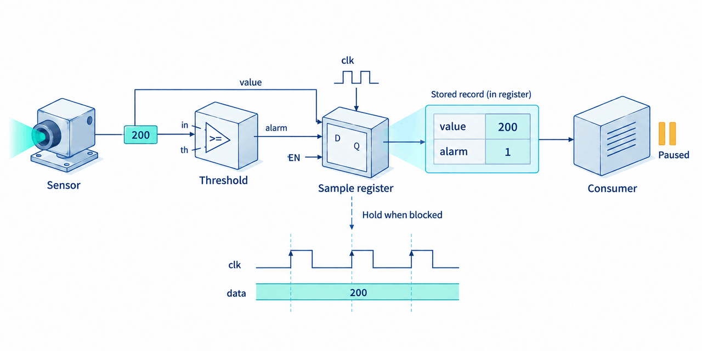

# 2. Capture a Sample {#chapter-2}

This example maps a one-slot RTL stage to CppHDL ports, combs, and registers,
then runs a native test and writes VCD without generating SystemVerilog first.

## 2.1 The example's behavior {#section-2-1}

Suppose a sensor provides an eight-bit measurement. We want to flag values at
or above a threshold and deliver the measurement and flag together.

The combinational decision is small:

```text
alarm = measurement >= threshold
accept = enable AND input_valid AND space_available
```

Capture the measurement and its alarm flag together. `en_in` controls capture,
not the clock signal.

## 2.2 Define when a sample transfers {#section-2-2}

The example uses rising-edge valid/ready handshakes. In CppHDL, parentheses
read a port's current value:

- The stage accepts an input when `valid_in() && ready_out()` is true.
- The consumer accepts the output when `valid_out() && ready_in()` is true.

The stage can deliver its stored sample and capture the next sample on the
same edge. Setting `en_in` to false blocks new inputs but still lets a stored
sample leave.

The payload is one struct with two byte fields:

| Field | Meaning |
| --- | --- |
| `value` | The measurement accepted on the input edge |
| `alarm` | Zero or one, calculated from the threshold on that same edge |

A byte-sized flag keeps the C++ layout and later 16-bit encoding simple.

## 2.3 Build the module {#section-2-3}

Derive the class from `Module`; declare public signals with `_PORT(T)` and
direction suffixes `_in` or `_out`. Use `reg<SampleWord>` for the payload and
`reg<u1>` for valid. A comb result variable does not become a hardware register.

The listing uses these types:

| C++ spelling | Meaning here |
| --- | --- |
| `u<8>` | An unsigned eight-bit value |
| `u1` | A one-bit unsigned class type, suitable inside `reg<>` |
| `uint8_t` | A native byte used for each field of the sample struct |
| `SampleWord` | The struct holding the sample; `__PACKED` requests packed C++ layout |
| `_PORT(SampleWord)` | A signal carrying a `SampleWord` value; it does not store that value between edges |

Later, `logic<16>` provides a sixteen-bit value with bit-selection methods.
For RTL values, use types with the intended width rather than a host-dependent
type such as `size_t`.
`reg<T>` requires a class type, so use `u1` rather than native `bool` as its
template argument.

Declare a member variable for each comb result, followed by a method named
`<variable_name>_func()`. For example, `SampleWord sample_comb;` is followed by
`SampleWord& sample_comb_func()`. The method calculates the result on each
direct call and returns a reference to that member variable. Assign every
result field on every path.

Here is a reading key for the remaining syntax in the listing:

| Construct | Purpose |
| --- | --- |
| `port = _ASSIGN(...)` | Install a connection that supplies a value when the port is read |
| `_ASSIGN_REG(...)`, `_ASSIGN_COMB(...)` | Faster alternatives for assigning a register's value or a comb's result |

You can use simple `_ASSIGN()` for any of these port connections if you are
unsure. `_ASSIGN_REG(...)` and `_ASSIGN_COMB(...)` just make native simulation
faster for register values and comb results, respectively.

The execution methods follow section 1.5. Here `_assign()` is empty because
the stage's output bindings are at their declarations and its inputs are
connected by the testbench.

The complete stage follows; section 2.4 then walks through its behavior.

**File: `SampleStage.h`**

```cpp
#pragma once
#include <cpphdl.h>
using namespace cpphdl;

struct SampleWord
{
    uint8_t value;
    uint8_t alarm;
} __PACKED;

class SampleStage : public Module
{
public:
    _PORT(bool) en_in;
    _PORT(bool) valid_in;
    _PORT(u<8>) value_in;
    _PORT(u<8>) threshold_in;
    _PORT(bool) ready_in;
    _PORT(bool) ready_out = _ASSIGN_COMB(ready_comb_func());
    _PORT(bool) valid_out = _ASSIGN((bool)valid_reg);
    _PORT(SampleWord) sample_out = _ASSIGN_REG(sample_reg);

private:
    reg<SampleWord> sample_reg;
    reg<u1> valid_reg;

    SampleWord sample_comb;
    SampleWord& sample_comb_func()
    {
        sample_comb.value = (uint8_t)value_in();
        sample_comb.alarm = value_in() >= threshold_in() ? 1 : 0;
        return sample_comb;
    }

    bool ready_comb;
    bool& ready_comb_func()
    {
        ready_comb = en_in() && (!(bool)valid_reg || ready_in());
        return ready_comb;
    }

public:
    void _assign() {}

    void _work(bool reset)
    {
        if (reset) {
            sample_reg._next = {};
            valid_reg._next = 0;
        }
        else if (!(bool)valid_reg || ready_in()) {
            valid_reg._next = en_in() && valid_in();
            if (en_in() && valid_in()) {
                sample_reg._next = sample_comb_func();
            }
        }
    }

    void _strobe()
    {
        sample_reg.strobe();
        valid_reg.strobe();
    }
};
```

## 2.4 C++ calls and register updates {#section-2-4}

The two combs answer separate questions:

- `sample_comb_func()` forms a complete payload from the current input.
- `ready_comb_func()` decides whether the stage can accept that payload on the next edge.

`_work` uses `sample_comb_func()` when capturing a sample; the ready output
uses `ready_comb_func()` through its binding.

**You can use `_ASSIGN()` for all these port connections. If you are unsure
whether an expression refers to register storage or a persistent comb result,
use `_ASSIGN()`.** `_ASSIGN_REG()` and `_ASSIGN_COMB()` are optional alternatives
that make native simulation faster for register values and comb results.

| Binding | Appropriate use |
| --- | --- |
| `_ASSIGN(expression)` | General choice, including register values, comb results, casts, and Boolean expressions |
| `_ASSIGN_REG(object)` | Faster binding to persistent register or input storage |
| `_ASSIGN_COMB(function())` | Faster binding to a comb result returned by reference |

The last two bind an **lvalue**, an existing object rather than a copied value.
A temporary such as `u<8>(128)` or a function result returned by value does not
meet their [lifetime requirement](#rule-1-connect-ports-during-setup); use
`_ASSIGN()` for those expressions.

The reset branch assigns zero to `sample_reg._next` and `valid_reg._next`.
When the stage is full and the consumer is not ready, neither non-reset
assignment runs. Both registers keep their values according to
[Rule 2](#rule-2-assign-next-registers-values-in-work).

The conditions produce these results:

| Situation before the edge | Action at the edge |
| --- | --- |
| Reset asserted | Clear the payload and valid bit |
| Full and downstream not ready | Hold payload and valid, regardless of enable |
| Slot available, enabled, input valid | Capture the new payload and set valid |
| Slot available, but no enabled valid input | Clear valid; the old payload bits need not change |

With no clock options, the converter supplies `clk` and an active-high
`reset`. `_work(true)` models synchronous reset; `_strobe()` applies it to
both registers. No explicit C++ clock port is needed in this single-clock mode.

After conversion, expect a struct package, module ports, combinational logic,
and an `always_ff @(posedge clk)` process. The converter may express the body
through generated tasks and temporary variables for the next register values.

## 2.5 Execute one edge correctly {#section-2-5}

Native simulation uses a global counter to decide when cached port values must be
recalculated:

```cpp
long _system_clock = -1;
```

Define it once per executable. The converter does not emit this counter into
RTL. The single-clock test uses Rule 3 in this order:

```text
set testbench stimulus values, if needed
advance _system_clock
observe transfers that will happen on this edge
call _work(reset)
call _strobe()
advance _system_clock
observe the newly committed outputs
```

In the test, the input variables are members, the constructor connects them,
and `tick(true)` performs reset. Later `tick()` calls default to normal
operation. This test reads outputs immediately after strobe, so it increments
the counter before those reads. It also increments the counter at the next
`tick()` to discard results cached by those checks before evaluating new stimulus.
The checks cover:

| Edge | Input situation | State after the edge |
| --- | --- | --- |
| Reset | No valid sample | Empty |
| Capture | Value 200, threshold 128, downstream blocked | Holds 200 with alarm 1 |
| Stall | Next input is 17, downstream still blocked | Still holds 200 |
| Drain | Input disabled, downstream ready | Empty |
| Capture | Enabled again, input 17 | Holds 17 with alarm 0 |
| Drain | No new valid input | Empty |

## 2.6 Write the first waveform {#section-2-6}

CppHDL's `VcdFile` reads values from addresses supplied by the testbench.
We copy the three outputs into ordinary testbench variables and
give their addresses to `VcdFile`. We do not pass port objects, comb results,
or whole `reg<T>` objects. A `reg<T>` object also stores the next value, so its
C++ object size is larger than the hardware value we want to display.

The test copies the outputs after calling `_strobe()` and incrementing
`_system_clock`. The variables remain alive until the `VcdFile` destructor
closes the file. The test writes one set of output values every 10 ns;
it does not record intermediate combinational changes.

Each signal entry is `{name, bit_width, address_of_storage}`. The `shown_*`
fields hold these copies in the testbench; they are not additional RTL registers. The
minimal dump includes the stored value, alarm, and valid bit, but does not
include the input signals or a clock lane. The chapter illustration shows the
timing concept; it is not a screenshot of this VCD.

**File: `sample_test.cpp`**

```cpp
#include "SampleStage.h"
#include <cpphdl_vcd.h>
#include <cassert>
#include <cstdio>

long _system_clock = -1;

struct SampleTest
{
    SampleStage dut;
    bool enable = true;
    bool valid = false;
    bool ready = false;
    u<8> value = 0;
    u<8> threshold = 128;
    uint8_t shown_value = 0;
    uint8_t shown_alarm = 0;
    uint8_t shown_valid = 0;
    unsigned time_ns = 0;
    VcdFile trace;

    SampleTest()
    {
        dut.en_in = _ASSIGN(enable);
        dut.valid_in = _ASSIGN(valid);
        dut.ready_in = _ASSIGN(ready);
        dut.value_in = _ASSIGN_REG(value);
        dut.threshold_in = _ASSIGN_REG(threshold);
        dut._assign();
        trace.signals = {
            {"value", 8, &shown_value},
            {"alarm", 8, &shown_alarm},
            {"valid", 1, &shown_valid}
        };
        trace.create("samples.vcd");
    }

    void tick(bool reset = false)
    {
        ++_system_clock;
        dut._work(reset);
        dut._strobe();
        ++_system_clock;
        shown_value = dut.sample_out().value;
        shown_alarm = dut.sample_out().alarm;
        shown_valid = dut.valid_out();
        trace.sample(time_ns);
        time_ns += 10;
    }
};

int main()
{
    SampleTest test;
    test.tick(true);
    assert(!test.dut.valid_out());

    test.valid = true;
    test.value = 200;
    test.tick();
    assert(test.dut.valid_out());
    assert(test.dut.sample_out().value == 200);
    assert(test.dut.sample_out().alarm == 1);

    test.value = 17;
    test.tick();
    assert(!test.dut.ready_out());
    assert(test.dut.sample_out().value == 200);

    test.enable = false;
    test.ready = true;
    test.tick();
    assert(!test.dut.valid_out());

    test.enable = true;
    test.tick();
    assert(test.dut.sample_out().value == 17);
    assert(test.dut.sample_out().alarm == 0);

    test.valid = false;
    test.tick();
    assert(!test.dut.valid_out());
    std::puts("PASS: capture, hold, drain, enable; wrote samples.vcd");
}
```

## 2.7 Build and test the sample stage {#section-2-7}

Compile and run `sample_test.cpp` to check capture, hold, drain, and enable
behavior and produce a VCD file. Then convert `SampleStage.h` to SystemVerilog
and use Verilator to check the generated RTL without running it.

```sh
g++ -std=c++17 -O2 -I"$CPPHDL_SRC/include" \
    "$BOOK/sample_test.cpp" -o "$BOOK/sample_test"
(cd "$BOOK" && ./sample_test)

"$CPPHDL" "$BOOK/SampleStage.h" --generated-dir="$BOOK/sv_stage" -- \
    -I"$CPPHDL_SRC/include"

verilator --lint-only --top-module SampleStage \
    "$BOOK/sv_stage/Predef_pkg.sv" \
    "$BOOK/sv_stage/SampleWord_pkg.sv" \
    "$BOOK/sv_stage/SampleStage.sv"
```

Keep C++ assertions enabled: do not define `NDEBUG`. In `$BOOK/samples.vcd`,
the output holds 200 at 10 and 20 ns, becomes invalid at 30 ns, and contains
17 at 40 ns. The test drives the inputs, but this VCD traces only outputs.

The native executable should print `PASS: capture, hold, drain, enable; wrote
samples.vcd`. The conversion and lint commands check that the design can also
be represented as RTL. They do not yet run this test against that RTL.

**Check your CppHDL understanding:** Why does changing a bound input require
incrementing `_system_clock`? Why does this test copy outputs into `shown_*`
variables instead of dumping the whole `reg<T>` object?

The next chapter adds a queue so the input can accept several more samples
while the consumer is paused.

\clearpage

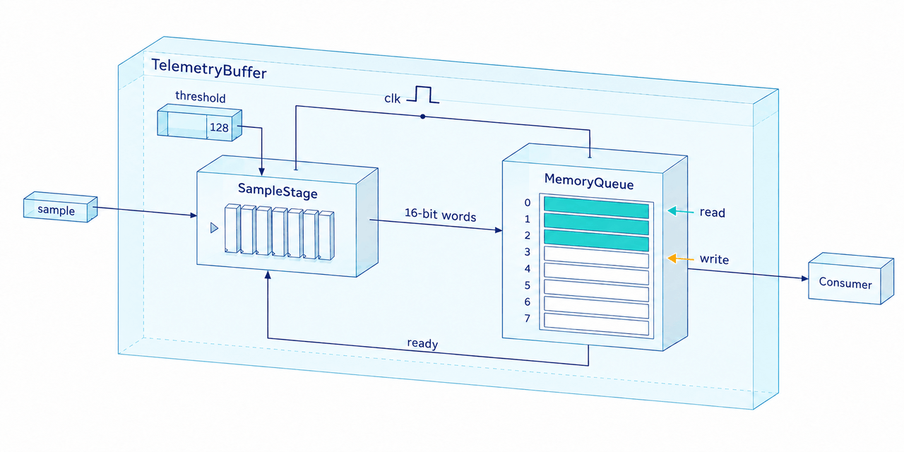

# 3. Absorb Bursts with Memory and Child Modules {#chapter-3}

This chapter adds `memory<>` and child modules. The main CppHDL concern is
preserving simultaneous register and memory updates despite sequential C++ calls.

## 3.1 The queue behavior used here {#section-3-1}

Add an eight-word queue after the stage. Its behavior is:

| Question | Choice in this chapter |
| --- | --- |
| How much queue storage? | Eight words, in addition to the stage's one slot |
| What is a word? | Sixteen bits: value in bits 7:0, alarm byte in bits 15:8 |
| When is a word visible? | Combinationally from the current head while nonempty |
| What happens when full? | Input ready is low, even if a read occurs on this edge |

Here input ready depends on the stored count, not on output ready. A full
queue therefore cannot accept a replacement on the edge that removes a word.
The example uses show-ahead reads;
`memory<>` does not automatically adapt that behavior to synchronous-read RAM.

## 3.2 Use `memory<>` and width-dependent C++ types {#section-3-2}

We need to store each measurement and its alarm byte together. Declare a
memory with two bytes per row and use `DEPTH` to select the number of rows:

```cpp
memory<u8, 2, DEPTH> storage;
```

That means `DEPTH` rows, each containing **two byte elements**. The second
argument is not a bit count. This differs from `array<COUNT, TYPE, PACKED>`,
whose first argument is an element count.

Here `u8` is CppHDL's byte class, and `MemoryQueue<8>` selects eight rows.
This example demonstrates a numeric template parameter, not the type-based
specialization discussed in the introduction.

With `memory<>`, assigning a row adds it to a list of pending writes.
`storage.apply()` copies those writes into the stored rows and clears the list.
A normal read still returns the stored row, not the pending write, as required
by [Rule 2](#rule-2-assign-next-registers-values-in-work).

The usual pointer and count widths become C++ type expressions:
`u<clog2(DEPTH)>` and `u<clog2(DEPTH) + 1>`. `static_assert` restricts this
implementation to supported power-of-two depths.

Use `uint32_t` when indexing RTL storage. A host `size_t` may be 64 bits;
unnecessarily wide runtime RTL indices can cause synthesis-tool problems.
Template size parameters can remain `size_t`.

## 3.3 Implement the queue {#section-3-3}

When the queue is empty, the module returns zero on its data output and false
on its valid output. The data comb reads memory only when the count is nonzero,
so it does not read an uninitialized row after reset.

This queue's reset clears pointers and count without reading or clearing the RAM.

**File: `MemoryQueue.h`**

```cpp
#pragma once
#include <cpphdl.h>
using namespace cpphdl;

template<size_t DEPTH>
class MemoryQueue : public Module
{
public:
    _PORT(bool) valid_in;
    _PORT(logic<16>) data_in;
    _PORT(bool) ready_in;
    _PORT(bool) ready_out = _ASSIGN((uint32_t)count_reg < DEPTH);
    _PORT(bool) valid_out = _ASSIGN((uint32_t)count_reg != 0);
    _PORT(logic<16>) data_out = _ASSIGN_COMB(data_comb_func());

private:
    static_assert(DEPTH >= 2 && (DEPTH & (DEPTH - 1)) == 0,
        "DEPTH must be a power of two, at least two");
    static constexpr size_t ADDR_BITS = clog2(DEPTH);
    memory<u8, 2, DEPTH> storage;
    reg<u<ADDR_BITS>> write_reg;
    reg<u<ADDR_BITS>> read_reg;
    reg<u<ADDR_BITS + 1>> count_reg;

    logic<16> data_comb;
    logic<16>& data_comb_func()
    {
        data_comb = 0;
        if ((uint32_t)count_reg != 0) {
            data_comb = (logic<16>)storage[(uint32_t)read_reg];
        }
        return data_comb;
    }

public:
    void _assign() {}

    void _work(bool reset)
    {
        bool push;
        bool pop;
        if (reset) {
            write_reg._next = 0;
            read_reg._next = 0;
            count_reg._next = 0;
        }
        else {
            push = valid_in() && ready_out();
            pop = valid_out() && ready_in();
            if (push) {
                storage[(uint32_t)write_reg] = data_in();
                write_reg._next = write_reg + 1;
            }
            if (pop) {
                read_reg._next = read_reg + 1;
            }
            if (push && !pop) {
                count_reg._next = count_reg + 1;
            }
            else if (pop && !push) {
                count_reg._next = count_reg - 1;
            }
        }
    }

    void _strobe()
    {
        storage.apply();
        write_reg.strobe();
        read_reg.strobe();
        count_reg.strobe();
    }
};
```

The queue uses the same implicit `clk` and synchronous reset as the sample stage.
`_assign()` is empty because the queue has no children or interface bundles;
its output bindings live in the port declarations.

## 3.4 Add the stage and queue as members of a parent {#section-3-4}

The parent sets the threshold, converts the measurement and alarm flag into a
16-bit word, and connects the stage to the queue. We can still test either child
module separately.

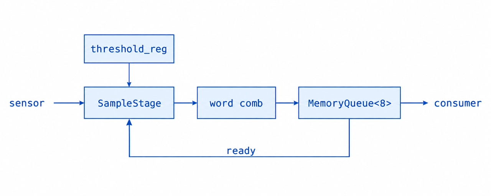

The parent uses three kinds of connections:

1. A child input can read a **parent input port**, such as the measurement.
2. A child input can read a **parent register**, such as the threshold.
3. A child input can read a **parent comb**, such as the encoded payload.

Use `word_comb.bits(high, low)` for inclusive bit selection, not a
`reinterpret_cast` of the C++ struct. The encoding is value in the low byte
and alarm in the high byte. The threshold register holds 128 after reset.

`value_in()` and the child port getters return references, so `_ASSIGN_COMB`
can bind them too. Its argument must be an lvalue as described in section 2.4.

**File: `TelemetryBuffer.h`**

```cpp
#pragma once
#include "SampleStage.h"
#include "MemoryQueue.h"

class TelemetryBuffer : public Module
{
    SampleStage stage;
    MemoryQueue<8> queue;

public:
    _PORT(bool) en_in;
    _PORT(bool) valid_in;
    _PORT(u<8>) value_in;
    _PORT(bool) ready_in;
    _PORT(bool) ready_out = _ASSIGN(stage.ready_out());
    _PORT(bool) valid_out = _ASSIGN(queue.valid_out());
    _PORT(logic<16>) data_out = _ASSIGN_COMB(queue.data_out());

private:
    reg<u<8>> threshold_reg;

    logic<16> word_comb;
    logic<16>& word_comb_func()
    {
        word_comb = 0;
        word_comb.bits(7, 0) = stage.sample_out().value;
        word_comb.bits(15, 8) = stage.sample_out().alarm;
        return word_comb;
    }

public:
    void _assign()
    {
        stage.en_in = _ASSIGN(en_in());
        stage.valid_in = _ASSIGN(valid_in());
        stage.value_in = _ASSIGN_COMB(value_in());
        stage.threshold_in = _ASSIGN_REG(threshold_reg);
        stage.ready_in = _ASSIGN(queue.ready_out());
        queue.valid_in = _ASSIGN(stage.valid_out());
        queue.data_in = _ASSIGN_COMB(word_comb_func());
        queue.ready_in = _ASSIGN(ready_in());
        stage._assign();
        queue._assign();
    }

    void _work(bool reset)
    {
        if (reset) {
            threshold_reg._next = 128;
        }
        stage._work(reset);
        queue._work(reset);
    }

    void _strobe()
    {
        threshold_reg.strobe();
        stage._strobe();
        queue._strobe();
    }
};
```

## 3.5 Understand hierarchy and latency {#section-3-5}

`TelemetryBuffer` applies the three rules to a hierarchy: `_assign()` connects
the children, `_work()` calls their work methods, and `_strobe()` calls their
strobes. At E0, the stage captures the first sample while the queue still sees
the stage's previous `valid_out == false`.

Starting empty, with the consumer ready, the first sample moves as follows:

| Edge | Transfers at this edge | State visible after strobe |
| --- | --- | --- |
| E0 | Sensor sample enters the stage | Stage valid, queue empty |
| E1 | Stage sample enters the queue | Queue valid; stage can hold the next sample |
| E2 | Consumer removes the oldest queued sample | Following queued data, if any, becomes the head |

The parent adds no register stage. Total capacity remains nine samples.

## 3.6 Link the model into a C++ test {#section-3-6}

The test directly instantiates the C++ RTL class and uses `std::deque<uint16_t>`
as its scoreboard. Only RTL headers go to the converter; the host test can use
ordinary C++ libraries without synthesis restrictions.

The test reads the output for its scoreboard before calling `_work()` and
`_strobe()`, as in Rule 3.

The test sends 128 samples. It first holds the consumer's ready input low to
fill the stage and queue, then pauses the consumer periodically. There are
enough transfers for each queue pointer to wrap several times.

Leave `USE_INTERFACES` undefined for this chapter: `Design` then aliases
`TelemetryBuffer`, and the later `InterfaceTelemetry.h` is not required.
Chapter 4 changes that alias while reusing the test.

**File: `buffer_test.cpp`**

```cpp
#ifdef USE_INTERFACES
#include "InterfaceTelemetry.h"
using Design = InterfaceTelemetry;
#else
#include "TelemetryBuffer.h"
using Design = TelemetryBuffer;
#endif
#include <cassert>
#include <cstdio>
#include <deque>

long _system_clock = -1;

int main()
{
    Design dut;
    bool enable = true;
    bool valid = false;
    bool ready = false;
    u<8> value = 0;
    std::deque<uint16_t> expected;
    unsigned sent = 0;
    unsigned received = 0;
    bool stalled = false;

    dut.en_in = _ASSIGN(enable);
    dut.valid_in = _ASSIGN(valid);
    dut.value_in = _ASSIGN_REG(value);
    dut.ready_in = _ASSIGN(ready);
    dut._assign();
    ++_system_clock;
    dut._work(true);
    dut._strobe();
    ++_system_clock;

    for (unsigned cycle = 0; cycle < 2000; ++cycle) {
        valid = sent < 128;
        value = (uint8_t)(sent * 13u);
        ready = cycle >= 30 && cycle % 7 != 0;
        ++_system_clock;

        const bool push = valid && dut.ready_out();
        const bool pop = ready && dut.valid_out();
        if (valid && !dut.ready_out()) stalled = true;
        if (pop) {
            assert(!expected.empty());
            assert((uint16_t)dut.data_out() == expected.front());
            expected.pop_front();
            ++received;
        }
        if (push) {
            const uint16_t byte = (uint8_t)value;
            expected.push_back(byte | ((byte >= 128 ? 1u : 0u) << 8));
            ++sent;
        }
        dut._work(false);
        dut._strobe();
        ++_system_clock;

        if (received == 128) {
            assert(sent == 128 && expected.empty() && stalled);
#ifdef USE_INTERFACES
            assert((uint32_t)dut.sent_out() == received);
#endif
            std::puts("PASS: 128 ordered samples under backpressure");
            return 0;
        }
    }
    std::fputs("FAIL: buffer did not drain\n", stderr);
    return 1;
}
```

## 3.7 Test the buffer and inspect its generated RTL {#section-3-7}

Run `buffer_test.cpp` to check that the stage and queue deliver samples in
order while the consumer pauses. Then convert `TelemetryBuffer.h` and lint
the generated modules. Inspect the RTL to confirm that the stage, queue, and
memory writes appear as intended.

```sh
g++ -std=c++17 -O2 -I"$CPPHDL_SRC/include" \
    "$BOOK/buffer_test.cpp" -o "$BOOK/buffer_test"
"$BOOK/buffer_test"

"$CPPHDL" "$BOOK/TelemetryBuffer.h" --generated-dir="$BOOK/sv_buffer" -- \
    -I"$CPPHDL_SRC/include" -I"$BOOK"

verilator --lint-only --top-module TelemetryBuffer \
    "$BOOK/sv_buffer/Predef_pkg.sv" \
    "$BOOK/sv_buffer/SampleWord_pkg.sv" \
    "$BOOK/sv_buffer/SampleStage.sv" \
    "$BOOK/sv_buffer/MemoryQueue.sv" \
    "$BOOK/sv_buffer/TelemetryBuffer.sv"
```

In the generated RTL, verify that the `stage` and `queue` members became child instances and that
deferred memory writes became clocked assignments. `memory<>` is not a promise
of a particular FPGA RAM or ASIC SRAM implementation.

The expected native result is `PASS: 128 ordered samples under backpressure`.
The test checks ordering and observes backpressure. It does not assert exact
E0/E1/E2 latency or exhaustively test full/empty transitions.

**Check your CppHDL understanding:** What would change if the parent called
`stage._strobe()` before `queue._work()`? How would you detect that scheduling
bug even if output ordering remained correct?

The hardware structure is now reusable. The connections are still expressed as
individual scalar ports. The next chapter groups those ports into interfaces
so developers can connect and extend modules without handling every wire separately.

\clearpage

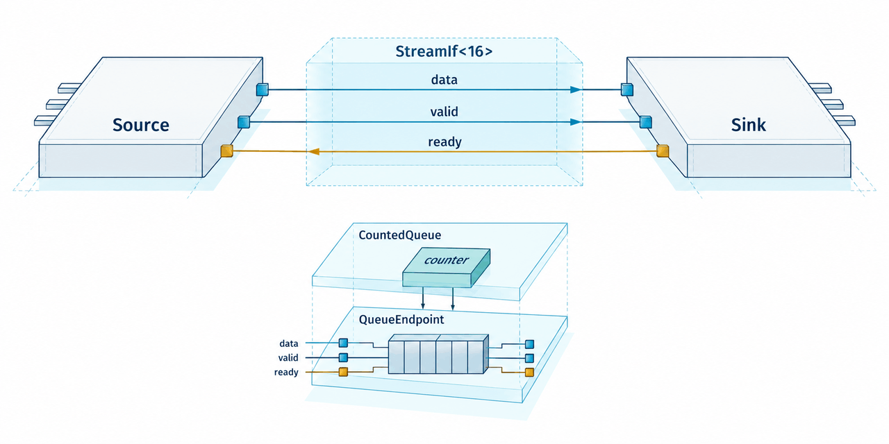

# 4. Connect Reusable Interface Endpoints {#chapter-4}

This chapter replaces scalar connections with CppHDL interfaces and uses
C++ inheritance to extend a synthesizable endpoint. The native test stays the same.

## 4.1 Declare a CppHDL interface {#section-4-1}

Derive `StreamIf<WIDTH>` from `Interface` and declare its signals with `_PORT`.
It carries the same streaming protocol as before:

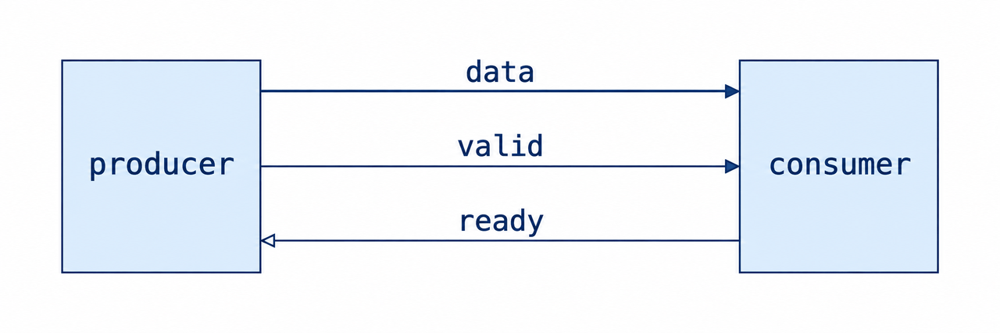

CppHDL determines interface directions from the member name's `_in` or `_out`
suffix instead of a SystemVerilog modport. Both endpoints use the same C++ type.

## 4.2 Learn the two direction conventions {#section-4-2}

Declare `valid_in`, `data_in`, and `ready_out` in the interface type.

A member named `sink_in` keeps each field's declared direction. A member named
`source_out` reverses every field's direction. In the table, direction is
relative to the module containing the interface:

| C++ access | Direction | Driven by |
| --- | --- | --- |
| `sink_in.valid_in` | Input | Producer |
| `sink_in.data_in` | Input | Producer |
| `sink_in.ready_out` | Output | This module |
| `source_out.valid_in` | Output | This module |
| `source_out.data_in` | Output | This module |
| `source_out.ready_out` | Input | Consumer |

The C++ field names do not change. To determine the direction of a generated
SystemVerilog port, read both the containing interface member's name and the
field's name. For example, the `_in` in `data_in` does not by itself mean that
the containing module receives that signal.

Here **flattening** means emitting an individual module signal for each
interface field. For example, the source's C++ `source_out.data_in` becomes
an RTL output named `source_out__data_out`, while `source_out.ready_out`
becomes an RTL input named `source_out__ready_in`.

The important CppHDL detail is that the source binds `source_out.data_in`
despite its `_in` leaf suffix. Interface reuse itself is not a new RTL capability.

## 4.3 Divide work between components and subclasses {#section-4-3}

We will keep the existing capture and queue behavior:

- `SampleSource` **contains** the chapter 2 stage and exposes a stream output.
- `QueueEndpoint` **contains** the chapter 3 memory queue and exposes two stream
  interfaces.
- `CountedQueue` **inherits** from `QueueEndpoint` and counts the words the consumer accepts.
- `StreamMonitor` adapts the final interface to the scalar ports our testbench
  already knows.

Here C++ inheritance extends a synthesizable module.
`CountedQueue::_work()` calls `QueueEndpoint::_work(reset)` and calculates
the counter's next value. Its `_strobe()` calls `QueueEndpoint::_strobe()` and
`sent_reg.strobe()`. These explicit base calls are necessary because the derived
methods hide the base methods; C++ does not call both automatically.

The derived counter is synthesized hardware. Put it in the host test instead
if it is needed only for simulation analysis.

Two small differences from chapter 3 are intentional. The top binds a constant
threshold of 128 instead of storing 128 in a register that never changes;
the alarm calculation after reset is unchanged. Also, `StreamMonitor` is
only a port adapter despite its name. The host scoreboard, not that adapter,
checks correctness.

## 4.4 Define local signals, then connect interfaces {#section-4-4}

`QueueEndpoint::_assign()` binds `sink_in.ready_out` to `queue.ready_out()`
and its output data/valid fields to the queue's corresponding outputs.

A parent connects the two complete interfaces using:

```cpp
assignIf(producer, buffer, producer.source_out, buffer.sink_in);
```

This is the interface form of [Rule 1](#rule-1-connect-ports-during-setup).
`assignIf` connects data/valid toward the buffer and ready toward the producer,
and calls their `_assign()` methods.

`CountedQueue` inherits `_assign()` and the `queue` member from `QueueEndpoint`.

**File: `InterfaceTelemetry.h`**

```cpp
#pragma once
#include "SampleStage.h"
#include "MemoryQueue.h"

template<size_t WIDTH>
struct StreamIf : public Interface
{
    _PORT(bool) valid_in;
    _PORT(logic<WIDTH>) data_in;
    _PORT(bool) ready_out;
};

class SampleSource : public Module
{
    SampleStage stage;

public:
    StreamIf<16> source_out;
    _PORT(bool) en_in;
    _PORT(bool) valid_in;
    _PORT(u<8>) value_in;
    _PORT(u<8>) threshold_in;
    _PORT(bool) ready_out = _ASSIGN(stage.ready_out());

private:
    logic<16> word_comb;
    logic<16>& word_comb_func()
    {
        word_comb = 0;
        word_comb.bits(7, 0) = stage.sample_out().value;
        word_comb.bits(15, 8) = stage.sample_out().alarm;
        return word_comb;
    }

public:
    void _assign()
    {
        stage.en_in = _ASSIGN(en_in());
        stage.valid_in = _ASSIGN(valid_in());
        stage.value_in = _ASSIGN_COMB(value_in());
        stage.threshold_in = _ASSIGN_COMB(threshold_in());
        stage.ready_in = _ASSIGN(source_out.ready_out());
        source_out.valid_in = _ASSIGN(stage.valid_out());
        source_out.data_in = _ASSIGN_COMB(word_comb_func());
        stage._assign();
    }

    void _work(bool reset)
    {
        stage._work(reset);
    }

    void _strobe()
    {
        stage._strobe();
    }
};

class QueueEndpoint : public Module
{
    MemoryQueue<8> queue;
public:
    StreamIf<16> sink_in;
    StreamIf<16> source_out;

    void _assign()
    {
        queue.valid_in = _ASSIGN(sink_in.valid_in());
        queue.data_in = _ASSIGN_COMB(sink_in.data_in());
        queue.ready_in = _ASSIGN(source_out.ready_out());
        sink_in.ready_out = _ASSIGN(queue.ready_out());
        source_out.valid_in = _ASSIGN(queue.valid_out());
        source_out.data_in = _ASSIGN_COMB(queue.data_out());
        queue._assign();
    }

    void _work(bool reset)
    {
        queue._work(reset);
    }

    void _strobe()
    {
        queue._strobe();
    }
};

class CountedQueue : public QueueEndpoint
{
public:
    _PORT(u<32>) sent_out = _ASSIGN_REG(sent_reg);

private:
    reg<u<32>> sent_reg;

public:
    void _work(bool reset)
    {
        QueueEndpoint::_work(reset);
        if (reset) {
            sent_reg._next = 0;
        }
        else if (source_out.valid_in() && source_out.ready_out()) {
            sent_reg._next = sent_reg + 1;
        }
    }

    void _strobe()
    {
        QueueEndpoint::_strobe();
        sent_reg.strobe();
    }
};

class StreamMonitor : public Module
{
public:
    StreamIf<16> sink_in;
    _PORT(bool) ready_in;
    _PORT(bool) valid_out = _ASSIGN(sink_in.valid_in());
    _PORT(logic<16>) data_out = _ASSIGN_COMB(sink_in.data_in());

    void _assign()
    {
        sink_in.ready_out = _ASSIGN(ready_in());
    }

    void _work(bool) {}
};

class InterfaceTelemetry : public Module
{
    SampleSource producer;
    CountedQueue buffer;
    StreamMonitor monitor;

public:
    _PORT(bool) en_in;
    _PORT(bool) valid_in;
    _PORT(u<8>) value_in;
    _PORT(bool) ready_in;
    _PORT(bool) ready_out = _ASSIGN(producer.ready_out());
    _PORT(bool) valid_out = _ASSIGN(monitor.valid_out());
    _PORT(logic<16>) data_out = _ASSIGN_COMB(monitor.data_out());
    _PORT(u<32>) sent_out = _ASSIGN_COMB(buffer.sent_out());

    void _assign()
    {
        producer.en_in = _ASSIGN(en_in());
        producer.valid_in = _ASSIGN(valid_in());
        producer.value_in = _ASSIGN_COMB(value_in());
        producer.threshold_in = _ASSIGN(u<8>(128));
        monitor.ready_in = _ASSIGN(ready_in());
        assignIf(producer, buffer, producer.source_out, buffer.sink_in);
        assignIf(buffer, monitor, buffer.source_out, monitor.sink_in);
    }

    void _work(bool reset)
    {
        producer._work(reset);
        buffer._work(reset);
        monitor._work(reset);
    }

    void _strobe()
    {
        producer._strobe();
        buffer._strobe();
        monitor._strobe();
    }
};
```

## 4.5 How the parent connects its three child modules {#section-4-5}

`InterfaceTelemetry` contains three child modules: `producer`, `buffer`, and
`monitor`. Its `_assign()` connects them with two `assignIf` calls:

- `producer.source_out` to `buffer.sink_in`.
- `buffer.source_out` to `monitor.sink_in`.

In this listing, endpoint `_assign()` methods define their driven outputs;
the parent's two `assignIf` calls connect the interfaces. The direct binding
to `queue.valid_in` is a scalar child-port connection, not an interface-field
connection. Both are covered by Rule 1.

The counter tests the same `valid && ready` condition as the queue's read
operation, so it increments once for each word the consumer accepts.

`StreamMonitor` uses an empty `_work(bool)` and inherits the empty default
strobe. This adapter adds no latency to chapter 3's design.

This example tests `CountedQueue` inheriting interfaces and a child module.
It does not test rebinding inherited scalar ports or accessing template
parameters through several base classes.

### Forwarding through a module boundary

To forward a wrapper's `proxy_in` interface to its child, put this call in the
wrapper's `_assign()`. Here `child` is a direct member of the wrapper, and
`proxy_in` and `child.sink_in` have the same interface type:

```cpp
assignIf(*this, child, proxy_in, child.sink_in);
```

Here both interface names end in `_in`, so their fields have the same directions.
The wrapper forwards its own interface to its child. This differs from connecting
a producer's output interface to a consumer's input interface in sibling modules.
See [AssignIfHierarchyProxy.cpp](../tests/interface/AssignIfHierarchyProxy.cpp)
for a complete example.

## 4.6 Test the interface-based buffer with the existing testbench {#section-4-6}

We changed the connections and added a counter; sample delivery should still
behave as in chapter 3. Reuse `buffer_test.cpp` to check this without rewriting
its stimulus or scoreboard. Compile it with `-DUSE_INTERFACES` so `Design`
refers to `InterfaceTelemetry` instead of `TelemetryBuffer`. Then convert
the new design and lint its generated SystemVerilog.

```sh
g++ -std=c++17 -O2 -DUSE_INTERFACES -I"$CPPHDL_SRC/include" \
    "$BOOK/buffer_test.cpp" -o "$BOOK/interface_test"
"$BOOK/interface_test"

"$CPPHDL" "$BOOK/InterfaceTelemetry.h" \
    --generated-dir="$BOOK/sv_interfaces" -- \
    -I"$CPPHDL_SRC/include" -I"$BOOK"

verilator --lint-only --top-module InterfaceTelemetry \
    "$BOOK/sv_interfaces/Predef_pkg.sv" \
    "$BOOK/sv_interfaces/SampleWord_pkg.sv" \
    "$BOOK/sv_interfaces/SampleStage.sv" \
    "$BOOK/sv_interfaces/MemoryQueue.sv" \
    "$BOOK/sv_interfaces/SampleSource.sv" \
    "$BOOK/sv_interfaces/QueueEndpoint.sv" \
    "$BOOK/sv_interfaces/CountedQueue.sv" \
    "$BOOK/sv_interfaces/StreamMonitor.sv" \
    "$BOOK/sv_interfaces/InterfaceTelemetry.sv"
```

This build also checks the added counter's final value,
`sent_out == 128`, before printing `PASS: 128 ordered samples under backpressure`.
The Verilator command is still lint-only; chapter 5 adds RTL execution.

For a type-parameter example, see
[TemplateHelperInstantiation.cpp](../tests/templates/TemplateHelperInstantiation.cpp):
an RTL module instantiates a helper as `TemplateInstantiationHelper<TYPE>` and
calls its method, which uses `TYPE::BIAS`. This is the type-dependent C++
generation discussed in the introduction, beyond selecting a numeric width.

**Checkpoint for the reader:** Which class drives
`buffer.source_out.ready_out`? Why does `CountedQueue` call both the base
work and base strobe methods? Which generated instance corresponds to the
inherited queue member?

Next, we add CppHDL's named clock methods and testbench scheduling for CDC.

\clearpage

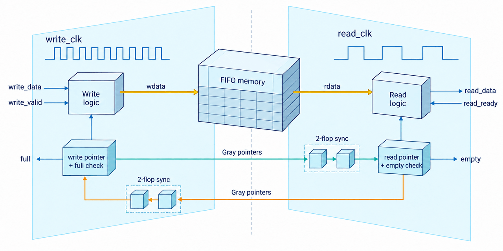

# 5. Cross Clock Domains and Test Both Flows {#chapter-5}

The FIFO uses a conventional Gray-pointer CDC architecture. The new material
is how CppHDL assigns methods to clocks, how a native test schedules coincident
edges, and how one C++ test can exercise both native and generated RTL models.
The FIFO is tested separately from chapter 4's adapters.

## 5.1 Separate the architecture from its C++ execution {#section-5-1}

Use `write_clk` for writes and `read_clk` for reads. Replace chapter 3's shared
occupancy count with local pointers and synchronized remote pointers; retain
16-bit memory words. The two-clock adapter applies Rule 3 to coincident edges.

## 5.2 Scope of this example {#section-5-2}

The example implements a memory-backed FIFO with two-stage pointer
synchronizers. CppHDL examples for single-bit, toggle, and mailbox crossings
are in [TwoClocksCdc.cpp](../tests/cdc/TwoClocksCdc.cpp). CppHDL does not choose
a CDC architecture for you or simulate analog metastability.

## 5.3 Give every register one clock owner {#section-5-3}

For 16 rows, use four address bits and five-bit binary/Gray pointers.
The diagram shows which clock updates each pointer and synchronizer:

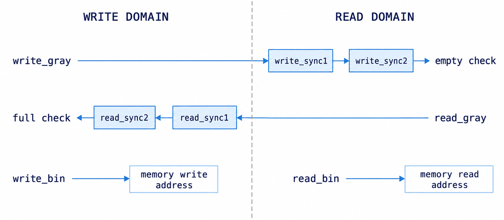

Each side uses its own clock to update the synchronizers shown next to its check.
In the code, `read_sync1/2` are **write-clocked** registers sampling the read
pointer; `write_sync1/2` are **read-clocked** registers sampling the write
pointer. Their names identify the information being synchronized, not the
clock that drives them.

Use this table to review both the C++ methods and generated edge blocks:

| Clock | What it updates |
| --- | --- |
| Write clock | Write binary/Gray pointers, read-pointer synchronizer stages, write release pipeline, memory write port |
| Read clock | Read binary/Gray pointers, write-pointer synchronizer stages, read release pipeline |
| Neither | Ready, valid, and the oldest word are calculated combinationally; they are not separate registers |


## 5.4 Map the pointer equations to the listing {#section-5-4}

Each clock domain sends a Gray-coded pointer to the other domain. Calculate
that pointer from the local binary pointer with:

```text
gray = binary XOR (binary >> 1)
```

The empty test compares `read_gray_reg` with `write_sync2_reg`. The full test
compares `write_gray_reg` with `read_sync2_reg` after inverting its top two bits.
The full mask is `0b11000` for this depth and extra-wrap-bit scheme.
These comparisons use current synchronizer values, as specified by Rule 2.

## 5.5 Decide how both sides reset and restart {#section-5-5}

During reset, the test calls `_work_write_clk(true)` on write-clock edges and
`_work_read_clk(true)` on read-clock edges. Both sides reset their pointers,
which discards the queued data.

Reset takes effect on each side's clock edge. Keep it high long enough for
both clocks to sample it; the test counts no transfers during reset. After
reset goes low, each side uses a two-bit register to delay transfers by two
local edges:

| Local edge after reset goes low | Value read by work | Value after strobe | Result |
| --- | --- | --- | --- |
| First | `00` | `01` | Local pointers remain reset |
| Second | `01` | `11` | Pointers stay at zero; bit 1 now permits transfers on later edges |
| Third | `11` | `11` | A handshake can advance the local pointer |

Work reads the current register value, so it allows transfers starting with
the third edge, subject to ready and valid. This example does not support
resetting only one side. If a clock stops, that side cannot reset until the
clock restarts. Section 5.7 shows handlers for asynchronous reset instead.

## 5.6 Implement the two-clock FIFO {#section-5-6}

We can now combine the pointer checks, memory access, and reset logic into
`AsyncSamples`. Its write method accepts words on write-clock edges; its read
method removes words on read-clock edges. The test uses these handshake
conditions to decide which transfers to check:

| Local edge | Acceptance expression outside reset |
| --- | --- |
| Write rising edge | `write_valid_in() && write_ready_out()` |
| Read rising edge | `read_valid_out() && read_ready_in()` |


The method suffix selects the clock: `_work_write_clk` and
`_strobe_write_clk` form the write-clock pair; the `_read_clk` pair handles
the read side. Their responsibilities are unchanged from Rules 2 and 3.
Section 5.7 shows how to declare these clocks to the converter.
The write method tests `write_release_reg[1]`; the read method tests
`read_release_reg[1]`. Each keeps its pointers at zero while that bit is zero.

CppHDL passes the `ASYNC_REG` comments into generated RTL attributes, including
those on the release pipelines. They do not change native simulation behavior.

`read_data_comb_func()` reads memory only when `read_valid_comb_func()` returns
true; otherwise it returns zero. These are combinational reads, not
synchronous block-RAM reads.

**File: `AsyncSamples.h`**

```cpp
#pragma once
#include <cpphdl.h>
using namespace cpphdl;

class AsyncSamples : public Module
{
public:
    _PORT(bool) write_valid_in;
    _PORT(logic<16>) write_data_in;
    _PORT(bool) write_ready_out = _ASSIGN_COMB(write_ready_comb_func());
    _PORT(bool) read_ready_in;
    _PORT(bool) read_valid_out = _ASSIGN_COMB(read_valid_comb_func());
    _PORT(logic<16>) read_data_out = _ASSIGN_COMB(read_data_comb_func());

private:
    static constexpr size_t DEPTH = 16;
    static constexpr size_t ADDR_BITS = 4;
    static constexpr size_t PTR_BITS = ADDR_BITS + 1;
    memory<u8, 2, DEPTH> storage;

    reg<u<PTR_BITS>> write_bin_reg;
    reg<u<PTR_BITS>> write_gray_reg;
    // (* ASYNC_REG = "TRUE" *)
    reg<u<PTR_BITS>> read_sync1_reg;
    // (* ASYNC_REG = "TRUE" *)
    reg<u<PTR_BITS>> read_sync2_reg;
    // (* ASYNC_REG = "TRUE" *)
    reg<u<2>> write_release_reg;

    reg<u<PTR_BITS>> read_bin_reg;
    reg<u<PTR_BITS>> read_gray_reg;
    // (* ASYNC_REG = "TRUE" *)
    reg<u<PTR_BITS>> write_sync1_reg;
    // (* ASYNC_REG = "TRUE" *)
    reg<u<PTR_BITS>> write_sync2_reg;
    // (* ASYNC_REG = "TRUE" *)
    reg<u<2>> read_release_reg;

    bool write_ready_comb;
    bool& write_ready_comb_func()
    {
        write_ready_comb = ((uint32_t)write_release_reg & 2u) != 0
            && write_gray_reg !=
                (read_sync2_reg ^ u<PTR_BITS>((1u << ADDR_BITS)
                    | (1u << (ADDR_BITS - 1))));
        return write_ready_comb;
    }

    bool read_valid_comb;
    bool& read_valid_comb_func()
    {
        read_valid_comb = ((uint32_t)read_release_reg & 2u) != 0
            && read_gray_reg != write_sync2_reg;
        return read_valid_comb;
    }

    logic<16> read_data_comb;
    logic<16>& read_data_comb_func()
    {
        read_data_comb = 0;
        if (read_valid_comb_func()) {
            read_data_comb = (logic<16>)storage[
                (uint32_t)read_bin_reg & (uint32_t)(DEPTH - 1)];
        }
        return read_data_comb;
    }

public:
    void _assign() {}

    void _work_write_clk(bool reset)
    {
        u<PTR_BITS> next;
        if (reset) {
            write_release_reg._next = 0;
        }
        else {
            write_release_reg._next = (write_release_reg << 1) | 1;
        }
        if (reset || ((uint32_t)write_release_reg & 2u) == 0) {
            write_bin_reg._next = 0;
            write_gray_reg._next = 0;
            read_sync1_reg._next = 0;
            read_sync2_reg._next = 0;
        }
        else {
            read_sync1_reg._next = read_gray_reg;
            read_sync2_reg._next = read_sync1_reg;
            if (write_valid_in() && write_ready_comb_func()) {
                storage[(uint32_t)write_bin_reg & (uint32_t)(DEPTH - 1)]
                    = write_data_in();
                next = write_bin_reg + 1;
                write_bin_reg._next = next;
                write_gray_reg._next = next ^ (next >> 1);
            }
        }
    }

    void _strobe_write_clk()
    {
        storage.apply();
        write_release_reg.strobe();
        write_bin_reg.strobe();
        write_gray_reg.strobe();
        read_sync1_reg.strobe();
        read_sync2_reg.strobe();
    }

    void _work_read_clk(bool reset)
    {
        u<PTR_BITS> next;
        if (reset) {
            read_release_reg._next = 0;
        }
        else {
            read_release_reg._next = (read_release_reg << 1) | 1;
        }
        if (reset || ((uint32_t)read_release_reg & 2u) == 0) {
            read_bin_reg._next = 0;
            read_gray_reg._next = 0;
            write_sync1_reg._next = 0;
            write_sync2_reg._next = 0;
        }
        else {
            write_sync1_reg._next = write_gray_reg;
            write_sync2_reg._next = write_sync1_reg;
            if (read_ready_in() && read_valid_comb_func()) {
                next = read_bin_reg + 1;
                read_bin_reg._next = next;
                read_gray_reg._next = next ^ (next >> 1);
            }
        }
    }

    void _strobe_read_clk()
    {
        read_release_reg.strobe();
        read_bin_reg.strobe();
        read_gray_reg.strobe();
        write_sync1_reg.strobe();
        write_sync2_reg.strobe();
    }
};
```

## 5.7 Relate the methods to generated RTL {#section-5-7}

Generate SystemVerilog with separate write-clock and read-clock processes.
Pass both clock names and frequencies to the converter so it can match them
to the methods in `AsyncSamples`:

```sh
"$CPPHDL" "$BOOK/AsyncSamples.h" \
    --generated-dir="$BOOK/sv_async" \
    --primary_clock write_clk 100000000 \
    --secondary_clock read_clk 71428571 -- \
    -I"$CPPHDL_SRC/include"
```

Declare the fastest clock as primary. Declaring any secondary clock also
requires an explicit primary declaration. Frequencies are in Hz; the read
frequency here corresponds approximately to a 14 ns period. The testbench
still determines the exact edge times and reset duration.

For a multi-clock design the positive-edge pair
`_work_<clock>(bool reset)` and `_strobe_<clock>()` is required for each declared
clock. Optional negative-edge pairs use `_work_neg_<clock>` and
`_strobe_neg_<clock>` for registers updated on falling edges.

Inspect `AsyncSamples.sv`. It should have clock ports and separate blocks with
these sensitivities:

```systemverilog
always_ff @(posedge write_clk)
always_ff @(posedge read_clk)
```

These fragments show which edge triggers each block; they are not complete
blocks. Each generated block calls the work task for that clock and applies
the resulting register updates. Only the write-clock process writes to `storage`.

### Integrating the earlier modules

Clock names currently apply to the whole design; the converter does not map
different child clock names to parent clock names. To add the earlier stage
to this design, give it and its descendants methods for both `write_clk` and
`read_clk`.

For a stage that uses only `write_clk`, put its existing calculations and
register updates in the write-clock methods and leave its read-clock methods
empty. Do the reverse for a component that uses only `read_clk`. The parent's
`_work_write_clk()` calls the children's `_work_write_clk()` methods, and so on
for the other three methods, in Rule 3's order.

Use `assignIf` for connections within each clock domain, not to replace the
FIFO between domains. It connects signals but adds no synchronizers.

### When true asynchronous assertion is required

The current FIFO resets only on clock edges. To reset it even when a clock
is stopped, add an asynchronous reset handler for each domain. The write-side
handler assigns the reset values without waiting for a write-clock edge:

```cpp
void _reset_pos_write_clk()
{
    write_bin_reg._next = 0;
    write_gray_reg._next = 0;
    read_sync1_reg._next = 0;
    read_sync2_reg._next = 0;
    write_release_reg._next = 0;
}
```

This is an optional modification, **not part of the tested FIFO listing**.
A corresponding read-domain handler must reset every register updated by the
read clock. The converter adds `posedge reset` to the clocked block's sensitivity
list, so the block also runs when reset rises. It then calls either the reset
handler or the normal work task. The `pos` in the method name describes the
clock edge, not the reset's polarity; the reset signal is active-high.

For asynchronous reset, the C++ test uses these calls:

| Event | What the C++ test calls |
| --- | --- |
| Reset rises, with or without a clock edge | Call all affected reset handlers, then their strobes |
| Clock edge while reset remains high | Call that clock's reset handler instead of work, then strobe |
| Reset falls | No work or strobe call from deassertion alone |

If reset rises for both sides, call both reset handlers, then both strobe
methods, following Rule 3's call order.

The fragment belongs inside `AsyncSamples` and requires the adapter changes
in this table. The complete listings and commands continue to test clocked
reset, not this alternative.

Keep the two-stage release delay on each side and reset both sides together.
Making reset asynchronous does not make it safe to reset only one side. See
[the asynchronous reset tests](../tests/reset/AsyncReset.cpp) and
[the specification](spec.md#asynchronous-reset) for the complete API behavior.

## 5.8 Run the same transfer test against C++ and SystemVerilog {#section-5-8}

Native execution tests the C++ model. Verilator execution tests the generated
SystemVerilog. Running both is valuable because a working native model alone
does not establish that conversion preserved widths, direction, reset, or
scheduling.

The `TestModel` class below provides the same methods for either implementation:

- For the native model, it changes the C++ variables bound to input ports and reads outputs through port getters.
- For the Verilated model, inputs and outputs are generated class members; `eval()` evaluates the RTL after inputs change.
- The stimulus, expected-data queue, and assertions are shared.

Defining `VERILATOR` selects the generated `VAsyncSamples` class; otherwise,
the adapter instantiates `AsyncSamples` directly. The host scoreboard needs
no simulator-specific code.

The test uses `t % 10 == 0` for write-clock rising edges and `t % 14 == 0`
for read-clock rising edges. Both conditions are true every 70 ns.

`wr` and `rd` select which work methods to call. `wlevel` and `rlevel` hold the
clock levels assigned to the Verilated model. The loop increments `t` by one
nanosecond per iteration. It lowers the Verilator clock inputs between rising
edges; the native model has no falling-edge methods in this example.

`TestModel` implements [Rule 3](#rule-3-call-work-and-strobe-methods-through-all-hierarchy-to-make-a-clock-tick)
for both models:

| Step | Native CppHDL | Verilated RTL |
| --- | --- | --- |
| Drive inputs | Update bound variables and advance `_system_clock` | Assign input members and call `eval()` |
| Observe transfers | Read port getters before work | Read output members before changing clocks |
| Apply edges | Call selected work methods, then selected strobes; advance `_system_clock` | Assign both clock levels, then call `eval()` once |

For example, when `wr` and `rd` are both true, `edges()` calls write work,
read work, write strobe, then read strobe.

Reset is active for `0 <= t < 35` and `1800 <= t < 1835`, covering both clocks.
At the second reset, the test checks that words remain queued, then clears
`expected`, the transfer counts, `saw_full`, and `saw_empty`. Afterward, the
test requires 512 words in order and checks that the FIFO became both full
and empty. It runs these assertions against each model.

When both handshakes occur at one timestamp, the scoreboard checks and removes
its oldest expected word before adding the newly written word. Otherwise, that
new word might incorrectly satisfy a read when the FIFO had actually been empty.

**File: `async_test.cpp`**

```cpp
#include <cassert>
#include <cstdint>
#include <cstdio>
#include <deque>

#ifdef VERILATOR
#include "VAsyncSamples.h"
#else
#include "AsyncSamples.h"
long _system_clock = -1;
#endif

class TestModel
{
#ifdef VERILATOR
    VAsyncSamples dut;
#else
    AsyncSamples dut;
    bool write_valid = false;
    cpphdl::logic<16> write_data = 0;
    bool read_ready = false;
#endif

public:
    TestModel()
    {
#ifdef VERILATOR
        dut.write_clk = 0;
        dut.read_clk = 0;
#else
        dut.write_valid_in = _ASSIGN(write_valid);
        dut.write_data_in = _ASSIGN_REG(write_data);
        dut.read_ready_in = _ASSIGN(read_ready);
        dut._assign();
#endif
    }

    void drive(bool reset, bool valid, uint16_t data, bool ready)
    {
#ifdef VERILATOR
        dut.reset = reset;
        dut.write_valid_in = valid;
        dut.write_data_in = data;
        dut.read_ready_in = ready;
        dut.eval();
#else
        (void)reset;
        write_valid = valid;
        write_data = data;
        read_ready = ready;
        ++_system_clock;
#endif
    }

    bool can_write()
    {
#ifdef VERILATOR
        return dut.write_ready_out;
#else
        return dut.write_ready_out();
#endif
    }

    bool can_read()
    {
#ifdef VERILATOR
        return dut.read_valid_out;
#else
        return dut.read_valid_out();
#endif
    }

    uint16_t data()
    {
#ifdef VERILATOR
        return dut.read_data_out;
#else
        return (uint16_t)dut.read_data_out();
#endif
    }

    void edges(bool reset, bool wr, bool rd, bool wlevel, bool rlevel)
    {
#ifdef VERILATOR
        (void)wr;
        (void)rd;
        dut.write_clk = wlevel;
        dut.read_clk = rlevel;
        dut.eval();
#else
        (void)wlevel;
        (void)rlevel;
        if (wr) dut._work_write_clk(reset);
        if (rd) dut._work_read_clk(reset);
        if (wr) dut._strobe_write_clk();
        if (rd) dut._strobe_read_clk();
        ++_system_clock;
#endif
    }
};

static uint16_t pattern(unsigned n)
{
    return (uint16_t)((n * 73u) ^ 0xa55au);
}

int main()
{
    TestModel model;
    std::deque<uint16_t> expected;
    unsigned sent = 0;
    unsigned received = 0;
    bool saw_full = false;
    bool saw_empty = false;
    bool wlevel = false;
    bool rlevel = false;

    for (unsigned t = 0; t < 30000; ++t) {
        const bool reset = t < 35 || (t >= 1800 && t < 1835);
        const bool wr = t % 10 == 0;
        const bool rd = t % 14 == 0;
        if (t == 1800) {
            assert(!expected.empty());
            expected.clear();
            sent = received = 0;
            saw_full = saw_empty = false;
        }
        const bool valid = !reset && sent < 512;
        const bool ready = !reset && t >= 500 && t % 98 >= 28;
        model.drive(reset, valid, pattern(sent), ready);

        // Observe the old state before either domain commits this timestamp.
        if (!reset) {
            const bool push = wr && valid && model.can_write();
            const bool pop = rd && ready && model.can_read();
            if (wr && valid && !model.can_write() && expected.size() == 16) {
                saw_full = true;
            }
            if (rd && !model.can_read()) saw_empty = true;
            if (pop) {
                assert(!expected.empty());
                assert(model.data() == expected.front());
                expected.pop_front();
                ++received;
            }
            if (push) {
                expected.push_back(pattern(sent));
                ++sent;
            }
        }

        if (wr) wlevel = true;
        else if (t % 10 == 5) wlevel = false;
        if (rd) rlevel = true;
        else if (t % 14 == 7) rlevel = false;
        model.edges(reset, wr, rd, wlevel, rlevel);

        if (t > 1835 && sent == 512 && received == 512) {
            assert(expected.empty() && saw_full && saw_empty);
            std::puts("PASS: 512 ordered words after coordinated reset");
            return 0;
        }
    }
    std::fputs("FAIL: CDC queue did not drain\n", stderr);
    return 1;
}
```

## 5.9 Build and run both flows {#section-5-9}

First compile and execute the native model:

```sh
g++ -std=c++17 -O2 -I"$CPPHDL_SRC/include" \
    "$BOOK/async_test.cpp" -o "$BOOK/async_native"
"$BOOK/async_native"
```

Then generate RTL with the command in section 5.7 and build the Verilated model:

```sh
verilator --cc --exe --build -j 2 \
    --top-module AsyncSamples --Mdir "$BOOK/obj_async" \
    -Wno-fatal \
    "$BOOK/sv_async/Predef_pkg.sv" \
    "$BOOK/sv_async/AsyncSamples.sv" \
    "$BOOK/async_test.cpp" \
    -CFLAGS "-std=c++17 -DVERILATOR" \
    -MAKEFLAGS "CXX=g++ LINK=g++"
"$BOOK/obj_async/VAsyncSamples"
```

Use an absolute path to the testbench because Make runs the generated build
rules from the object directory. `CXX=g++ LINK=g++` selects the compiler and
linker driver. Omit this override if Verilator is already configured with the correct compiler,
or substitute your supported compiler.

Both successful runs print:

```text
PASS: 512 ordered words after coordinated reset
```

These commands run both models, unlike the lint-only RTL commands in earlier
chapters. For automation, register separate native and RTL CTest entries and
regenerate the RTL and rebuild its executable after changes. Passing both
tests shows that both models satisfy these assertions for these inputs; it
does not prove equivalence for all inputs.

### Read warnings instead of hiding them

During validation with Verilator 5.050, this CDC example produced
`MULTIDRIVEN` diagnostics on converter-generated `*_tmp` next-state variables
assigned in both a work task and the clocked block that calls it. The C++ and
RTL tests passed with `-Wno-fatal`, which allows simulation despite warnings.
That is **not a warning-free lint result or approval of the physical CDC implementation**.

The command keeps diagnostics visible rather than disabling their warning
class. For each reported assignment, check which clock is supposed to update
that register, using the table in section 5.3. If two domains really do write
one register, fix the design. The warnings about these generated temporary
variables are not a reason to ignore other multiple-driver warnings.

## 5.10 What this test checks, and what to add next {#section-5-10}

Before reusing this FIFO, distinguish what the supplied test checks from what
still needs testing. The table links each covered behavior to its stimulus or
assertion; the suggestions below cover additional cases.

| What we check | How the test checks it |
| --- | --- |
| Edges occurring separately and together | Use 10 ns and 14 ns periods; sample both handshakes before applying coincident edges |
| The writer must wait when full | Write faster than reading; delay and periodically pause reads |
| Reads after starting empty | Resume after reset and wait for the write pointer to reach the read domain |
| Words arrive intact and in order | Compare received words with the expected-data queue |
| Pointers wrap correctly | Transfer hundreds of words through 16 slots |
| Reset discards pending data | Reset both sides while words remain queued, then check the restarted run |
| C++ and RTL pass the same checks | Run the same assertions with each model |

Before using the FIFO in a product, also test a faster reader, clocks that
start at different times, clocks paused around reset, and other supported
depths and widths. Let the source pause between words, and vary the length of
consumer pauses randomly. Add an assertion that output valid stays asserted
and output data stays unchanged while the consumer is blocked.
These are useful extensions, not claims about what the listing already tests.

CppHDL adds no exemption from normal CDC signoff: metastability, placement,
timing constraints, reset safety, and memory implementation still require
the usual physical-design checks.

**Check your CppHDL understanding:** Which methods must run when two clocks
rise together? Which additional testbench calls would asynchronous reset need?
Why does passing the native test not validate the converter output?

\clearpage

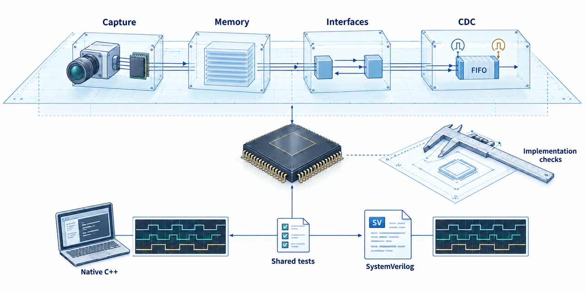

# 6. Conclusion to Part I {#chapter-6}

The circuits are conventional RTL. We compiled their C++ descriptions with
testbenches, wrote output values to VCD, added a counter through inheritance,
and ran the same FIFO test against C++ and generated SystemVerilog.

The benefit is access to C++ types, compilers, analysis tools, and software test
environments without maintaining a separate behavioral model. Follow the
work/strobe call order, test the generated RTL, and retain the usual synthesis
and CDC checks.

The next part keeps this RTL contract at module boundaries but lets an HLS
scheduler implement selected C++ methods inside those modules.

\clearpage

# Part II. Schedule C++ Algorithms and Synthesize Hardware {.unnumbered}

Lets now study how to use High Level Synthesis capabilities of cpphdl toolkit
with High Frequency Trading application as an example. The calculations are
easier to develop as C++ methods than as a
handwritten FSM. Their implementation must nevertheless accept consecutive
input words, preserve packet boundaries, and wait when an output is blocked.

Chapter 7 chooses the method boundaries and execution contracts. Chapter 8
uses those contracts to build a longer pipeline for a requested clock period.
Chapter 9 develops the source-level design choices, with before/after examples.
Neither scheduling nor retiming makes a store-and-scan packet algorithm into
a streaming design automatically: the C++ must expose work that can overlap.

\clearpage

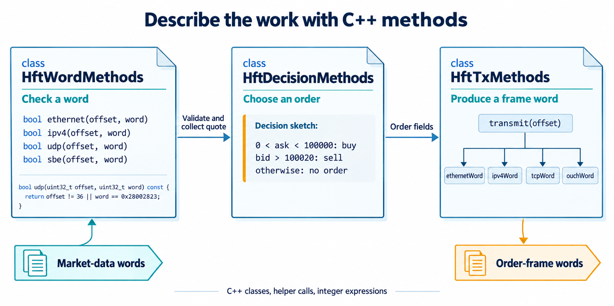

# 7. HLS Principles {#chapter-7}

High Level Synthesis (HLS) turns an algorithm into a hardware implementation.
You write calculations, conditions, loops, and helper methods in C++ instead
of assigning every operation to a clock and writing the corresponding RTL
control logic.

The central task is **scheduling data dependencies**. For `y = (a + b) * c`,
the multiplication needs the addition's result. They may execute as one
combinational chain, or in separate stages with a register holding the sum.
In the latter case, the matching value of `c` must also reach the multiplication
stage. Independent calculations may run in parallel.

Make two decisions separately: **how calls execute** and **how data is stored
and accessed**. Section 7.1 explains the two execution modes. Section 7.2
describes the memory types and their access contracts. We then apply both
choices to the HFT example.

HLS constructs the initial control logic and pipeline. Optional synthesis
retiming uses delay estimates to adjust register boundaries; chapter 8 covers
that step. HLS can also emit scheduled SystemVerilog without CppHDL synthesis.

## 7.1. HLS modes {#hls-modes}

CppHDL has two HLS execution modes:

- **Delayed execution, `ClockedDelayer<T>`:** one invocation runs at a time.
  Each new call sees the preceding call's completed state changes. Use it for
  dependent updates, loops, and ordered control work.
- **Pipelined execution, `ClockedPipeline<T, STAGES>`:** calls overlap in
  successive stages. Use it for a stream of independent calculations or
  deliberately latency-tolerant feedback.

These modes choose the relationship between calls, not a guaranteed clock
frequency. Delayed execution favors sequential behavior; pipelined execution
favors throughput and permits delayed feedback to change stateful behavior.
Both use an ordinary C++ class with a `command()` entry method.
Include `hls/Clocked.h` for the wrappers.

First, separate three measurements:

- **Clock period:** the time available for the logic between register edges.
- **Latency:** how many clocks an accepted command takes to produce a result.
- **Initiation interval (II):** how often another command can be accepted.

A deep pipeline can have long latency and still accept one command every
clock. A short calculation can have low latency yet wait for its response to
be consumed before accepting another command. None of the template names
alone guarantees a physical clock frequency.

### The common connection contract

The parent supplies `operation_in`, `index_in`, and `value_in`, plus
`command_valid_in`. The method chooses what these three arguments mean.
`command_ready_out` reports whether the wrapper can accept them. Acceptance
occurs at the edge where both command-valid and command-ready are high.

The wrapper returns `result_out` and `fault_out` with `response_valid_out`.
The parent supplies `response_ready_in`; the response transfers at an edge
where both response signals are high. Keep an offered command stable until
accepted. A blocked response remains valid with its payload unchanged.
Check the fault with the response rather than treating every result as valid
application data. Reset cancels in-flight work.

Connect these signals once in the parent's `_assign()` and call the child's
work and strobe methods through the hierarchy, as in Part I. The illustrations
below show the generated hardware, not the native wrapper's implementation.
For a delayed worker, the rectangles identify execution roles, not one
clock per rectangle. For a pipeline, the rectangles are successive stages.

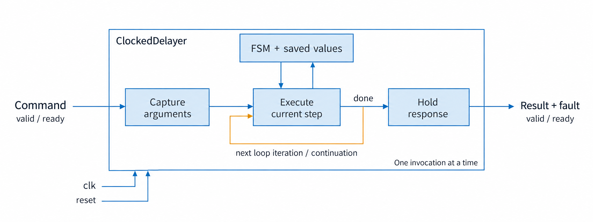{width=90%}

### `ClockedDelayer`: finish one operation before starting another

**Purpose.** Use this wrapper for algorithms whose next call must see the
completed state changes of the previous call. Examples include updating a
container, traversing a tree, or running a loop that accumulates a result.
These are ordered transactions rather than independent stream words.

**Hardware structure.** The scheduler creates control state that selects the
current continuation of the C++ method. Arithmetic and conditions between
clock boundaries form combinational logic. A loop resumes on later clocks;
values still needed then are retained in storage across those boundaries.
Straight-line helper calls can belong to the same clock step. The hardware
does not execute one C++ statement per clock or maintain a CPU call stack.

Consider a worker that adds four values to a persistent total:

```cpp
struct AccumulateFour {
    uint32_t total = 0;
    uint64_t command(uint32_t first, uint32_t step, uint32_t unused) {
        for (uint32_t i = 0; i < 4; ++i)
            total += first + i * step;
        return total;
    }
};
cpphdl::hls::ClockedDelayer<AccumulateFour> accumulator;
```

**Execution and feedback.** After reset, command `(1, 1, 0)` adds
1 + 2 + 3 + 4 and returns 10. A later command `(10, 1, 0)` starts with that
total, adds 10 + 11 + 12 + 13, and returns 56. Its iterations use the updated
total from preceding iterations. No second invocation runs against an
unfinished first invocation.

The controller captures a command, executes the scheduled steps, and holds
the response for the consumer. While executing or holding an unconsumed
response it cannot start the next command. Loop tests, memory operations,
and entry/exit control affect the exact latency; four source iterations are
not a promise of four clocks for the entire command.

**Benefits.** Sequential state dependencies remain straightforward. Loops,
supported containers, and bounded recursion can be represented without
handwriting their control FSMs. Resources used in successive steps can be
reused where the scheduler supports sharing; concurrent invocations do not
require separate in-flight state.

**Costs and limits.** One active command limits throughput. Long acyclic
calculations between suspension points can limit frequency because the
delayed scheduler does not automatically balance them to a timing target.
Sharing hardware can save area, but one active call does not guarantee a
single shared arithmetic unit for every expression. Inspect the implementation.
This is suitable for ordered control work, not a stream that requires a
new command every clock. It preserves supported transaction behavior, not the
execution time of native C++.

#### Parameters and native testing

For the example above, `ClockedDelayer<AccumulateFour>` uses the default
parameters. `T` supplies
`uint64_t command(uint32_t, uint32_t, uint32_t)`. The three inputs become
`operation_in`, `index_in`, and `value_in`; the method chooses their meaning.

The second parameter, `MAX_RECURSION`, is a compile-time bound from 0 to 16.
Zero rejects recursive calls. A nonzero bound permits finite expansion/sharing
by call depth; exceeding it reports a hardware fault, not an unbounded stack.
The remaining parameters select storage and are described together in
section 7.2.

The native wrapper executes a whole C++ command as a transaction. Generated
RTL executes its scheduled steps. Compare transaction results, not native and
RTL cycle counts, for this wrapper.

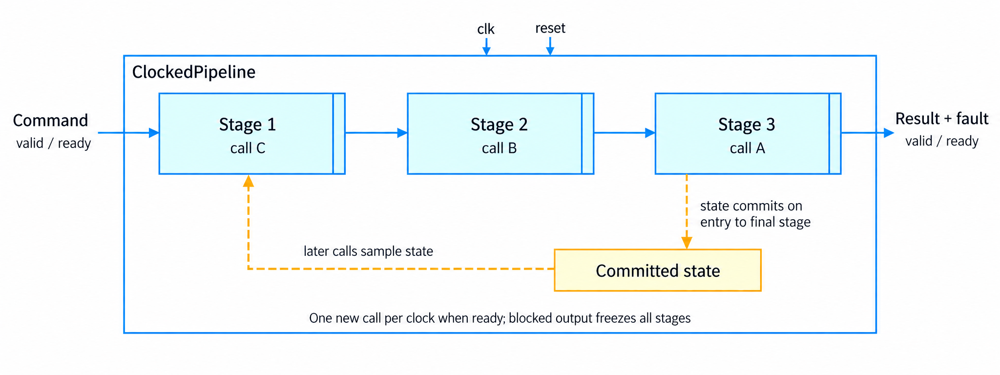{width=90%}

### `ClockedPipeline`: overlap independent calculations

**Purpose.** Use this wrapper when new input work should enter before earlier
work has produced its result. Word parsing, arithmetic transforms, and
explicitly indexed formatting are suitable when calls are independent or
their feedback is deliberately latency-tolerant.

**Hardware structure.** HLS splits the method's operation graph across the
requested stages. Each stage contains combinational logic and register
boundaries that retain intermediate data, predicates, and validity. At a
given clock, stage 1 can process call C while stages 2 and 3 process B and A.
The generated hardware computes different parts of those calls concurrently;
it does not calculate everything first and merely delay the answer.

For a small stateless example, add a bias and multiply by a gain:

```cpp
struct ScaleValue {
    uint64_t command(uint32_t bias, uint32_t gain, uint32_t value) {
        return (uint64_t(value) + bias) * gain;
    }
};
cpphdl::hls::ClockedPipeline<ScaleValue, 3> scaler;
```

The cast makes the addition and product unsigned 64-bit calculations;
overflow follows that type's modulo arithmetic. HLS decides the initial
placement of operations. The three stages do not prescribe an adder in one
particular stage or divide a multiplier into three equal pieces. Timing-driven
cuts inside arithmetic are a separate synthesis step.

**Execution.** Offer A = `(1, 2, 10)`, B = `(1, 2, 20)`, and
C = `(1, 2, 30)` on consecutive ready clocks. Their results are 22, 42, and 62.
With no stalls, the following is the pipeline state **after** each edge:

| Edge | Stage 1 | Stage 2 | Output stage |
| --- | --- | --- | --- |
| 1 | A | empty | empty |
| 2 | B | A | empty |
| 3 | C | B | A: 22 |
| 4 | next call | C | B: 42 |
| 5 | next call | next call | C: 62 |

A result that becomes visible after edge 3 can transfer on edge 4 when the
consumer is ready. Latency to output-valid is three edges including admission;
the interval between consecutive output results is one clock. Empty input
cycles become bubbles. If a valid output is blocked, the whole pipeline
freezes and command-ready falls; no stage overwrites a blocked result.

**Feedback.** Stateless `ScaleValue` has none. For a stateful method, each
admitted call reads the currently committed object state and carries a
candidate update through the pipeline. That update commits when the result
enters the final stage, not when the consumer eventually removes it. A call
admitted on the commit edge still reads the old state.

For example, consider a method that increments persistent state:

```cpp
struct Counter {
    uint32_t count = 0;
    uint64_t command(uint32_t, uint32_t, uint32_t) {
        return ++count;
    }
};
```

With `ClockedPipeline<Counter, 3>`, three consecutive admissions can all
return 1: they sampled the same committed zero before any update became
visible. `ClockedDelayer<Counter>` would produce 1, 2, 3 on three completed
calls. This is **relaxed, or floating, feedback**. Pipeline updates are
whole-object snapshots; overlapping calls have neither automatic forwarding
nor a field-wise merge. Extra retiming stages delay this feedback further.

**Benefits.** With ready consumers, II=1 gives one accepted command per clock.
Splitting combinational work can support a shorter clock period, and
`fit_pipeline_retiming` can add timing-driven stages while retaining the
streaming interface. Stateless or suitably structured methods remain ordinary
C++ algorithms with a clear native reference.

**Costs and limits.** Live operands, tags, and candidate state consume pipeline
registers. More stages increase latency and may increase area. Floating
feedback can change stateful results, not just delay them. Loops, recursion,
dynamic allocation, and scheduled-memory operations are currently rejected
in this wrapper. A blocked output stops every stage. Use explicit RTL for an
immediate per-word recurrence, or a delayed worker when calls must wait for
each preceding update.

The supported source subset includes integer expressions, branches, and
straight-line helper calls. Static locals and mutable globals are rejected;
persistent object state must be trivially copyable with constant initialization.
Unsupported code does not silently switch to delayed scheduling.

#### Parameters and native testing

For the arithmetic example, the complete declaration is:

```cpp
cpphdl::hls::ClockedPipeline<ScaleValue, 3, uint32_t, uint64_t> scaler;
//                         T, stages, Argument, Result
```

`STAGES` is 1..64 and defaults to 2. It specifies initial depth, not a timing
target. Each of the three arguments has type `Argument`, and `command` must
return `Result`. Supported types are unsigned native integers of 8, 16, 32,
64, or 128 bits; 128-bit native execution needs compiler support for
`__uint128_t`. Structs are not accepted as this entry signature; pack fields
into supported integers or handle the struct in the surrounding RTL.

For example, the integer-LLM example preserves the full product width with
`ClockedPipeline<Product, 4, uint64_t, __uint128_t>`. A wider result does not
mean that every intermediate automatically becomes wide: C++ expression types
still determine arithmetic width.

Without stalls, a result reaches the output after `STAGES` rising edges,
counting its acceptance edge. When a valid output is blocked, all stages
freeze and command-ready falls. The native wrapper models this latency and
backpressure; it computes each result at admission, while generated RTL
distributes the actual calculations among stages. Synthesis can add further
stages, as chapter 8 explains.

### Choose the execution mode

Use `ClockedDelayer` when a new call must wait for the preceding state update.
Use `ClockedPipeline` when calls can overlap. A pipeline can accept work every
clock, but its additional stages do not preserve immediate feedback.

`Clocked<T, ...>` is the compatibility spelling of
`ClockedDelayer<T, ...>`, with identical parameters and implementation.
It is not another execution mode. The memory wrapper introduced next also
uses delayed scheduling.

## 7.2. Memory types {#hls-memory-types}

After choosing how calls execute, choose how their data is accessed.
CppHDL provides the following storage contracts:

1. **Direct register storage:** local objects become register-backed storage
   or individual signals. Accesses do not require a scheduled memory-read
   cycle; dynamic indexing can require selection logic.
2. **Shared internal register memory:** addressable storage uses an internal
   port with a one-clock read contract. Accesses share that port.
3. **Shared internal block RAM:** the same scheduled port contract, with
   synchronous RAMs and a block-RAM inference attribute in ordinary generated SV.
4. **External pointer memory:** marked pointer accesses use a request/completion
   interface. An external SRAM or DDR controller determines the response delay.

Storage technology and access latency are not interchangeable: direct
register storage is not automatically a one-clock memory. Nor does a pointer
select DDR by itself. The following examples show the actual selections.

The internal-storage parameters belong to `ClockedDelayer`. They do not add
scheduled-memory support to `ClockedPipeline`; its live operands and candidate
state are carried through stage registers as described in section 7.1.

### An array used by a delayed worker

We will use the same eight-element array to compare internal storage
choices. One command writes an element; another sums the array:

```cpp
struct BatchSum {
    uint32_t values[8]{};
    uint64_t command(uint32_t operation, uint32_t index, uint32_t value) {
        if (operation == 0) {
            values[index & 7u] = value;
            return value;
        }
        uint64_t sum = 0;
        for (uint32_t i = 0; i < 8; ++i) sum += values[i];
        return sum;
    }
};
```

Place `ClockedDelayer<BatchSum>` in a parent to turn these methods into a
multicycle worker. The scheduler retains `sum` and the loop position between
iterations and continues after the loop when it finishes. Helper calls that
contain loops suspend their callers too. This is source-level scheduling, not
one CPU-like instruction per clock.

### Direct register storage

The default delayed wrapper automatically lowers addressable objects to local
register-backed storage. Known scalar values can remain individual signals;
dynamic indexing can produce a mux. This mode does not insert a memory wait
for every access. Loop boundaries still consume clocks, and a chain of direct
reads and updates can produce a long combinational path.

It permits direct access at the cost of register storage and selection logic.
Section 9.6 compares small register tables with port-based memory; a packet
array does not become BRAM merely because its C++ name contains "memory".

### Shared internal register memory

To serialize addressable accesses through the internal port, select shared
memory and leave the block-RAM option disabled:

```cpp
cpphdl::hls::ClockedDelayer<BatchSum, 0, 16, 4096, true, false> registers;
```

This has a one-clock memory-read contract and transfers up to eight bytes per
port operation. Larger accesses need successive transfers. The dependent
method statements resume when the read is available. A complete command can
therefore take many clocks even though one read takes one clock.

Unlike direct storage, accesses are scheduled through the shared port. This
limits simultaneous access but avoids requiring a separate access path for
every source expression. The storage remains register-backed.

### Shared internal block RAM

To request block-RAM inference with the same one-clock port contract, enable
both shared memory and block RAM:

```cpp
cpphdl::hls::ClockedDelayer<BatchSum, 0, 16, 4096, true, true> block_ram;
```

The last template argument makes the ordinary SV emitter generate synchronous
byte-lane RAMs with `ram_style = "block"`. This is the implemented selection
mechanism; an arbitrary source comment saying "BRAM" does not select it.
The annotation in generated SV requests inference from the downstream tool,
not a guaranteed physical layout. Reset restarts object initialization rather
than clearing every RAM bit.

Keep the two compilation routes distinct: ordinary HLS SV can retain these
inferred RAMs for a technology tool. CppHDL's current **generic gate mapper
expands memories into registers and muxes**. The block-RAM policy is not yet a
BRAM-macro mapping option for `--synth`.

### Internal-storage parameters

The complete delayed-wrapper declaration, in parameter order, is:

```cpp
cpphdl::hls::ClockedDelayer<BatchSum, 0, 16, 4096, false, false> worker;
//                       T, recursion, address bits, heap bytes,
//                          shared memory, block RAM
```

`T` and the recursion bound select the method and allowed call depth, as
described in section 7.1. The remaining parameters select its storage:

- **`ADDRESS_BITS`** selects 8..64-bit internal addresses, default 16. It does
  not narrow payload integers or resize C++ pointer slots in stored objects.
- **`HEAP_BYTES`** bounds allocation storage, default 4096; it must be a
  multiple of 16 between 16 and 16777216. Objects and addressable temporaries
  can require additional storage. This is not a container element count.
- **`SHARED_MEMORY`** selects a shared internal port for addressable storage
  instead of direct accesses. Scalar calculations need not use that port.
- **`BLOCK_RAM`** selects the inferred block-RAM backend of that shared port.
  It requires `SHARED_MEMORY=true`.

### Containers use the selected internal storage

A container is a C++ organization of data, not an additional memory type.
Its supported accesses use the delayed wrapper's chosen storage contract.

The delayed scheduler can also follow real `std::vector`, `std::list`,
`std::map`, `std::multimap`, and `std::unordered_map` method bodies. The
[standard-container regressions](../hls/tests/std/) use libc++ headers so those
bodies are available to the AST traversal. Missing out-of-line implementations
need an explicit supported override; successful native linking alone does not
make their bodies synthesizable.

For example, this bounded use of a vector collects eight configuration values:

```cpp
struct LimitList {
    std::vector<uint32_t> values;
    uint64_t command(uint32_t operation, uint32_t index, uint32_t value) {
        if (operation == 0) {
            if (values.size() < 8) values.push_back(value);
            return values.size();
        }
        return index < values.size() ? values[index] : 0;
    }
};
```

Include `<vector>` and choose a bounded allocation pool for its delayed
wrapper. The current generated allocator is monotonic: deletion does not
reclaim storage; reset does. Creating a container object with
`new std::vector<...>` is not supported. Section 9.9 explains how to budget
element allocations and why bounded live size alone is insufficient.

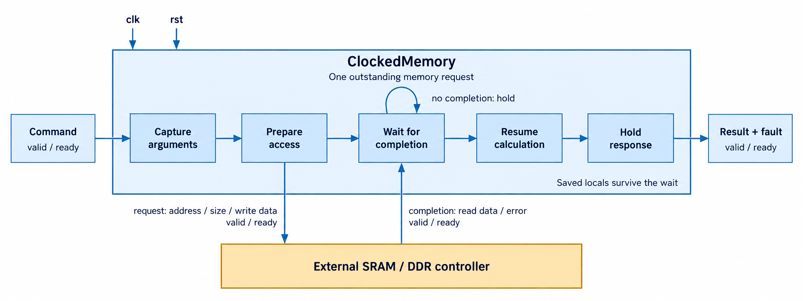{width=90%}

### External memory: `ClockedMemory` waits for pointer accesses

**Purpose.** This is the delayed execution mode with an external-memory
interface, not a third HLS mode. Use this wrapper when pointer expressions
must access an external memory controller. The controller can acknowledge a request or
return read data after a variable number of clocks. The wrapper preserves
method order across those waits rather than assuming that a dereference is
combinational or completes on the next clock.

**Hardware structure.** This is a delayed FSM with request registers,
completion handling, and saved values for the continuation. A memory access
captures its address, size, direction, and write data. After acceptance,
the worker waits without reissuing the request. A read completion supplies
the operand needed by later statements; a write also requires acknowledgement.
The external SRAM/DDR controller remains a separate component.

Here a lookup is followed by an addition:

```cpp
struct ReadAndBias {
    uint64_t command(uint32_t base, uint32_t index, uint32_t bias) {
        auto words = cpphdl::hls::external_memory<const uint32_t>(base);
        return uint64_t(words[index]) + bias;
    }
};
cpphdl::hls::ClockedMemory<ReadAndBias> reader;
```

**Execution and feedback.** With base `0x1000` and index 3, the read request
addresses byte `0x100c` and has size 4. If memory returns 7 and the captured
bias was 5, the result is 12. The addition cannot use an earlier response or
an arbitrary value while waiting. The saved bias remains 5 even if command
input pins change after their original command was accepted.

The sequence is command acceptance, request acceptance, completion acceptance,
dependent calculation, and response. These are handshake events and execution
steps, not five guaranteed consecutive clocks. Memory can respond quickly or
keep the worker waiting. The control feedback in the picture holds the
continuation until the required event; it does not admit overlapping calls
against unfinished memory operations.

**Connections.** There are two distinct interfaces. The command/response
ports connect the worker to its parent. `memory_out` connects it to a memory
controller through `assignIf`. Its request carries byte address, size, write
direction, and data; its completion carries read data and an error flag.
Both channels have independent valid/ready handshakes. An accepted write
requires exactly one completion just like a read.

**Benefits.** The algorithm retains readable pointer accesses and helper
calls while hardware explicitly handles delayed responses. Temporary values
survive a wait, operations stay ordered, and controller errors can reach
`fault_out`. The same method can be tested against a bound host buffer before
testing the bus-level implementation.

**Costs and limits.** There is one active command and one outstanding memory
request. A slow controller therefore limits throughput; adding arithmetic
pipeline stages does not hide that wait. The current interface has 32-bit
byte addresses and up to 64-bit data per access, without bursts or an implicit
cache. It supplies no AXI adapter or DDR PHY. Its untagged channel requires
coordinated reset so that an old completion cannot satisfy a new request.
Native execution accesses the host buffer directly and does not reproduce
controller latency; use RTL tests for stalls and errors.

For a throughput-oriented design, use this worker to prepare operands for
a separate `ClockedPipeline` child, with explicit buffering and ownership
between them. Section 9.10 develops that arrangement.

#### Parameters and native testing

An external-memory worker has a smaller parameter list:

```cpp
cpphdl::hls::ClockedMemory<ReadAndBias, 32> reader;
```

The second parameter is the byte-address width. Only 32 is currently supported.
Its command arguments and result have the same types as `ClockedDelayer`.
It adds `ExternalMemoryIf<32> memory_out`; it does not take the delayed
wrapper's heap, shared-memory, or block-RAM parameters.

The example above uses 32-bit elements, so indexing scales the byte address
by four. Supported integer element sizes are 1, 2, 4, and 8 bytes, naturally
aligned. A 64-bit pointer element type selects an eight-byte access, not an
arbitrarily wide DDR bus. The next subsection gives the complete interface
and native memory-binding example.

### Connect and test the external-memory interface

In `ReadAndBias`, indexing `words` creates a request and suspends the
method until completion. Ordinary local pointers do not become DDR pointers;
`external_memory<T>` marks the external address space. Pointer aliases and
helper parameters of type `cpphdl::hls::external_ptr<T>` preserve that identity.
Do not cast them to ordinary local pointers.

The current interface supports naturally aligned 1-, 2-, 4-, or 8-byte integer
accesses, including signed and const-qualified elements. It uses 32-bit byte
addresses, 64-bit data, and one outstanding request. Stores also wait for a
completion before dependent statements resume. It has no automatic bursts,
cache, timeout, allocation, or AXI controller.

At the controller-facing interface, request `valid_in`/`ready_out` accompany
`write_in`, `addr_in`, `size_in`, and `data_in`. Completion
`valid_out`/`ready_in` accompany `data_out` and `error_out`. With the wrapper's
`memory_out` orientation the directions reverse, as in chapter 4. Connect the
whole interface once with `assignIf`. The adapter to AXI4 or a read/write/busy
controller must handle its own bus protocol and byte lanes.

One accepted request must produce one completion, even for a write. Hold both
request and response payloads stable while blocked. Misalignment reports
fault 3 before a request; a controller error reports fault 5. Reset is needed
after a fault. Reset the requester and controller together and discard old
responses, because this channel has no transaction IDs.

For a native functional test, supply existing host storage first:

```cpp
uint32_t words[16]{};
words[3] = 7;
cpphdl::hls::bind_external_memory(words, sizeof(words), 0x1000);
```

The binding supplies one contiguous mapping per simulation thread. Native
execution accesses it directly; it does not model DDR waits. Check stalls,
errors, and cancellation in RTL tests, as in
[`ExternalPointer.cpp`](../hls/tests/ExternalPointer.cpp) and its SV testbench.
Keep all pointer arithmetic in bounds; the controller is responsible for
hardware range checks.

This variable-latency contract cannot run inside `ClockedPipeline`.
Section 9.10 shows a loader/compute split that waits for external data without
putting a memory wait in every input-word calculation.

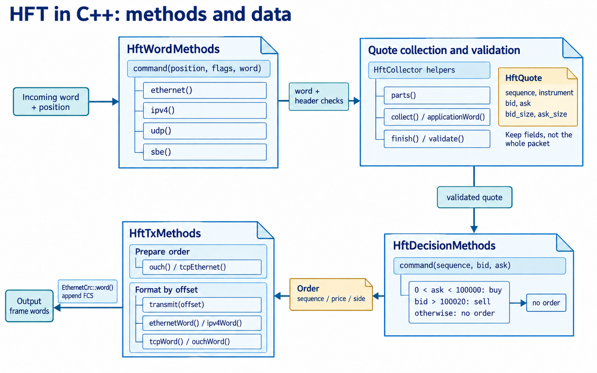

## 7.3 Follow a word through the HFT example {#section-7-3}

High-frequency trading (HFT) responds to market updates with trading decisions.
Our example receives a restricted Ethernet/IPv4/UDP feed containing an SBE
quote, checks it, and may generate an OUCH order in an Ethernet/IPv4/TCP frame.
The decision is deliberately small: buy below a price threshold or sell above
another, after validating the instrument, quantities, and sequence.

We follow the input word through the parser rather than copying a packet into
a buffer first. This is a **streaming parser with conditional response
generation**, not an unchanged Ethernet forwarding bridge. Words pass through
the parsing pipeline with their metadata; outgoing order frames are generated
separately. The full example is
[hft.cpp](../hls/examples/net/hft.cpp), with its protocol restrictions in the
[example README](../hls/examples/net/README.md).

The input carries 32 data bits, valid/ready, SOF, EOF, and a byte count. The first
wire byte occupies bits 7:0. At 315 MHz, one accepted word per clock provides
10.08 Gbit/s of raw interface capacity. This is not application payload rate:
framing, packet gaps, and output congestion also consume capacity.

The implementation divides work as follows:

- An RTL ingress stage attaches the byte offset and framing information.
- An HLS word pipeline checks the headers and passes the word onward.
- An RTL collector retains the six quote fields and validates the frame.
- An HLS decision pipeline selects an order, if any.
- A four-order FIFO decouples decisions from transmission.
- An HLS formatting pipeline produces explicitly numbered output words;
  RTL logic adds the Ethernet FCS.

Only quote fields, checksums, small descriptors, and in-flight pipeline values
are retained. There is no complete RX or TX packet array. This avoids both
store-and-scan latency and large dynamic byte selectors. Section 9.2 compares
these architectures and explains when a packet buffer is actually necessary.

## 7.4 Keep the algorithm in C++; choose its execution in the wrapper {#section-7-4}

We first write a method that checks one part of a word. This excerpt is the
UDP check from `HftWordMethods`:

```cpp
bool udp(uint32_t offset, uint32_t word) const {
    return offset != 36 || word == 0x28002823;
}
```

Byte offset 36 contains the chosen destination port and UDP length. The
constant reflects this example's byte order and fixed packet format. For
other offsets this particular check succeeds without examining the word.
The Ethernet, IPv4, and SBE helpers check their own offsets in the same way.

The class's `command` method combines these checks and returns the original
word with its metadata. The important part is that **offset is an argument**,
not a hidden cursor advanced by the parser:

```cpp
uint64_t command(uint32_t position, uint32_t flags, uint32_t word) {
    uint32_t offset = position >> 16;
    uint32_t checks = uint32_t(ethernet(offset, word)) |
        (uint32_t(ipv4(offset, word)) << 1) |
        (uint32_t(udp(offset, word)) << 2) |
        (uint32_t(sbe(offset, word)) << 3);
    uint32_t metadata = (position & 4095u) | (offset << 12) |
        (checks << 20) | ((flags & 31u) << 24);
    return (uint64_t(metadata) << 32) | word;
}
```

The field layout is specific to this bounded frame format. Carrying position,
checks, and framing alongside the word lets later stages associate a result
with the correct frame even when the pipeline becomes longer.

These methods contain no ports, clock calls, or `reg<>` objects. An RTL parent
selects their execution policy by declaring a child:

```cpp
cpphdl::hls::ClockedPipeline<HftWordMethods, 4> receiver;
```

Include `hls/Clocked.h` to use the wrappers. CppHDL recognizes the wrapper type
and schedules the reachable method bodies from the Clang AST. It does not
compile them into CPU instructions and then synthesize a processor to run those
instructions. Local values become signals; values needed across clock
boundaries require storage. Helper calls can contribute logic to the same
stage rather than consuming a clock merely because they are functions.

The parent still follows Part I's connection and lifecycle rules. For example,
its `_assign()` connects the receiver's `value_in` to the ingress word register,
connects the other arguments and handshakes, and calls `receiver._assign()`.
Its work and strobe methods invoke the corresponding child methods. HLS
replaces the implementation **inside** the wrapper, not the parent's wiring.

## 7.5 Pipeline independent words; keep feedback deliberate {#section-7-5}

The HFT word method needs no preceding word's state to perform its header
checks. Therefore successive commands can occupy four stages concurrently.
The initial HLS scheduler places operations by dependency depth and registers
values that cross stages. It does not yet estimate their nanosecond delays.

The decision method has the same useful property. Its output carries the
sequence with the selected price:

```cpp
uint64_t command(uint32_t sequence, uint32_t bid, uint32_t ask) {
    if (ask != 0 && ask < 100000)
        return (uint64_t(sequence) << 32) | ask;
    if (bid > 100020)
        return (uint64_t(sequence) << 32) | bid;
    return 0;
}
```

The collector has already rejected invalid quotes and applies the quantity
and instrument conditions before this call. This excerpt is the price
selection, not the entire trading policy. Keeping the input checks outside
the price method also makes its functional test small and direct.

The frame position and CRC do need the preceding word's update. The counter
example in section 7.1 explains why those updates cannot use the pipeline's
floating feedback unchanged. Our HFT parent keeps these recurrences in
explicitly ordered RTL and passes position to the independent word method.
The price method receives a complete validated quote, so it needs no packet
cursor or unfinished frame state.

This separates dependent protocol state from overlapping calculations.
Neither the execution mode nor a different memory type would automatically
make a packet-scanning loop into this streaming design.

## 7.6 Retain quote fields, not whole packets {#section-7-6}

The collector needs sequence, instrument, bid, ask, and two quantities, along
with validation state. It can discard each header word after extracting its
contribution. It must still wait for the final checks before authorizing an
order: parsing early does not justify acting on a frame with a bad FCS.

[`HftCollector.h`](../hls/examples/net/HftCollector.h) uses five RTL stages:
prepare checksum contributions, accumulate and capture a frame snapshot,
fold checksums, validate the quote, and filter its sequence. Each stage carries
the matching valid and error fields. Backpressure freezes them together.
Accumulation and sequence filtering have short, ordered feedback paths.

Ethernet CRC uses a 32-bit-word XOR network from
[`EthernetCrc.h`](../hls/examples/net/EthernetCrc.h), with partial-word handling
at EOF. It does not store and later rescan a packet or spend four clocks on
four incoming bytes. Section 9.3 shows why the processing width matters;
section 9.5 explains which values need pipeline storage.

Transmission follows the same principle. The formatter first accepts and
commits one order descriptor. Then the wrapper issues offsets 0, 4, ..., 108.
For a read command the relevant part of `HftTxMethods` is:

```cpp
return transmit(sequence); // Here the second argument is the byte offset.
```

`transmit` selects fixed header words and inserts fields from the committed
descriptor. There is no hidden cursor that would depend on the preceding
pipeline call, and no TX packet buffer. The wrapper waits for the current
frame's EOF before loading another order, so it cannot replace the descriptor
while old words still use it. Words within a frame can be consecutive;
order loading and pipeline draining still create a gap between frames.

## 7.7 Use HLS without CppHDL synthesis or retiming {#section-7-7}

HLS alone already replaces a handwritten loop FSM or distributes independent
calculations among a chosen number of stages. It emits synthesizable
SystemVerilog which you can inspect, simulate with Verilator, and give to your
existing FPGA or ASIC flow. This is useful even when a project does not use
CppHDL's experimental gate mapper or delay estimates.

For the checked-in HFT top, ordinary conversion is:

```sh
build/cpphdl --generated-dir build/book-hft-rtl \
  hls/examples/net/hft.cpp -- -Iinclude -DHFT_PIPELINE_STAGES=4
```

There is no `--hls` flag. Wrapper types select their schedulers automatically.
Without `--synth`, this command emits the HFT modules and scheduled pipeline
SV, but performs no timing-driven retiming. Four HLS stages do not establish
315 MHz timing; that must be checked in a later implementation flow.

Use the repository's native and RTL tests rather than comparing only one
quoted price. From a configured build with Clang/libc++ and Verilator:

```sh
cmake -S . -B build -DCPPHDL_BUILD_TESTS=ON \
  -DCPPHDL_BUILD_HLS_TESTS=ON
cmake --build build --target cpphdl hls_hft -j2
ctest --test-dir build -R '^hls_hft_' --output-on-failure
```

The native model and four/eight-stage Verilator models use an independent
packet oracle. The tests cover 1,000 randomized quotes, invalid headers and
FCS, partial words, sequence filtering, backpressure, and reset. A further
run supplies 20,000 consecutive RX words and checks bubble-free TX words
within frames. The generated RTL and logs are in
`build/hls/examples/net/rtl4/` and `rtl8/`.

This verifies more than arithmetic: a deeper pipeline must not join one
frame's price with another frame's sequence, repeat a blocked output word, or
commit work cancelled by reset. These checks also form the basis for testing
retiming in the next chapter.

\clearpage

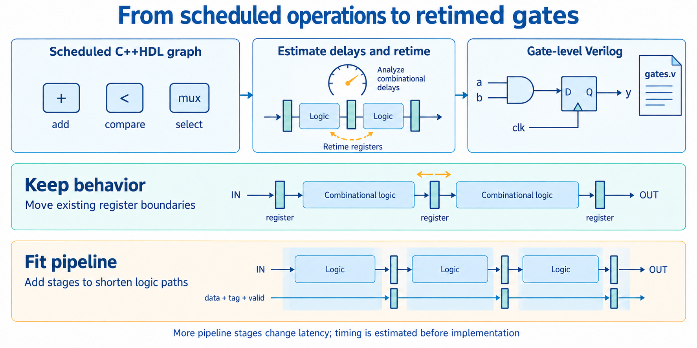

# 8. Synthesis and Retiming {#chapter-8}

## 8.1 Turn the scheduled design into gates {#section-8-1}

The HFT example now has explicit RTL around three scheduled HLS pipelines.
We want to implement that complete design and determine where additional
registers are needed for a requested clock period.

CppHDL synthesis exports typed operations, registers, memory accesses, and
connections into a shared graph. For an HLS wrapper it exports the **actual
scheduled implementation**, not the native wrapper that evaluates a C++ method
as a reference transaction. It can then estimate delays, retime the graph,
and map operations into technology-independent gates.

The output is `gates.v`, not a processor executing the C++ and not a file of
unscheduled C++ expressions. Arithmetic becomes gate networks; connections
and bit selection can remain wiring. No Yosys invocation or re-parsing of
generated SV is involved. The host C++ compiler builds a graph-emitter program;
it does not choose the circuit by compiling the algorithm into machine code.

To generate the baseline gates without requesting retiming:

```sh
build/cpphdl --synth --top Hft --module Hft \
  --output build/book-hft-gates hls/examples/net/hft.cpp
```

Use a new or empty output directory. `--top` selects the C++ class or root
instance; `--module` names the emitted Verilog module. Keep design compiler
options such as `-I` and `-D` after `--`.

The result is not an FPGA bitstream or a netlist of ASIC library cells.
Technology mapping, physical implementation, and final timing checks remain
downstream tasks. In particular, current generic memory mapping uses
flip-flops and muxes, not BRAM or SRAM macros. A buffered-packet design can
therefore become expensive before any retiming is attempted; selecting a
different retiming mode cannot repair that architectural choice.

## 8.2 Separate HLS stage placement from timing-driven retiming {#section-8-2}

`ClockedPipeline<HftWordMethods, 4>` gives HLS four initial stages. HLS groups
dependent operations and carries data and control across those boundaries.
It does not know whether one group's logic takes 1 ns or 8 ns in a cell model.

Retiming answers the next question: **does the logic between each pair of
register boundaries fit the chosen period?** The built-in model estimates
gate, arithmetic, mux, memory-read, clock-to-Q, and setup delays. Constant
shifts and bit rearrangements are wiring; variable selectors and long
arithmetic contribute delay. The reports use nanoseconds.

For example, after adding necessary operand delays, an arithmetic expression
could change from one long register-to-register path into three shorter ones:

```text
Before: R -> compare -> select -> arithmetic -> R
After:  R -> compare -> R -> select -> R -> arithmetic -> R
```

This is an illustration, not the measured placement of the HFT decision
method. If `select` also consumes price data that bypasses `compare`, that
data must receive matching registers. The same applies to the sequence,
validity, and branch predicate. Delaying only the result bus would mix calls.

The estimates do not include target-library characterization, routing,
placement, fanout, or clock skew. A declared clock frequency alone does not
enable retiming: explicitly select a mode and period. Treat an estimated fit
as a result to take into implementation, not proof of physical timing closure.

## 8.3 Preserve behavior by moving existing boundaries {#section-8-3}

Choose `keep_behaviour_retiming` when existing clock-cycle behavior is part of
the interface contract. It moves register boundaries across eligible pure
combinational operations while preserving cycle behavior. It does not add
latency to make a difficult path appear to meet timing.

For example, in a legal two-stage arithmetic chain it can move an operation
from an overloaded stage into an underused neighbor. Register banks may split
or merge around an operation, so preserving behavior does not mean preserving
the exact register count. Clock, edge, reset, initial-value, and memory rules
limit legal moves. Registers cannot move through a RAM access or between
clock domains.

This is the appropriate intent for strong feedback: a state machine must
continue to see its next state at the same logical edge. It is not a promise
that every feedback circuit can be retimed. The current search is bounded
and greedy, and may leave `target_met=false` when no useful legal move is found.
Inspect the report even if generation succeeds.

For HLS streaming regions the current implementation is stricter: keep mode
leaves a region unchanged if it already fits, and otherwise rejects it rather
than changing its feedback latency. Use fit mode to lengthen the HFT pipelines.

## 8.4 Add stages when latency may change {#section-8-4}

Choose `fit_pipeline_retiming` for a feed-forward or latency-tolerant pipeline.
It adds register boundaries when the next operation would exceed the estimated
period and balances the other paths at each join. Oversized supported
arithmetic can be expanded into generic gates and split internally. Memory
transactions and explicitly preserved boxes are not arbitrarily split.

The HFT command is:

```sh
build/cpphdl --synth --top Hft --module Hft \
  --retiming fit_pipeline_retiming \
  --clock-period-ns 3.174603175 \
  --output build/book-hft-retimed hls/examples/net/hft.cpp
```

The period corresponds to 315 MHz. For 312 MHz the period would be
3.205128205 ns. The selected target is a register-to-register timing budget,
not a limit on total packet-processing latency.

In a `ClockedPipeline` region, fit mode retains the existing ready/valid
interface and II=1. Additional stages let more calls be in flight; a ready
consumer can still receive consecutive results. Backpressure freezes the
region, and validity, results, faults, and candidate state remain aligned.

For stateful methods, those additional stages also delay state visibility.
Retiming does not make the counter from section 7.1 behave like a serial
counter. Keep immediate recurrences out of this contract, or design and test
the algorithm to tolerate the delayed feedback. The HFT parser avoids the
problem by passing explicit offsets; TX waits for its descriptor to commit
before requesting its words.

An indivisible operation that cannot fit produces an error. So can an
unsupported clock/reset combination or a memory-address change that would
alter the access transaction. Fit mode must not report success merely because
it placed registers around a still-overlong operation.

### Delayed feedback is a different retiming contract

Retiming a `ClockedDelayer` FSM does **not** turn it into `ClockedPipeline`.
For supported feedback graphs, fit mode can spread one original state
transition over several physical clocks, keeping committed state unchanged
until all next values are ready. It adds `retiming_ready_out` and
`retiming_commit_out`; the caller must use that admission/commit protocol.

For scheduled HLS, one such transaction represents one original FSM edge,
not an entire method call. Inputs are admitted at ready. The original
valid/ready output bundle is interpreted before the edge with commit asserted,
not as a handshake on every intervening physical clock. This path requires
an explicit adapter and can reduce throughput. It is useful for ordered
control work, but not a substitute for the one-word-per-clock HFT pipeline.
The full contract and restrictions are in
[retiming.md](retiming.md#scheduled-hls-graphs).

## 8.5 Apply timing rules at the intended boundary {#section-8-5}

A CLI rule can cover the whole design, as above, or a particular instance and
its descendants using `--retime-module INSTANCE_PATH`. Use the actual instance
path from the exported graph, not the C++ class name. For a streaming wrapper,
the rule must cover the whole region; do not select only its result registers
and leave its handshake or state behind.

For a reusable ordinary RTL module, a source annotation can specify the rule:

```cpp
class
#ifdef __clang__
[[clang::annotate("CPPHDL_RETIMING=fit_pipeline_retiming:3.174603175")]]
#endif
PacketStage : public cpphdl::Module {
    // Ports and implementation omitted in this annotation example.
};
```

An explicit CLI rule overrides source rules for that run. Independent
annotated regions are allowed; overlapping rules are rejected. Changed
latency at an ordinary module boundary needs corresponding integration and
tests. It is not automatically safe for an arbitrary surrounding protocol.

Some operations must remain intact. In ordinary RTL graph synthesis,
`CPPHDL_ONE_CLOCK` on a pure function prohibits registers inside that call;
an over-budget call is rejected. `CPPHDL_KEEP_BOX=delay_ns` on an eligible
combinational module preserves its implementation boundary and declares its
propagation delay. That number is **not a clock count**. These constraints
are not currently supported inside scheduled HLS pipeline methods.

HLS pipelines can instead use pure integer free/static functions marked
`CPPHDL_BLACKBOX=module:delay_ns`. Their native bodies provide the reference;
generated RTL calls a separately supplied combinational module. This can
represent a technology arithmetic block, but neither the annotation nor a
zero declared delay implements missing hardware. Supply the matching module
for simulation and implementation, with a realistic timing contract. See
[external math blackboxes](synthesis.md#external-math-blackboxes) for the
supported port and type restrictions.

## 8.6 Read the HFT result without confusing latency and throughput {#section-8-6}

The current HFT example's documented 315 MHz run estimates a worst path of
3.15 ns against a 3.174603175 ns target. Its initial four-stage HLS regions
become:

| Region | Total clocks after retiming | II |
| --- | ---: | ---: |
| RX header checks | 12 | 1 |
| Trading decision | 6 | 1 |
| TX word formatting | 30 | 1 |

These figures describe the checked-in example's reported run, not fixed API
guarantees. Regenerate reports after changing code, stages, or the delay model.
The run inserts 30,155 register bits. They hold in-flight calculations and
metadata; they are not packet RAM. The ingress register, five collector
stages, and TX command register are additional explicit RTL stages.

A 30-stage formatter can emit one word per clock once filled. Conversely,
a short delayed FSM may emit a word only after several clocks of dependent
work. Always read both latency and II. End-to-end order latency also includes
arrival of the quote and FCS, queueing, descriptor loading, and output stalls;
adding the three table entries is not a packet-latency measurement.

The full-design target also applies outside HLS. The collector once had an
8.32 ns validation path. It was split explicitly into its five RTL stages;
inserting stages inside the three HLS wrappers alone could not fix it. The
short CRC and accumulation feedback remains ordered, while frame snapshots
pass through later validation stages.

Retiming did not remove a packet array: the source had already removed it.
Chapter 9 examines how that source decision, value widths, and memory-port
choices affect storage and selection logic before timing is considered.

## 8.7 Verify the transformed implementation {#section-8-7}

Start by reading the generated reports, then simulate the gates. In the
selected synthesis output directory:

- `manifest.json` identifies completion and generated artifacts.
- `timing.json` reports estimated paths, target status, added registers, and
  resulting streaming-region latency and II.
- `operations.v` shows the operation-level implementation.
- `gates.v` is the mapped generic-gate design used for gate-level simulation.
- `graph.cc` and, when retimed, `retimed_graph.cc` expose graph construction
  for further inspection or native graph execution.

Do not compare a retimed response with the source model at the same clock
number. For stateless transformations, compare accepted transactions in
order. For floating feedback, the reference must also use the resulting
commit latency; a simple output delay is not enough to reproduce changed
state visibility. Packet metadata and handshake assertions remain essential.

The HFT regression uses the same packet oracle for native C++, baseline gates,
and retimed gates. It drives real physical clocks, with no adapter that waits
several clocks for each offered RX word. Run it with:

```sh
cmake -S . -B build -DCPPHDL_BUILD_TESTS=ON \
  -DCPPHDL_BUILD_HLS_TESTS=ON -DCPPHDL_BUILD_SYNTH_TESTS=ON
cmake --build build --target cpphdl hls_hft -j2
ctest --test-dir build -R '^synth_hls_hft$' --output-on-failure
```

The retimed regression writes its netlist under
`build/synth/tests/hls_hft/retimed/gates.v`. Alongside functional decisions,
check frame boundaries, checksums, partial final words, blocked outputs,
queue saturation, and reset with work in flight. Test consecutive words,
not only isolated packets separated by long pauses.

There are still system limits. A 110-byte response cannot be sent indefinitely
for every 78-byte request at the same word rate. The example can backpressure
its input, but a physical Ethernet receiver cannot pause arriving frames:
the MAC boundary needs buffering and an overflow policy. The example also
uses a mock established TCP session, not a complete exchange connection or
risk system. Neither additional pipeline stages nor a passing gate simulation
removes those requirements.

## 8.8 Take the result back to the C++ design {#section-8-8}

Use explicit C++ RTL for cycle-sensitive protocol state. Use delayed HLS for
ordered methods and memory waits. Use pipeline HLS for independent or
latency-tolerant calls that need to overlap. Generate ordinary SV when an
existing technology flow will implement it; add CppHDL synthesis and fit
retiming when you want its graph-based gate implementation and timing-driven
pipeline construction.

The HFT example combines those choices rather than forcing the entire design
through one scheduler. C++ methods express the packet checks and formatting;
RTL makes per-word state and queues explicit; retiming extends the independent
pipelines. Keeping only the application information that later work needs
makes all three steps simpler and the resulting hardware more practical.

The final chapter turns these choices into concrete source edits. Use it
when a working conversion produces too many registers, large muxes, or an
unexpected number of memory transactions.

\clearpage

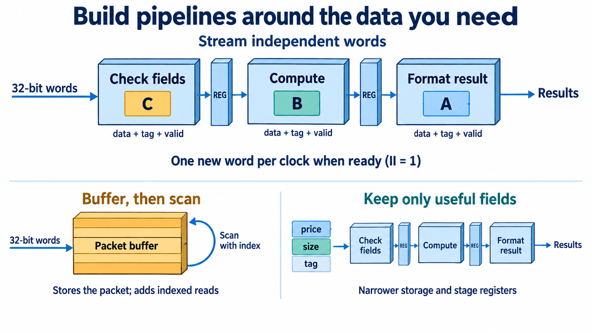

# 9. Developing Hardware-Friendly HLS C++ Design {#chapter-9}

Correct C++ does not automatically describe economical hardware. A processor
reuses its arithmetic units and memory ports as it executes statements.
Synthesized logic may instead implement independent expressions in parallel,
retain values across several stages, and build a selector for each dynamic
array access. The source must make the intended amount of work and storage
clear enough to evaluate the result.

This chapter compares small alternatives rather than giving another complete
packet processor. Unless identified as a repository excerpt, a snippet is an
isolated design example. Fragments use the local variables described immediately
before them; they are not additional files needed to build the HFT example.

## 9.1 Start with rates and bounds {#section-9-1}

For each method, first decide what one accepted call represents: a word,
a quote, an entire packet, or a configuration operation. Then determine how
often that call must be accepted and which state it needs.

For our HFT path, the useful units are one 32-bit RX word, one validated quote,
and one explicitly indexed TX word. The header method needs a word and its
position. The price method needs quote fields. Neither needs the whole packet.

Write a small resource budget before selecting templates:

- Four queued orders contain four 65-bit descriptors: 260 payload bits,
  plus FIFO control. That is not four queued Ethernet frames.
- A 2048-byte packet array alone contains 16384 bits, before selectors or
  pipeline registers. Its declared capacity is hardware capacity even if
  most tested packets use only 78 bytes.
- A shared port transferring eight bytes per access needs multiple accesses
  to read a large object. One-clock reads do not mean one-clock whole objects.
- A word pipeline must accept each required word, not merely produce a low
  average execution time on isolated packets.

Include burst rate and downstream pauses. A finite FIFO absorbs a bounded
burst; it cannot fix a permanent input/output bandwidth mismatch. Likewise,
making a delayed operation's physical clock faster does not imply II=1.

## 9.2 Replace whole-packet storage with the state the next step needs {#section-9-2}

A software-style receive routine often stores all bytes, then parses them.
With `rx`, `used`, and parsing helpers declared elsewhere, the problematic
shape is:

```cpp
rx[used++] = byte;
if (eof) {
    parse_ethernet(rx);
    parse_ipv4(rx);
    parse_udp(rx);
    parse_quote(rx);
}
```

The buffer must survive until EOF. Each helper can introduce more indexed
reads, and loops under delayed scheduling add execution clocks after receipt.
If direct storage is used, dynamic byte selections can become large muxes.
If port storage is used, reads compete for that port. Neither implementation
obtains streaming throughput merely by calling the same array a cache.

For fixed-format headers, replace the stored-byte lookup with a check on the
current word. The HFT example's actual UDP check is:

```cpp
return offset != 36 || word == 0x28002823;
```

There is no future need for those header bytes after their contribution has
been captured. Retain a cumulative header-valid bit, required checksum state,
and the fields needed by the decision. For a simpler aligned application
record, the capture logic might be:

```cpp
if (offset == 0) quote.sequence = word;
if (offset == 4) quote.instrument = word;
if (offset == 8) quote.bid = word;
if (offset == 12) quote.ask = word;
```

This is an illustrative aligned record, not the HFT wire layout: its quote
starts at byte 50, so the real collector combines fields that straddle words.
The benefit is the same: retain the application fields, not every header and
padding byte. Perform this state capture in an ordered collector, not as
uncoordinated updates in a floating-feedback pipeline.

**Do not remove buffering when the behavior requires it.** A bridge that must
withhold all forwarded bytes until FCS validation needs storage for those
bytes. Packet replay, retransmission, and arbitrary payload inspection can
also require buffering. Choose that contract explicitly, use an appropriate
memory port, and budget its bandwidth. Our example generates a new order
after validation; it does not need to replay the received frame.

## 9.3 Match the work unit to the interface width {#section-9-3}

A byte-oriented CRC loop is a useful software reference. It is not a suitable
four-clock implementation for an input that delivers four bytes every clock:

```cpp
for (uint32_t lane = 0; lane < 4; ++lane)
    crc = crc_byte(crc, uint8_t(word >> (lane * 8)));
```

Under delayed scheduling, loop iterations introduce clock steps. Under the
current pipeline scheduler, such a loop is rejected. Manually spelling out
four dependent byte calls removes the loop but can leave a long combinational
chain. The intended implementation is a parallel word transform:

```cpp
uint32_t next_crc = EthernetCrc::word(crc, word, byte_count);
```

The repository's helper expands the CRC's linear bit relations into a balanced
XOR network. `byte_count` handles the final partial word. An ordered RTL
register commits the new CRC only when its corresponding word transfers.
The testbench can keep the slower, independent byte/bit reference.

The same question applies to checksums and parsing: can this word contribute
directly, or are we inserting a byte loop merely because the software source
was written that way? Do not rewrite every operation into a large unrolled
network without checking delay and area, but do make the intended word rate
explicit. Storing the packet and performing the byte loop after EOF only
moves the bottleneck.

## 9.4 Choose widths from value ranges, including intermediates {#section-9-4}

Wide C++ types can create wide adders, comparators, dividers, and saved
temporaries. A host `size_t` is often 64 bits; that is seldom necessary for a
small hardware index. If a table has 256 entries, avoid a 64-bit interface
argument solely because a software API used `size_t`:

```cpp
// index is a uint32_t command argument; the table has exactly 256 entries.
uint32_t bounded_index = index & 255u;
uint32_t value = table[bounded_index];
```

This deliberately wraps the index. Use it only if wraparound is part of the
contract. If an invalid index must fail, test `index < 256` and take an explicit
error path instead. Do not replace a bounds check with a mask just to reduce
logic. Known range bits can simplify address selection, but inspect generated
widths: C++ promotions and retained address arithmetic can still be wider.

Narrowing operands must not silently discard valid results. A product of two
unsigned 16-bit values needs 32 bits. Cast **before** multiplication:

```cpp
uint32_t product = uint32_t(a) * uint32_t(b); // a and b are uint16_t.
```

Without these casts, integer promotion can perform the multiply as signed
`int`; large products can overflow before assignment. For the sum of 256
maximum 16-bit unsigned samples, 24 result bits are sufficient, but a 32-bit
native accumulator is a convenient supported representation:

```cpp
uint32_t sum = 0;
for (uint32_t i = 0; i < 256; ++i) sum += samples[i];
```

This is a delayed-loop example, not a pipeline method. If a different range
needs more than 32 bits, widening is necessary, not waste. The integer-LLM
example retains full 128-bit products and accumulation because truncating
them would change its Q16.48 answers.

Similarly, `ClockedDelayer<Methods, 0, 16>` narrows hardware pointer logic; it
does not change `uint64_t` payloads, `size_t`, or host-layout pointer slots in
stored nodes. Do not estimate the arena size as if every node field had become
16 bits. Check `MEM_BYTES`, field offsets, and the emitted address widths.

## 9.5 Carry only live data through a pipeline {#section-9-5}

Each value that must survive a stage boundary needs storage unless it can be
recomputed or otherwise eliminated. A wide input retained until the last
stage can cost more registers than the calculation itself.

The HFT word checker needs the original word downstream, so its result packs
that word with compact metadata:

```cpp
return (uint64_t(metadata) << 32) | word;
```

The decision stage has different needs. It returns the sequence and selected
price, rather than carrying all header fields onward:

```cpp
return (uint64_t(sequence) << 32) | selected_price;
```

These are existing packing patterns, not a requirement to make every bus
64 bits. Determine which values each consumer actually needs. Include the
tag, valid, error, or frame information that preserves association; removing
necessary metadata is a correctness bug, not an optimization.

As a rough planning bound, carrying a live 512-bit value through ten register
boundaries can require 5120 data-register bits. That is not an exact retimer
cost formula: liveness, constants, shared values, and scheduling can reduce
it, while control and other temporaries add storage. Measure the emitted design.

Moving a calculation later can also shorten a value's lifetime. For example,
derive a fixed header word from its offset near the TX output rather than
building a complete frame and retaining it while earlier work proceeds. This
is what `HftTxMethods` does. Retiming should register the necessary computation,
not snapshots of a packet that the algorithm never needed to retain.

## 9.6 Distinguish storage bits from access logic {#section-9-6}

An array's payload size is only one part of its hardware cost. Four parallel
dynamic reads can need four selection networks in direct-register mode:

```cpp
uint32_t a = table[index0];
uint32_t b = table[index1];
uint32_t c = table[index2];
uint32_t d = table[index3];
```

Selecting shared memory trades that parallel access for scheduled transactions;
it does not invent four read ports. Ask whether the algorithm needs all four
values in the same clock. If it does, options include a wider row holding
the related fields or independently addressed banks, designed and connected
explicitly. A C++ struct alone does not promise a particular RAM width or
port layout.

For a genuinely tiny fixed table, direct selection may be appropriate. This
excerpt from the HFT order FIFO selects one 65-bit descriptor from four slots:

```cpp
order_comb = orders[0];
if (read_reg == 1) order_comb = orders[1];
if (read_reg == 2) order_comb = orders[2];
if (read_reg == 3) order_comb = orders[3];
```

There are only four possible inputs. This is not advice to expand a 4096-row
memory into thousands of `if` statements. Large tables need an explicit
storage and access policy. Nor is a large packed-vector shift a substitute
for an efficient memory access: shifting the entire store to extract one
element can create a wide barrel selector.

For shared HLS memory, an access transfers up to eight bytes. A large C++
record can require several transfers. Count the bytes and accesses per call,
not just the number of source expressions. Copying a record is still data
movement even when written as one assignment.

### Choose row width from the fields consumed together

Suppose every lookup needs both price and quantity. Two addressable tables
describe two reads, even though the index is the same:

```cpp
uint32_t price = prices[index];
uint32_t quantity = quantities[index];
```

If updates and readers can use a common record, store those two fields in one
64-bit word and sample it once:

```cpp
uint64_t entry = quotes[index];
uint32_t price = uint32_t(entry);
uint32_t quantity = uint32_t(entry >> 32);
```

Here `prices` and `quantities` were 256-element `uint32_t` arrays; `quotes` is
a 256-element `uint64_t` array. Both layouts contain 16384 payload bits. The
second expresses one eight-byte read followed by wiring, rather than two
four-byte reads. It also requires a matching write format. If the fields
change independently, account for byte enables or a read/modify/write; packing
can make that workload worse.

Logical row width is not physical bank count. The current shared HLS BRAM
backend emits eight byte-lane RAMs, even for small workloads. A device mapper
may use separate physical blocks with unused capacity. Count the mapped RAM
primitives, not just total bytes divided by a block's advertised capacity.
CppHDL's generic gate backend instead expands this storage into registers and
muxes. Use the appropriate report for the route you actually build.

Avoid declaring several large banks "for future parallelism" before assigning
their ports and ownership. Independent simultaneous reads need real bandwidth;
a shared port gives serialization, while duplicated storage requires coherent
writes to every copy. Neither should appear accidentally because the C++
passed a large table by value to several helpers.

## 9.7 Update a field, not a reconstructed store {#section-9-7}

Avoid source that describes a whole-store read/modify/write when the intended
effect is a byte or word update. In direct register logic, this pattern asks
for a wide mask, shift, and merge:

```text
store = (store & ~(byte_mask << bit_offset))
      | (extended_byte << bit_offset)
```

Express the actual access instead, with `bytes` declared as byte-addressable
storage and a validated byte index:

```cpp
bytes[index] = new_byte;
```

This gives lowering a narrower update to implement. It does **not** guarantee
a single physical byte write in every backend. Register storage still needs
write selection, and memory mapping must preserve the intended byte enable.
Inspect the result for whole-store muxes or shifts, especially after an
aggregate copy or a representation change.

When the application always updates a complete word, use a word access rather
than four unrelated byte updates:

```cpp
words[index] = new_word;
```

This is valid only when alignment, byte order, and partial-write semantics
match the interface. Ethernet's final word may contain fewer than four valid
bytes, so the HFT design carries a byte count instead of treating padding
as received data. Do not improve a memory shape by changing those semantics.

## 9.8 Make repeated reads and helper reuse visible, then verify sharing {#section-9-8}

When a value is unchanged during a calculation, one sample should serve its
uses. Compare these fragments, where `p` points into scheduled memory and
`read_price` only reads the pointed-to price:

```cpp
uint32_t spread = read_price(p) - bid;
bool buy = read_price(p) < limit;
```

A named sample expresses that intent directly:

```cpp
uint32_t ask = read_price(p);
uint32_t spread = ask - bid;
bool buy = ask < limit;
```

The HLS memory-effect analysis can also reuse proven identical reads within
one clock region. It invalidates knowledge at relevant writes, unknown aliases,
and clock boundaries. `const` on a helper does not prove that all memory
reachable through its arguments is unchanged.

Capturing a local value deliberately reuses that sample. It is wrong if the
specification requires a new observation after an intervening write or wait.
For externally updated memory, decide explicitly whether the operation needs
one coherent sample or multiple observations; do not assume arbitrary DDR
reads can be merged across clocks.

Source reuse and hardware sharing are different questions. Calling a helper
twice makes the C++ shorter:

```cpp
uint32_t left = transform(a);
uint32_t right = transform(b);
```

But overlapping pipeline calls can require parallel hardware. A generated
`__shared` function name proves text reuse, not necessarily one arithmetic
unit, one register set, or one memory-access schedule. The delayed scheduler
can share certain eligible multicycle helpers because calls are ordered.
That sharing may need argument storage and a return-continuation selector.

Choose a shared unit when its service rate meets the workload, then inspect
the graph or mapped gates. Do not claim an area reduction from a smaller SV
file alone. Conversely, removing a C++ local declaration need not save a
register: the compiler may already have eliminated it, or its value may
still be live across a clock under another name.

## 9.9 Bound allocations and recursion separately {#section-9-9}

A maximum number of live entries is not always a maximum number of allocated
bytes. Consider a software loop that repeatedly inserts and clears a vector:

```cpp
values.push_back(value);
values.clear();
```

`clear()` retains vector capacity; it does not reset the HLS allocation arena.
This particular push/clear sequence can reuse its initial capacity and need
no further allocation. Growth to larger capacities is different: replaced
allocations still consume the generated arena until reset.

For a node container, repeated insertion and erasure makes the issue clearer:

```cpp
nodes.emplace(key, value);
nodes.erase(key);
```

Here `nodes` is a `std::map` and the key is absent before insertion. Native
erasure frees its node, but the current generated allocator does not reclaim
those bytes. Repeated allocations can exhaust a bounded hardware pool even
though at most one entry is live. The allocation budget must cover the
workload, not merely its maximum live size.

Choose a supported workload with a bounded allocation total between resets,
or use fixed storage when the capacity is intrinsically fixed. For example,
an eight-value configuration record can be represented without element
allocation:

```cpp
struct FixedLimits {
    uint32_t values[8]{};
    uint32_t count = 0;
    uint64_t command(uint32_t operation, uint32_t index, uint32_t value) {
        if (operation == 0) {
            if (count < 8) values[count++] = value;
            return count;
        }
        return index < count ? values[index] : 0;
    }
};
```

This changes the implementation contract; it is not a replacement for a test
that promises actual `std::vector` behavior. Use the standard container when
its operations are required, and test the real capacity and allocation paths.

Recursion is another independent bound. A tree with a bounded node pool still
needs a sufficient call-depth bound for its recursive methods. Increasing
`MAX_RECURSION` can increase generated control and saved values even if heap
capacity is unchanged. Start from the algorithm's proven depth requirement,
not an arbitrarily large number "to be safe", and test the bound violation.
The source scheduler emits finite continuations and depth-specific bodies,
not an unbounded processor stack.

## 9.10 Separate unpredictable loading from regular computation {#section-9-10}

A pipeline cannot promise an input every clock if each input waits for an
unpredictable external response. The following ordinary C++ method belongs
in a `ClockedMemory` worker, not a streaming word pipeline:

```cpp
uint64_t command(uint32_t base, uint32_t index, uint32_t value) {
    auto table = cpphdl::hls::external_memory<const uint64_t>(base);
    return table[index] + value;
}
```

Its pointer looks simple in C++, but generated hardware must issue the read,
retain `value`, and resume addition only after completion. A one-outstanding
interface cannot hide arbitrary DDR latency by increasing pipeline depth.

When data can be prepared ahead of use, split the design:

```text
ClockedMemory loader -> free local tile
                              |
                        mark tile ready
                              |
                    ClockedPipeline compute
                              |
                 release tile after last read
```

Two tiles allow loading one while computing from the other. The parent must
track ownership: never overwrite a tile until the consumer has captured its
last operand, and never read a tile before its fill is complete. Output
backpressure must not accidentally release a tile early or duplicate a result.

The [TiledMatVec example](../hls/examples/llm/TiledMatVec.cpp) implements this
pattern with explicit `memory<>` tiles. It overlaps loading and computation,
but the external port can still be the throughput limit. Compare bytes needed
per result with the achieved memory service rate before adding more arithmetic
lanes. A wider custom DDR interface is another explicit RTL/controller choice,
not a consequence of casting a pointer to a wider C++ type.

For the HFT example, preload a small configuration table if that satisfies the
application. Do not turn every header check into a DDR lookup, or buffer every
packet merely because configuration comes from external memory. If a fresh
external read really is required per quote, budget the resulting admission
rate and provide the corresponding buffering or rejection policy.

## 9.11 Remove hidden cursors from overlapping calls {#section-9-11}

A formatter that reads and increments a member cursor depends immediately on
the previous call:

```cpp
uint32_t word = format_word(cursor);
cursor += 4;
return word;
```

It works as ordered software or inside a delayed worker. In a floating-feedback
pipeline, several calls can read the same cursor. Extra retiming stages change
how many calls do so. An output delay does not correct repeated offsets.

Pass the offset explicitly instead:

```cpp
uint64_t command(uint32_t operation, uint32_t offset, uint32_t value) {
    return format_word(offset);
}
```

This fragment assumes `format_word` reads stable configuration and has no
hidden update. The producer increments its offset only when a command is
accepted. Configuration must remain stable for every command that uses it.
In the real HFT formatter, a separate load operation commits the order first;
the wrapper drains that frame before loading the next descriptor.

Do the same analysis for counters, checksums, history, and sequence filters:
which calls may overlap, which state version do they observe, and who owns
the ordered update? Keep a one-clock recurrence in explicit RTL when that
is the required interface rate. Use delayed scheduling when waiting is
acceptable. Do not rely on changing the native test's stage count until a
state-dependent failure happens to disappear.

## 9.12 Measure the implementation, not the prettiness of the source {#section-9-12}

After each architectural change, compare the same workload and capacity in
both implementations. A smaller test dataset is not an optimization of the
original design. Record:

- Result correctness and accepted/produced transaction counts.
- Required II, sustained measured rate, and backpressure behavior.
- Storage capacity, memory widths, bank count, and accesses per command.
- Register bits before and after retiming, with the widest live values named.
- Logic/gate counts and estimated worst path for the same target period.
- Technology-mapped LUTs, RAMs, DSPs, or cells when that downstream flow is used.

Keep units distinct. A generic mux count is not an FPGA LUT count. A RAM
attribute is not a physical RAM count. A 16-bit pointer does not imply
16-bit host-layout node fields. A passing Verilator test does not establish
timing closure. A combinational blackbox declared with zero delay merely
removes that delay from the estimate; it does not make the implemented
arithmetic free or instantaneous.

If a design unexpectedly grows, inspect one cause at a time. First check
retained data and widths, then the number and shape of memory accesses, then
duplicated computation and state, and finally timing-induced storage. Keep a
baseline report and test results so a proposed simplification can be rejected
when it actually increases area or breaks throughput.

For the HFT design, the central improvement was architectural: check headers
as words arrive, retain only the application fields, and generate output words
from offsets. HLS then schedules the useful calculations, and retiming places
more registers where their delay requires them. That sequence gives the tools
a hardware-friendly problem instead of asking them to discover a different
packet algorithm after the fact.

\clearpage

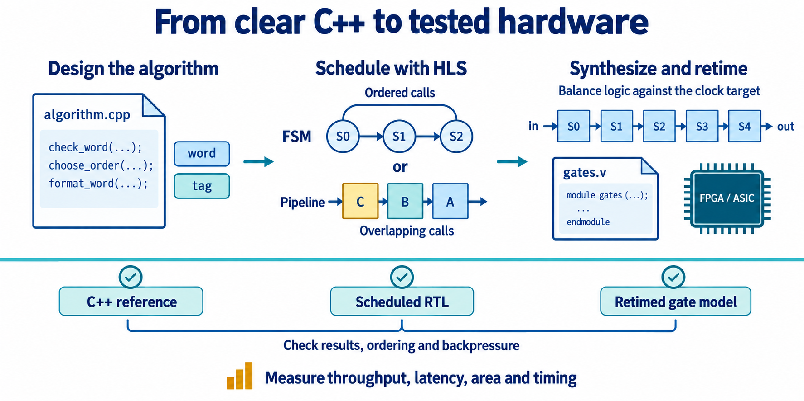

# Conclusion to Part II {#part-ii-conclusion .unnumbered}

The HFT example starts with C++ methods for checking words, choosing an order,
and formatting a response. HLS turns those methods into scheduled hardware.
Use delayed execution when calls must observe preceding updates; use a pipeline
when calls can overlap. Choose storage separately, according to capacity,
access rate, and response latency.

Synthesis maps the scheduled design to gates. Keep-behavior retiming moves
existing register boundaries while preserving behavior. Fit-pipeline retiming
adds stages to meet estimated timing, increasing latency and delaying feedback.
Neither mode replaces the designer's decisions about streaming, retained data,
or ordered protocol state. HLS also remains useful without this step: its
scheduled SystemVerilog can enter an existing implementation flow.

Test the C++ algorithm, scheduled RTL, and retimed gate model against the same
required results, ordering, and backpressure behavior. Then compare throughput,
latency, area, and timing. C++ keeps the algorithm readable and directly testable;
the generated design still needs final acceptance verification and physical
implementation timing checks.

\clearpage

# Materials and Example Sources {#materials .unnumbered}

All links below point to the CppHDL repository on GitHub. They follow the
`main` branch, so source files may change after this edition.

**Book listings, chapters 2-5**

These examples are included in [the book source](https://github.com/mirekez/cpphdl/blob/main/doc/cpphdl_book.md),
not stored as separate source files in the repository:

- Chapter 2: `SampleStage.h` and `sample_test.cpp`, including VCD output.
- Chapter 3: `MemoryQueue.h`, `TelemetryBuffer.h`, and `buffer_test.cpp`.
- Chapter 4: `InterfaceTelemetry.h`, tested with `buffer_test.cpp`.
- Chapter 5: `AsyncSamples.h` and `async_test.cpp`, with native and Verilator flows.

The short teaching examples in Part II, including `AccumulateFour`,
`ScaleValue`, `Counter`, `BatchSum`, `LimitList`, and `ReadAndBias`,
also live in the book. They are excerpts illustrating individual features;
the repository examples below provide complete build and test flows.

**RTL, interfaces, and clock-domain crossing**

- [Fifo2clk.cpp](https://github.com/mirekez/cpphdl/blob/main/examples/cdc/Fifo2clk.cpp): memory-backed asynchronous FIFO; [generated SystemVerilog](https://github.com/mirekez/cpphdl/blob/main/examples/cdc/generated/Fifo2clk.sv).
- [TwoClocksCdc.cpp](https://github.com/mirekez/cpphdl/blob/main/tests/cdc/TwoClocksCdc.cpp): synchronization, mailbox, FIFO, reset-release, and multi-clock tests.
- [AsyncReset.cpp](https://github.com/mirekez/cpphdl/blob/main/tests/reset/AsyncReset.cpp): asynchronous reset examples and tests.
- [AssignIfHierarchyProxy.cpp](https://github.com/mirekez/cpphdl/blob/main/tests/interface/AssignIfHierarchyProxy.cpp): parent-to-child interface connections.
- [TemplateHelperInstantiation.cpp](https://github.com/mirekez/cpphdl/blob/main/tests/templates/TemplateHelperInstantiation.cpp): template helpers used by an RTL module.

**Streaming HFT example, chapters 7-9**

- [HFT README](https://github.com/mirekez/cpphdl/blob/main/hls/examples/net/README.md): supported packet formats, restrictions, and build instructions.
- [hft.cpp](https://github.com/mirekez/cpphdl/blob/main/hls/examples/net/hft.cpp): C++ parsing, decision, and transmit methods with their RTL wrappers.
- [HftCollector.h](https://github.com/mirekez/cpphdl/blob/main/hls/examples/net/HftCollector.h): staged collection and validation of application fields.
- [EthernetCrc.h](https://github.com/mirekez/cpphdl/blob/main/hls/examples/net/EthernetCrc.h): word-based Ethernet CRC processing.
- [FrameSize.h](https://github.com/mirekez/cpphdl/blob/main/hls/examples/net/FrameSize.h) and [ReceiveMetadata.h](https://github.com/mirekez/cpphdl/blob/main/hls/examples/net/ReceiveMetadata.h): frame-size checking and receive metadata.
- [WordMath.h](https://github.com/mirekez/cpphdl/blob/main/hls/examples/net/WordMath.h): word-processing helpers.
- [market.xml](https://github.com/mirekez/cpphdl/blob/main/hls/examples/net/market.xml): example SBE market-data schema.
- [HftTest.h](https://github.com/mirekez/cpphdl/blob/main/hls/examples/net/HftTest.h): packet generation and response checks.
- [HFT test runner](https://github.com/mirekez/cpphdl/blob/main/hls/examples/net/Run.cmake) and [synthesis test runner](https://github.com/mirekez/cpphdl/blob/main/synth/tests/hls/Run.py): scheduled RTL and gate-level verification flows.
- [Generated HFT SystemVerilog](https://github.com/mirekez/cpphdl/tree/main/hls/examples/net/generated): checked-in scheduled modules and packages.

**Containers and external memory**

- [DelayedArray.cpp](https://github.com/mirekez/cpphdl/blob/main/hls/tests/std/DelayedArray.cpp) and [DelayedVector.cpp](https://github.com/mirekez/cpphdl/blob/main/hls/tests/std/DelayedVector.cpp): array and vector methods.
- [DelayedList.cpp](https://github.com/mirekez/cpphdl/blob/main/hls/tests/std/DelayedList.cpp): linked-list methods.
- [DelayedMap.cpp](https://github.com/mirekez/cpphdl/blob/main/hls/tests/std/DelayedMap.cpp) and [DelayedMapSmall.cpp](https://github.com/mirekez/cpphdl/blob/main/hls/tests/std/DelayedMapSmall.cpp): map examples with different bounds.
- [DelayedMultimap.cpp](https://github.com/mirekez/cpphdl/blob/main/hls/tests/std/DelayedMultimap.cpp) and [DelayedUnorderedMap.cpp](https://github.com/mirekez/cpphdl/blob/main/hls/tests/std/DelayedUnorderedMap.cpp): multimap and hash-map methods.
- [Standard-container test directory](https://github.com/mirekez/cpphdl/tree/main/hls/tests/std): shared configuration and supporting sources for these examples.
- [ExternalPointer.cpp](https://github.com/mirekez/cpphdl/blob/main/hls/tests/ExternalPointer.cpp) and [its SystemVerilog testbench](https://github.com/mirekez/cpphdl/blob/main/hls/tests/ExternalPointer.sv): pointer-based external memory with delayed responses.
- [TiledMatVec.cpp](https://github.com/mirekez/cpphdl/blob/main/hls/examples/llm/TiledMatVec.cpp): external-memory loading separated from pipelined computation.
- [WeightProduct.h](https://github.com/mirekez/cpphdl/blob/main/hls/examples/llm/WeightProduct.h), [WeightProduct.cpp](https://github.com/mirekez/cpphdl/blob/main/hls/examples/llm/WeightProduct.cpp), and [TiledMatVecTest.h](https://github.com/mirekez/cpphdl/blob/main/hls/examples/llm/TiledMatVecTest.h): compute wrapper and tiled matrix-vector verification.
- [Integer LLM example README](https://github.com/mirekez/cpphdl/blob/main/hls/examples/llm/README.md): memory contracts, math support, and test commands.

**Synthesis and retiming companion tests**

- [logic_retiming.cpp](https://github.com/mirekez/cpphdl/blob/main/synth/tests/retiming/logic_retiming.cpp): retiming logic paths.
- [ram_retiming.cpp](https://github.com/mirekez/cpphdl/blob/main/synth/tests/retiming/ram_retiming.cpp): retiming around memory.
- [keep_box.cpp](https://github.com/mirekez/cpphdl/blob/main/synth/tests/retiming/keep_box.cpp): preserved module boundaries with declared delay.
- [one_clock.cpp](https://github.com/mirekez/cpphdl/blob/main/synth/tests/retiming/one_clock.cpp): one-clock execution constraints.
- [feedback_frames.cpp](https://github.com/mirekez/cpphdl/blob/main/synth/tests/retiming/feedback_frames.cpp): feedback and corresponding frame metadata.

**Tool and API references**

- [Repository README](https://github.com/mirekez/cpphdl/blob/main/README.md): obtain, build, and test CppHDL.
- [RTL specification](https://github.com/mirekez/cpphdl/blob/main/doc/spec.md) and [best practices](https://github.com/mirekez/cpphdl/blob/main/doc/best_practice.md): RTL APIs and design conventions.
- [Clocked.h](https://github.com/mirekez/cpphdl/blob/main/hls/Clocked.h): clocked HLS wrapper declarations.
- [HLS guide](https://github.com/mirekez/cpphdl/blob/main/doc/hls.md): scheduling and memory options.
- [Synthesis guide](https://github.com/mirekez/cpphdl/blob/main/doc/synthesis.md), [retiming guide](https://github.com/mirekez/cpphdl/blob/main/doc/retiming.md), and [lowering design](https://github.com/mirekez/cpphdl/blob/main/doc/lowering.md): graph conversion, timing, and implementation details.
