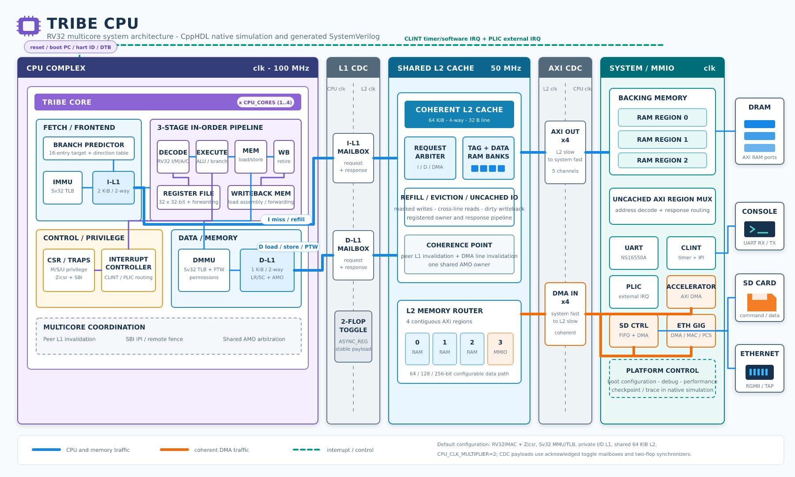

# Tribe RISC-V CPU



## About

Tribe is a RV32 RISC-V CPU model written in the CppHDL C++ dialect. The model runs both as a native C++ simulation and as generated SystemVerilog through Verilator. One `Tribe` core contains a small in-order pipeline, private instruction and data L1 caches, CSR/trap support, interrupt routing, and optional Sv32 MMU/TLBs. `TribeTest<CPU_CORES>` composes one or more cores around a shared coherent L2 cache, clock-domain crossings, and AXI4-style memory ports; the simulation and SoC wrappers add memories and devices around that cluster.

The base implementation targets RV32IMC integer software. `tribe_cpu/Config.h` enables atomics, interrupt routing, and Sv32 translation through `TRIBE_CFG_RV32IA`, `TRIBE_CFG_ISR`, and `TRIBE_CFG_MMU_TLB`; each defaults to `1` and is also a CMake setting. These select `ENABLE_RV32IA`, `ENABLE_ISR`, and `ENABLE_MMU_TLB` in the sources. Zicsr and traps are enabled unconditionally by the current configuration. The L2 memory data width is selected with `L2_AXI_WIDTH`; the build provides 64-, 128-, and 256-bit targets. The address map starts at `memory_base_in` and contains four contiguous memory/device regions; the last is uncached IO/MMIO.

Current cache defaults are a 2 KiB instruction L1, a 1 KiB data L1, and a shared 64 KiB L2, all with 32-byte lines. L1 caches are two-way and L2 is four-way. `CPUS_PER_L2_CACHE` defaults to four, but ordinary Tribe and SoC targets remain single-core. Only `MULTICORE` targets and the configured multi-port L2 test use that core count.

## Structure

The single-core CPU is the `Tribe` module in `tribe_cpu/Tribe.h`. It instantiates these blocks in the primary `clk` domain:

| Block | Source | Role |
| --- | --- | --- |
| `Decode` | `tribe_cpu/Decode.h` | Instruction decode, register source selection, and `State` construction. |
| `Execute` | `tribe_cpu/Execute.h` | ALU operation and branch resolution. |
| `ExecuteMem` | `tribe_cpu/ExecuteMem.h` | Memory request generation, split access handling, and optional atomics. |
| `WritebackMem` | `tribe_cpu/WritebackMem.h` | Load response capture, split-load assembly, and store-to-load forwarding. |
| `Writeback` | `tribe_cpu/Writeback.h` | Architectural register writeback formatting. |
| `CSR` | `tribe_cpu/CSR.h` | CSR, privilege, trap, and return-from-trap state. |
| `MMU_TLB` | `tribe_cpu/MMU_TLB.h` | Optional Sv32 instruction/data address translation and page-table walking. |
| `InterruptController` | `tribe_cpu/InterruptController.h` | Optional CLINT and PLIC/external interrupt routing into CSR trap input. |
| `File<32,32,false>` | `tribe_cpu/common/File.h` | Integer register file with a separate `FileStorage` child; primary bypass is handled by the core. |
| `L1Cache` | `tribe_cpu/cache/L1Cache.h` | Separate instruction and data L1 caches. |
| `BranchPredictor` | `tribe_cpu/BranchPredictor.h` | Small direct-mapped branch predictor. |

`TribeTest<CPU_CORES>` in `tribe_cpu/TribeTestModule.h` is the CPU-cluster composition point. It owns the core array, one instruction and one data `L1MemFastToSlowCdc` per core, the shared `L2Cache`, AXI CDCs on both sides of L2, peer-cache invalidation, SBI inter-hart routing, and multicore AMO arbitration.

The executable simulation wrapper is `TestTribe` in `tribe_cpu/TribeTest.h`, driven by `tribe_cpu/main.cpp`. It instantiates three RAM regions, an IO region mux, NS16550A UART, CLINT, PLIC, Accelerator, SD controller plus SD verification card, and the ethgig DMA/MAC/PCS/PHY chain plus optional TAP-backed RGMII verification link. `tribe_cpu/SoC/System.cpp` packages `TribeTest<1>` with UART, CLINT, PLIC, Accelerator, SD controller, and the third RAM region into a synthesizable-style `System` module where the first two DRAM regions remain outside the DUT.

## CPU Pipeline

```text
  PC -> IMMU -> [translation registers] -> I-L1
   ^                                        |
   |                              [fetch instruction + PC]
   |                                        |
   |                                      Decode
   |                                        |
   |                                [decode_state_reg]
   |                                        |
   |                       File reads + operand forwarding
   |                                        |
   |                                  [state_reg[0]]
   |                                        |
   +-- branch/trap redirect <----------- Execute
   |                              ALU / iterative MUL,DIV
   |                                        |
   |                           ExecuteMem / [state_reg[1]]
   |                                        |
   |                 DMMU -> [translation registers] -> D-L1
   |                                                    |
   |                                              L1/L2 CDC
   |                                                    |
   |                          WritebackMem <--- load response
   |                               |
   |                 [load result / retirement readiness]
   |                               |
   |                      Writeback -> File writes
   |
   +-- CSR <- [CSR commit record / interrupt metadata]
```

Brackets mark register boundaries, not separate modules. `fetch_instr_reg`, `fetch_pc_reg`, and `fetch_buffer_valid_reg` hold the I-cache response. `Decode` produces control and register indexes into `decode_state_reg`; register-file reads and forwarding then supply operands for `state_reg[0]`. `state_reg[1]` owns the memory/writeback instruction. ALU-only instructions bypass the data-memory path.

Instruction and data translations are captured in separate `immu_*_reg` and `dmmu_*_reg` records before driving the caches. `ExecuteMem` owns issued load/store, split-access, and atomic sequencing. `WritebackMem` holds returned load data; the core distinguishes result availability from retirement readiness so an AMO cannot retire before its write completes. CSR updates and interrupt metadata have their own registered commit boundary. These stages shorten combinational paths; they do not imply one instruction completes on every clock. Hazards, iterative arithmetic, memory waits, and redirects still stall or flush the appropriate stages.

## Principal connection of modules

```text
                                  primary clk domain
  +--------------------------------------------------------------------------+
  |  Tribe core 0: pipeline + I-L1 + D-L1                                    |
  |  Tribe core N: pipeline + I-L1 + D-L1                                    |
  |       | I refill        | D refill/store + both MMU walkers              |
  |       v                  v                                                |
  |  L1MemFastToSlowCdc  L1MemFastToSlowCdc                                  |
  |       |                  |                                                |
  +-------|------------------|------------------------------------------------+
          |                  |                    l2_clock domain
  +-------v------------------v------------------------------------------------+
  |                     shared coherent L2Cache                               |
  |       ^ coherent AXI inputs                   | AXI memory/device outputs  |
  +-------|---------------------------------------|----------------------------+
          |                                       |
  Axi4FastToSlowCdc                     Axi4SlowToFastCdc
          ^                                       v
  Accelerator / SD / EthGigDMA          RAM0, RAM1, RAM2, Axi4RegionMux
                                                       |
                                                       +-> UART / CLINT / PLIC
                                                       +-> Accelerator / SD / Ethernet
```

The shared L2 is the coherence point. CPU private L1s use a level-held `L1MemIf`; coherent DMA masters enter L2 through `axi_in`; L2 reaches backing RAM and uncached MMIO through `axi_out`. The cluster uses explicit mailbox CDC modules on these bus boundaries. Its optional `dma_line_*` allocation sideband is already in the L2 domain, not a fast-clock AXI input. `System` instantiates a five-device IO mux and omits Ethernet; native `TestTribe` uses a six-device mux and includes the Ethernet chain.

## Clocks

The design has two synchronous, phase-aligned clock inputs with distinct ownership:

| Clock | Default frequency | Owned state |
| --- | --- | --- |
| `clk` | 100 MHz | CPU pipeline, register files, MMU/TLBs, private L1 caches, devices, RAM responders, region muxes, and the fast sides of all CDC modules. |
| `l2_clock` | `100 MHz / CPU_CLK_MULTIPLIER` | Shared L2 tag/data RAM, L2 controller state, and the slow sides of all CDC modules. |

`CPU_CLK_MULTIPLIER` is defined in `tribe_cpu/Config.h`, defaults to `2`, must be positive, and must divide 100 MHz exactly. With the default, `l2_clock` is 50 MHz and has a rising edge on every second primary-clock cycle. Native C++ and Verilator harnesses use the same unshifted edge relationship.

CppHDL conversion receives the clocks explicitly:

```text
--primary_clock clk 100000000 \
--secondary_clock l2_clock 50000000
```

`Tribe`, its L1 caches, and all devices advance through `_work()`/`_strobe()` on `clk`. `L2Cache` advances only through `_work_l2_clock()`/`_strobe_l2_clock()`. `L1MemFastToSlowCdc`, `Axi4FastToSlowCdc`, and `Axi4SlowToFastCdc` each contain state in both domains and transfer stable payloads with synchronized toggle handshakes. The two-flop toggle synchronizers carry `ASYNC_REG` attributes. Requests remain held until acknowledged, so correctness does not depend on a one-cycle pulse or on the current value of `CPU_CLK_MULTIPLIER`.

Reset is applied to both domains. Test harnesses keep reset active long enough for at least one `l2_clock` edge; otherwise fast-domain state could leave reset before L2 and the slow sides of the CDCs have sampled reset.

The clocks are supplied by the enclosing design or testbench; `CPU_CLK_MULTIPLIER` does not instantiate a hardware clock divider. The FPGA scripts use a separate 312/156 MHz target pair with the same 2:1 ratio. Those are timing-analysis targets, not the default CMake simulation frequencies or a claim that every configuration meets timing.

## Module Inventory

The following tables cover production modules, C++ implementation layers, composition wrappers, and verification frontends under `tribe_cpu`. A cache layer inherited into its controller is not a separate RTL instance; RAM banks and other member modules are. Small payload structs and enums are described with their owner. Paths in these tables are relative to `tribe_cpu/`.

### Composition Modules

| Module | Source | Purpose |
| --- | --- | --- |
| `Tribe` | `Tribe.h` | One RV32 core, pipeline control, private I/D L1 caches, translation, interrupts, and L1 memory interfaces. |
| `TribeTest<CPU_CORES>` | `TribeTestModule.h` | CPU cluster, shared L2, CDCs, peer invalidation, multicore SBI routing, and AMO ownership. |
| `System` | `SoC/System.cpp` | Synthesizable-style single-core SoC with internal RAM2 and five MMIO devices; exports RAM0/RAM1 AXI ports. |
| `SystemTest` | `SoC/System.cpp` | Native/Verilator host wrapper around `System` with external DRAM models and executable loading. |
| `TestTribe` | `TribeTest.h` | Full simulation platform with memories, all devices, tracing, UART, checkpoints, performance counters, SD images, and TAP networking. |

### Core Modules

| Module | Source | Purpose |
| --- | --- | --- |
| `Decode` | `Decode.h` | Decodes RV32I/C/M/A/Zicsr instructions and builds the pipeline `State`. |
| `Execute` | `Execute.h` | Integer ALU, multiply/divide, comparisons, and branch target/decision logic. |
| `ExecuteMem` | `ExecuteMem.h` | Issues loads/stores, handles split accesses, and sequences LR/SC/AMO operations. |
| `WritebackMem` | `WritebackMem.h` | Matches cache responses, assembles split loads, and performs store-to-load forwarding. |
| `Writeback` | `Writeback.h` | Selects and formats the value written to the integer register file. |
| `File` | `common/File.h` | Integer register-file control and same-cycle write forwarding. |
| `FileStorage` | `common/FileStorage.h` | Register-file memory, boot values, and additional SBI/debug register reads. |
| `CSR` | `CSR.h` | Machine/supervisor CSR state, privilege transitions, exception entry, and trap return. |
| `InterruptController` | `InterruptController.h` | Combines CLINT, PLIC, CSR enable, delegation, and privilege state into one interrupt request. |
| `MMU_TLB` | `MMU_TLB.h` | Sv32 TLB, permission checks, direct physical window, and hardware page-table walker. |
| `BranchPredictor` | `BranchPredictor.h` | Direct-mapped target table with saturating direction counters. |

Instruction semantics are supplied by `spec/Rv32i.h`, `Rv32ic.h`, `Rv32im.h`, `Rv32ia.h`, and `Zicsr.h`; `spec/State.h` defines the packed control record and operation enums passed through the pipeline.

### Cache And CDC Modules

| Module/layer | Source | Purpose |
| --- | --- | --- |
| `L1CacheGeometry` | `cache/l1/L1CacheGeometry.h` | Shared line/set/tag/beat calculations and cacheability predicates. |
| `L1CacheState` | `cache/l1/L1CacheState.h` | L1 ports, RAMs, FSM/register state, and grouped request/response records. |
| `L1CacheRequest` | `cache/l1/L1CacheRequest.h` | Captures CPU requests and builds one grouped backing-memory request. |
| `L1CacheRefill` | `cache/l1/L1CacheRefill.h` | Accumulates refill beats and assembles cached or direct words. |
| `L1CacheLookup` | `cache/l1/L1CacheLookup.h` | Associative tag lookup, hit data selection, and RAM issue control. |
| `L1CacheResponse` | `cache/l1/L1CacheResponse.h` | Groups CPU response, busy, and performance outputs. |
| `L1Cache` | `cache/l1/L1CacheController.h` | Final L1 module that wires RAM ports and advances initialization, lookup, refill, and completion states. |
| `L1MemIf` | `cache/L1MemIf.h` | Level-held request/wait interface between an L1/MMU path and shared L2. |
| `L1MemFastToSlowCdc` | `cache/L1MemCdc.h` | One-entry request/response toggle mailbox from `clk` to `l2_clock`. |
| `L2CacheGeometry` | `cache/l2/L2CacheGeometry.h` | Shared L2 set/tag/line/beat geometry. |
| `L2CacheByteOps` | `cache/l2/L2CacheByteOps.h` | Masked and unaligned word merge/extract helpers. |
| `L2CacheRegionRouter` | `cache/l2/L2CacheRegionRouter.h` | Maps physical addresses to contiguous memory regions and uncached policy. |
| `L2CacheTagOps` | `cache/l2/L2CacheTagOps.h` | Packs, extracts, and searches valid/dirty/tag entries. |
| `L2CacheResponseGlue` | `cache/l2/L2CacheResponseGlue.h` | Slices cache lines into beats and joins cross-line reads. |
| `L2CacheTimeoutOps` | `cache/l2/L2CacheTimeoutOps.h` | Operation-age and timeout predicates used by diagnostics/tests. |
| `L2CachePortOps` | `cache/l2/L2CachePortOps.h` | Request-source priority and CPU wait helper policy. |
| `L2CacheState` | `cache/l2/L2CacheState.h` | L2 interfaces, physical RAMs, FSM, request/response records, and replacement state. |
| `L2CacheRamBank` | `cache/l2/L2CacheRamBank.h` | Synchronous single-port tag/data bank clocked by `l2_clock`. |
| `L2CacheRequest` | `cache/l2/L2CacheRequest.h` | Arbitrates AXI, D, and I requests and captures a stable `CacheRequest`. |
| `L2CacheMemory` | `cache/l2/L2CacheMemory.h` | Routes refill, eviction, and uncached transactions to AXI memory/device ports. |
| `L2CacheTagData` | `cache/l2/L2CacheTagData.h` | Hit lookup, write merge, refill merge, eviction line, and read-beat datapaths. |
| `L2CacheWait` | `cache/l2/L2CacheWait.h` | Produces per-core I/D wait signals from registered response ownership. |
| `L2Cache` | `cache/l2/L2CacheController.h` | Final shared-cache controller and `l2_clock` state owner. |
| `Axi4FastToSlowCdc` | `common/Axi4Cdc.h` | Transfers independent AXI channels from `clk` masters to the L2 domain. |
| `Axi4SlowToFastCdc` | `common/Axi4Cdc.h` | Transfers L2 AXI masters to `clk`-domain RAM/device responders. |

### Interconnect, Storage, And Device Modules

| Module | Source | Purpose |
| --- | --- | --- |
| `Axi4Ram` | `common/Axi4Ram.h` | AXI responder backed by simulation/checkpointable memory. |
| `Axi4RegionMux` | `common/Axi4RegionMux.h` | Routes one uncached AXI region to multiple MMIO responders. |
| `RAM` | `common/RAM.h` | Single-port synchronous-read RAM used by L1 tag/data storage on `clk`. |
| `Memory` | `common/Memory.h` | Dual-port masked memory primitive with show-ahead or registered reads. |
| `IOUART` | `devices/IOUART.h` | Minimal write-only UART-style output device for bare-metal tests. |
| `NS16550A` | `devices/NS16550A.h` | 16550-compatible UART subset with RX buffering and PLIC interrupt. |
| `CLINT` | `devices/CLINT.h` | Per-hart software interrupts, timer compare, and shared machine time. |
| `PLIC` | `devices/PLIC.h` | Priorities, pending/enables, thresholds, and claim/complete contexts. |
| `Accelerator` | `devices/Accelerator.h` | Test accelerator with local memory, PRBS generation, and coherent DMA. |
| `SDController` | `devices/sd/SDController.h` | MMIO, PIO, descriptor/DMA, IRQ, and SD command/data control. |
| `SDFifo` | `devices/sd/SDFifo.h` | Small byte FIFO used by the SD datapath and tests. |
| `SDPhysical` | `devices/sd/SDPhysical.h` | Card-facing SD command/response byte-stream engine. |
| `EthGigDMA` | `devices/net/ethgig/ethgig_dma.h` | Xilinx-compatible Ethernet/DMA register and descriptor engine. |
| `EthGigMAC` | `devices/net/ethgig/ethgig_mac.h` | Ethernet framing, padding, CRC, filtering, and payload streams. |
| `EthGigPCS` | `devices/net/ethgig/ethgig_pcs.h` | Bidirectional buffering between MAC and PHY byte streams. |
| `EthGigPHY` | `devices/net/ethgig/ethgig_phy.h` | RGMII nibble conversion and fixed-link MDIO register behavior. |

`common/Axi4.h` defines `Axi4If` and the grouped `Axi4Driver`/`Axi4Responder` payloads. These implement the project's AXI-style subset, not every AXI4 signal: address/ID, valid/ready, write byte strobes, and read/write last are present; burst length/size/type and response error codes are not.

### Verification Modules

| Module | Source | Purpose |
| --- | --- | --- |
| `SDCardVerif` | `verif/SDCardVerif.h` | Host-side SD image/card behavior and checkpoint state. |
| `SDCardVerifFrontend` | `verif/SDCardVerif.h` | CppHDL module exposing the SD verification model as byte-stream ports. |
| `RGMIIVerif` | `verif/RGMIIVerif.h` | Host-side packet queues and RGMII frame behavior. |
| `RGMIIVerifFrontend` | `verif/RGMIIVerif.h` | CppHDL module connecting packet verification to PHY nibble ports. |
| `EthGigTapSocket` | `TribeDebug.h` | Native simulation Unix-socket endpoint for the host TAP bridge. |

## Main (Core)

`Tribe` is a small in-order CPU with registered fetch, decoded control, execute, and memory/writeback state. The `State` structure carries instruction controls and operands; separate registers retain translation results, load completion, and CSR commit events.

Top-level `Tribe` ports:

| Port | Type | Description |
| --- | --- | --- |
| `dmem_*_out`, `imem_read_addr_out` | scalar debug ports | Current private-cache requests for trace and testbench use. |
| `reset_pc_in` | `uint32_t` | Reset PC. |
| `boot_hartid_in` | `uint32_t` | Reset value for `a0`, conventionally hart id. |
| `boot_dtb_addr_in` | `uint32_t` | Reset value for `a1`, conventionally device-tree address. |
| `boot_priv_in` | `u<2>` | Initial privilege mode when CSR support is enabled. |
| `external_cache_invalidate_in` | `bool` | External request to invalidate L1 caches after coherent DMA writes when a wrapper needs software-visible freshness. |
| `peer_cache_invalidate_*_in` | scalar ports | Multicore targeted private-cache and LR/SC reservation invalidation. |
| `memory_base_in` | `uint32_t` | Physical base address of the attached memory map. |
| `memory_size_in`, `mem_region_size_in` | map configuration | Lets the core identify translated RAM and direct/uncached device space. |
| `i_mem_out` | `L1MemIf<TRIBE_L2_AXI_WIDTH>` | Instruction L1 miss/refill path exported to the cluster CDC. |
| `d_mem_out` | `L1MemIf<TRIBE_L2_AXI_WIDTH>` | Data L1, AMO, and shared MMU page-table-walk path exported to the cluster CDC. |
| `clint_msip_in` | `bool` | CLINT machine software interrupt pending input, when interrupts are enabled. |
| `clint_mtip_in` | `bool` | CLINT machine timer interrupt pending input, when interrupts are enabled. |
| `time_lo_in` | `uint32_t` | Low 32 bits of platform time for CSR/time reads, normally driven by CLINT. |
| `time_hi_in` | `uint32_t` | High 32 bits of platform time for CSR/time reads, normally driven by CLINT. |
| `external_irq_in` | `bool` | External interrupt input, normally driven by PLIC when interrupts are enabled. |
| `sbi_*_out`, `sbi_*_in` | scalar ports | Local timer requests and multicore IPI/FENCE.I/SFENCE.VMA routing. |
| `remote_fence_i_in`, `remote_sfence_vma_in` | `bool` | Multicore remote cache/translation fence requests. |
| `atomic_request_out`, `atomic_data_request_out`, `atomic_complete_out`, `atomic_grant_in` | `bool` | Cluster AMO ownership handshake in builds with both `MULTICORE` and atomics enabled. |
| `debug_core_out` through `debug_decode_out` | grouped debug structs | Coherent snapshots of core, MMU, cache, writeback, CSR, IRQ, register, branch, and decode state. |
| `debug_sbi_out` | `TribeSbiDebug` | Grouped SBI request/handling snapshot. |
| `perf_out` | `TribePerf` | Per-cycle performance/stall/cache debug snapshot. |
| `debugen_in` | plain `bool` member | C++ simulation debug print enable, not a generated RTL port. |

The core handles hazards, redirects, memory waits, page-table-walk arbitration, SBI requests, invalidation, and load forwarding. Both walkers share `d_mem_out` with D-cache traffic. A walker acquires the registered `l2_ptw_owner_reg` only when D-cache has no outgoing request; DMMU wins over IMMU at acquisition. The owner retains the port until it withdraws its read, so a later request cannot steal an in-flight response. The data MMU has a direct physical window for IO.

Most grouped debug ports are compiled under `ENABLE_MMU_TLB`; `debug_sbi_out` and `perf_out` are separate outputs. Their record definitions are in `TribeDebug.h` and `Tribe.h`. The cluster forwards core 0's snapshots, not a sum over all cores.

`Tribe` itself does not contain L2, DRAM, or memory-mapped devices. It exposes two `L1MemIf` channels plus interrupt, timer, SBI, and invalidation ports. `TribeTest<CPU_CORES>` connects those channels to the shared L2 through CDCs and provides the external AXI boundary used by the simulation and SoC wrappers.

### Decode

Ports:

| Port | Type | Description |
| --- | --- | --- |
| `pc_in` | `uint32_t` | PC associated with `instr_in`. |
| `instr_valid_in` | `bool` | Indicates that `instr_in` is valid for decode. |
| `instr_in` | `uint32_t` | 32-bit instruction word from I-cache; compressed instructions are decoded from low bits. |
| `regs_data0_in` | `uint32_t` | Register-file value for decoded `rs1`. |
| `regs_data1_in` | `uint32_t` | Register-file value for decoded `rs2`. |
| `rs1_out` | `u<5>` | Decoded source register 1 index for register-file read. |
| `rs2_out` | `u<5>` | Decoded source register 2 index for register-file read. |
| `state_out` | `State` | Decoded `State` carrying operands and control fields into execute. |

`Decode` selects the active decoder specification from `Rv32im`, `Rv32ia`, and `Zicsr` according to build flags. It fills `State`, attaches the PC, marks validity, and handles the AUIPC PC operand. The module itself is combinational. In the current `Tribe` composition its register-value inputs are tied to zero: decoded controls cross `decode_state_reg` first, and the core attaches the register values afterward. Standalone users can still supply the two operand ports directly.

### Execute

Ports:

| Port | Type | Description |
| --- | --- | --- |
| `state_in` | `State` | Execute-stage `State` after forwarding and trap redirection. |
| `multicycle_state_in` | `State` | Unmodified execute-stage instruction and operands identifying an iterative multiply/divide operation. |
| `alu_result_out` | `uint32_t` | Integer ALU or completed multiply/divide result. |
| `mem_addr_out` | `uint32_t` | Dedicated `rs1_val + imm` load/store address, independent of the ALU result mux. |
| `multicycle_wait_out` | `bool` | Multiply/divide result is not yet available for the current instruction. |
| `debug_alu_a_out` | `uint32_t` | Debug ALU operand A. |
| `debug_alu_b_out` | `uint32_t` | Debug ALU operand B. |
| `branch_taken_out` | `bool` | Branch/jump taken result. |
| `branch_target_out` | `uint32_t` | Resolved branch or jump target. |

`Execute` separates ALU results, memory-address generation, and branch comparisons. Branches compare operands directly; they do not depend on upper bits of the ALU output. Multiply uses an iterative shift/add datapath, and divide/remainder uses iterative division. Result registers retain the instruction PC, opcode, and operands so a completed result cannot satisfy a different instruction. `multicycle_state_in` is kept separate from trap-rewritten `state_in` to avoid a wait/redirect feedback path.

### ExecuteMem

Ports:

| Port | Type | Description |
| --- | --- | --- |
| `state_in` | `State` | Execute-stage `State` after forwarding/trap-return adjustments. |
| `alu_result_in` | `uint32_t` | Effective address, connected to `Execute.mem_addr_out` in Tribe. |
| `dcache_read_valid_in` | `bool` | Atomic read response valid, when atomics are enabled. |
| `dcache_read_addr_in` | `uint32_t` | Address tag returned with D-cache read data. |
| `dcache_read_expected_addr_in` | `uint32_t` | Expected physical address for atomic read completion. |
| `dcache_read_data_in` | `uint32_t` | D-cache read data used by AMO operations. |
| `mem_stall_in` | `bool` | Holds issued memory request while D-cache/L2 cannot accept it. |
| `hold_in` | `bool` | Holds request metadata while the pipeline waits for writeback. |
| `transaction_owner_valid_in` | `bool` | Memory-stage owner remains valid; prevents reissuing a held request after retirement. |
| `reservation_invalidate_in`, `reservation_invalidate_addr_in` | `bool`, `uint32_t` | Peer-store notification for LR/SC reservation invalidation, when atomics are enabled. |
| `mem_write_out` | `bool` | Registered store request to D-cache. |
| `mem_write_addr_out` | `uint32_t` | Store address to D-cache. |
| `mem_write_data_out` | `uint32_t` | Store data to D-cache. |
| `mem_write_mask_out` | `uint8_t` | Store byte mask to D-cache. |
| `mem_read_out` | `bool` | Registered load request to D-cache. |
| `mem_read_addr_out` | `uint32_t` | Load address to D-cache. |
| `mem_split_out` | `bool` | Current access crosses a 32-byte L1 line and must be split. |
| `mem_split_busy_out` | `bool` | A delayed second split transaction is pending. |
| `split_load_out` | `bool` | Writeback must assemble a split load from two words. |
| `split_load_low_out` | `uint32_t` | Low aligned address for split-load matching. |
| `split_load_high_out` | `uint32_t` | High aligned address for split-load matching. |
| `atomic_busy_out` | `bool` | Atomic LR/SC/AMO sequence is active, when atomics are enabled. |
| `atomic_sc_result_out` | `uint32_t` | Store-conditional architectural result, 0 for success and 1 for failure. |

`ExecuteMem` turns decoded memory operations into D-cache requests. It detects accesses that cross an L1 cache line and issues the first and second aligned transactions in order, while providing metadata for `WritebackMem` to reconstruct split loads. With `ENABLE_RV32IA`, it also implements LR/SC reservation tracking and AMO read-modify-write sequencing.

### Writeback

Ports:

| Port | Type | Description |
| --- | --- | --- |
| `state_in` | `State` | Writeback-stage `State`. |
| `alu_result_in` | `uint32_t` | ALU result to write for ALU instructions. |
| `mem_data_in` | `uint32_t` | Raw aligned load data. |
| `mem_data_hi_in` | `uint32_t` | High word for legacy split-load interface; normally zero after `WritebackMem` assembly. |
| `mem_addr_in` | `uint32_t` | Load address used for byte/halfword interpretation. |
| `mem_split_in` | `bool` | Indicates split-load result selection. |
| `regs_data_out` | `uint32_t` | Final architectural value for the integer register file. |
| `regs_wr_id_out` | `uint8_t` | Destination register index. |
| `regs_write_out` | `bool` | Register-file write enable. |

`Writeback` formats the final value for the integer register file. It selects PC+2, PC+4, ALU result, or memory result according to `State::wb_op`, and sign- or zero-extends byte and halfword loads based on `funct3`. Register x0 is still protected by the register file and write-enable logic around this stage.

### WritebackMem

Ports:

| Port | Type | Description |
| --- | --- | --- |
| `state_in` | `State` | Writeback-stage `State`. |
| `alu_result_in` | `uint32_t` | Address expected for the active load response. |
| `split_load_in` | `bool` | Indicates that two aligned read responses must be assembled. |
| `split_load_low_addr_in` | `uint32_t` | Low aligned address of a split load. |
| `split_load_high_addr_in` | `uint32_t` | High aligned address of a split load. |
| `dcache_read_valid_in` | `bool` | D-cache read response valid. |
| `dcache_read_addr_in` | `uint32_t` | D-cache response address tag. |
| `dcache_read_data_in` | `uint32_t` | D-cache read data. |
| `dcache_write_valid_in` | `bool` | Store request accepted/visible to D-cache. |
| `dcache_write_addr_in` | `uint32_t` | Store address for forwarding history. |
| `dcache_write_data_in` | `uint32_t` | Store data for forwarding history. |
| `dcache_write_mask_in` | `uint8_t` | Store byte mask for forwarding history. |
| `store_forward_enable_in` | `bool` | Enables forwarding for RAM accesses; the core disables it for IO addresses. |
| `retire_in` | `bool` | Consumes the completed load owned by the current writeback instruction. |
| `load_ready_out` | `bool` | Load result is available for register writeback and forwarding. |
| `load_raw_out` | `uint32_t` | Raw load data before architectural sign/zero extension. |
| `load_result_out` | `uint32_t` | Architecturally extended load value for late forwarding. |
| `wb_mem_data_out` | `uint32_t` | Load data passed to `Writeback`. |
| `wb_mem_data_hi_out` | `uint32_t` | High split-load word passed to `Writeback`. |

`WritebackMem` captures D-cache responses, waits for both halves of a split load, assembles unaligned words, and retains completed results until `retire_in`. This is not a fixed one-cycle load latency. The core registers result availability and transport completion separately before asserting retirement. Forwarding uses byte masks and a short store history; it is disabled for atomics and for addresses outside the RAM regions. `debug_load_*`, `debug_split_*`, and `debug_held_load_valid_out` expose response ownership to the grouped core debug output.

### CSR

`CSR` owns machine/supervisor status, trap vectors, exception PCs and causes, delegation, interrupt masks, and `satp`. Its inputs separate architectural updates from read, legality, and redirect calculations:

| Ports | Purpose |
| --- | --- |
| `state_in`, `commit_in` | Registered retirement record and one-time commit event. |
| `read_state_in` | Execute-stage instruction whose CSR value is read. |
| `trap_check_state_in` | Instruction checked for a synchronous illegal-CSR trap. |
| `legality_state_in`, `legality_out` | Decode-time legality check captured with decoded control. |
| `redirect_state_in` | Instruction used to calculate the trap or xRET target independently of commit. |
| `interrupt_valid_in`, `interrupt_cause_in`, `interrupt_to_supervisor_in` | Interrupt metadata accompanying the commit record. |
| `redirect_interrupt_*_in` | Separate interrupt metadata for target selection. |
| `reset_priv_in`, `hartid_in` | Initial privilege and architectural hart ID. |
| `irq_pending_bits_in`, `software_irq_set_in` | Hardware pending bits and SBI software-interrupt request. |
| `time_lo_in`, `time_hi_in` | Platform time supplied by CLINT. |
| `read_data_out`, `write_pending_out` | CSR read result and outstanding serialized CSR write. |
| `trap_vector_out`, `epc_out`, `illegal_trap_out` | Trap/xRET target selection and illegal-access indication. |
| `mstatus_out`, `mie_out`, `mideleg_out`, `medeleg_out`, `mip_sw_out`, `priv_out`, `satp_out` | Current architectural state used by interrupts and translation. |
| `mepc_out`, `mtvec_out`, `mcause_out`, `mtval_out`, `sepc_out`, `stvec_out`, `scause_out`, `stval_out` | Machine/supervisor trap state and debug visibility. |

The core supplies `csr_commit_state_reg` with a separate `csr_commit_fire_reg` pulse. Holding a record during a stall therefore does not repeat its architectural side effects. CSR/system instructions wait for serialized updates before subsequent execution observes the new state.

### File And FileStorage

`common/File.h` implements two register reads, two writes, and write-to-read bypassing. `read_addr0_in`/`read_addr1_in` select source registers; each write has address, data, and enable inputs. Reset supplies `reset_x10_in` and `reset_x11_in` for the boot hart ID and DTB pointer. Additional outputs expose x1, x10, x11, x16, and x17 for debug and SBI handling. The core protects x0 through its read/write control.

`FileStorage` is the child that owns the memory. Native C++ uses `memory<>`; the annotated `FileStoragePrimitive.sv` replacement uses distributed RAM with a validity bitmap and separate x10/x11 registers, avoiding a reset on the RAM array. Its second write is specifically wired to x11, as required by Tribe's SBI return path. This physical replacement is not a general arbitrary-address two-write-port RAM.

Tribe instantiates `File<32,32,false>`: the primary write-first bypass is disabled because the core supplies its own operand forwarding. The independent second-write SBI bypass remains active.

## Peripheral

### L1Cache

Ports:

| Port | Type | Description |
| --- | --- | --- |
| `write_in` | `bool` | CPU write request. The data L1 is write-through to L2. |
| `write_data_in` | `uint32_t` | 32-bit write data. |
| `write_mask_in` | `uint8_t` | Byte mask for the 32-bit write. |
| `read_in` | `bool` | CPU read request. |
| `addr_in` | `uint32_t` | CPU byte address. |
| `read_data_out` | `uint32_t` | 32-bit CPU read result. |
| `read_addr_out` | `uint32_t` | Address tag associated with `read_data_out`. |
| `read_valid_out` | `bool` | Read response valid. |
| `busy_out` | `bool` | Cache cannot accept or complete the current request. |
| `stall_in` | `bool` | Front-end/pipeline stall input. |
| `flush_in` | `bool` | Redirect flush input, used by I-cache fetch. |
| `invalidate_in` | `bool` | Clears valid tags for FENCE.I/SFENCE.VMA. |
| `invalidate_line_in` | `bool` | Invalidates one addressed set after a peer/DMA store. |
| `invalidate_addr_in` | `uint32_t` | Address selecting the set for targeted invalidation. |
| `cache_disable_in` | `bool` | Forces direct, uncached reads for MMIO/direct paths. |
| `mem_out` | `L1MemIf<PORT_BITWIDTH>` | Grouped read/write/refill request, read data, and wait handshake toward L2. |
| `perf_out` | `L1CachePerf` | L1 hit/wait/state performance snapshot. |

`L1Cache` is a small set-associative cache with 32-byte lines. It is instantiated twice: `icache` with ID 0 and `dcache` with ID 1. The line is stored in even/odd 16-bit RAM halves, then assembled into 32-bit words on reads and refills. The data L1 is write-through; it sends 32-bit stores directly to L2 and does not own dirty state.

A read not served by the retained line follows `IDLE -> LOOKUP -> COMPARE -> SELECT -> ASSEMBLE -> DONE` on a hit. The controller captures synchronous tag RAM outputs in `tag_entries_reg`, records the hit and way in `L1LookupState`, captures the selected line halves in `L1SelectedLineState`, then forms `L1HeldResponse`. A miss enters `REFILL` after `SELECT`. Reads within a retained line can use `selected_line_hit_comb_func()` without repeating the RAM lookup.

`L1RequestState` groups the request address and cacheability; `L1RefillState` groups the beat index, line halves, and requested-word data. Stores invalidate the local cached set instead of maintaining dirty L1 lines. Peer invalidation increments an eight-bit per-set generation without taking the tag RAM port away from unrelated traffic. A generation wrap triggers a physical tag-clear walk; a conflicting in-flight line request is discarded. Full invalidation also walks tags, while a branch flush discards the fetch request without clearing every tag.

The implementation is split into geometry, state, request, refill, lookup, response, and controller layers, each with a focused native unit test. The L1 refill port width equals the selected L2 AXI width and may be smaller than the cache line. A miss refills a line over one or more `PORT_BITWIDTH` beats. For data reads that would cross the final word of a cache line, the CPU split logic handles the access before L2 sees a cacheable fill. MMIO/direct reads bypass L1 caching. Cached RAM direct reads stay aligned to the containing L2 beat so dirty data already present in L2 is used instead of stale backing RAM.

### L2Cache

Ports:

| Port | Type | Description |
| --- | --- | --- |
| `i_mem_in` | `L1MemIf<PORT_BITWIDTH>[CPU_PORTS]` | Per-core instruction refill request/response interfaces. |
| `d_mem_in` | `L1MemIf<PORT_BITWIDTH>[CPU_PORTS]` | Per-core data, AMO, and page-table-walk request/response interfaces. |
| `memory_base_in` | `uint32_t` | Base physical address of the memory map. |
| `memory_size_in` | `uint32_t` | Total visible bytes across all regions. |
| `mem_region_size_in` | `uint32_t[MEM_PORTS]` | Per-region byte sizes. Regions are contiguous, not interleaved. |
| `mem_region_uncached_in` | `bool[MEM_PORTS]` | Per-region bypass flag; device/MMIO regions are uncached. |
| `axi_in` | `Axi4If<ADDR_BITS, 4, PORT_BITWIDTH>[MEM_PORTS]` | Coherent full-address slave ports for external AXI masters such as DMA. |
| `axi_out` | `Axi4If<MEM_ADDR_BITS, 4, PORT_BITWIDTH>[MEM_PORTS]` | Master ports to RAM/device regions. |
| `dma_line_*_in`, `dma_line_ready_out` | full-line sideband | Optional coherent cache-line allocation path with byte keep mask. |

`L2Cache` is a configurable set-associative shared cache with 32-byte lines and a configurable memory beat width; the default Tribe configuration is four-way and 64 KiB. One controller arbitrates requests onto banked tag/data storage. External AXI writes take priority over external AXI reads, followed by CPU requests. CPU pairs are selected round-robin, with D before I within a pair. External AXI masters can read cached CPU data, and CPUs can read data written through an external AXI slave port. CPU round-robin does not override continuous external AXI traffic.

The request, memory, tag/data, wait, and controller layers operate only on `l2_clock`. `request_pipe_reg` captures `L2ActiveRequestComb`, including the complete `CacheRequest`; the following consume edge installs `req_reg` and issues the synchronous RAM read. `ST_LOOKUP_CAPTURE` snapshots RAM outputs, `ST_LOOKUP` registers hit/victim/write-merge results, and `ST_LOOKUP_RESULT` completes a hit or starts eviction/refill. DMA allocation can delay the RAM read through `ST_READ`.

`CacheResponse` holds completion identity and data in a fixed table with eight AXI slots and eight CPU-pair slots. CPU wait is released only for a matching I/D selection, address, and operation; AXI B/R responses retain their IDs and honor ready. This is a staged, shared controller, not a one-request-per-cycle pipeline. CDC synchronization, misses, dirty eviction, and MMIO add further latency.

Refill data is first captured in `refill_data_reg`; `ST_AXI_R_WRITE` merges and writes it on the next L2 cycle. Uncached reads use the corresponding `ST_IO_R_RESULT` response stage. Grouped records also cover request geometry, selected hit/victim, write-word pairs, MMIO write payloads, AXI routing, and `L2RamControlsComb`, so related decisions use the same request state.

L2 memory ports are split into contiguous regions. Address selection subtracts `memory_base_in`, chooses a region by cumulative region size, and then forwards a local byte address to the selected AXI master port. Cached regions allocate and evict dirty cache lines through AXI. Uncached regions bypass the tag/data RAM and issue single-beat MMIO reads and writes, so device regions do not infer cache storage.

The optional `dma_line_*` port allocates a whole line with a byte keep mask on an L2 edge. It is intended for reserved packet storage: the caller owns the backing-store policy for any dirty line replaced by this path. It is not interchangeable with ordinary coherent AXI DMA. Both `TestTribe` and `System` currently tie it inactive. In multicore use, `TribeTest` transfers accepted allocation addresses back to the CPU domain through an acknowledged invalidation mailbox and blocks another allocation until that mailbox is available.

### L2CacheRamBank

`L2CacheRamBank<WIDTH, DEPTH>` provides `addr_in`, `read_in`, `write_in`, `write_data_in`, and registered `read_data_out`. Both native storage and `L2CacheRamBankPrimitive.sv` implement one synchronous read/write address on `l2_clock`; a simultaneous read/write returns the old word. Reset clears the output register, not the memory array. The L2 controller initializes tags separately.

The controller declares 32 data-bank leaves and four tag-bank leaves, with inactive leaves tied off for synthesis to remove. Active data banks are 32 bits wide, one per word per way; tag widths are rounded to bytes. Current bounds include at most four ways, 32 active data banks, 256-bit AXI data, eight memory ports, and eight CPU pairs. The memory-port count must be a power of two. Bank depth is the number of sets, `CACHE_SIZE / CACHE_LINE_SIZE / WAYS`.

### L1 And AXI Clock Bridges

`L1MemIf<PORT_BITWIDTH>` contains request fields `read_in`, `write_in`, `addr_in`, `write_data_in`, `write_mask_in`, and `cache_disable_in`; the response is `read_data_out` plus `wait_out`. Stores carry a 32-bit value and byte mask even when the refill bus is wider. The requester holds its operation and payload until wait goes low on its clock edge. This is a completion protocol, not separate request-ready and response-valid channels.

`L1MemFastToSlowCdc` exposes `fast_in` and `slow_out`. It captures one request, synchronizes a request toggle, holds the slow request until completion, and returns registered data with a synchronized response toggle. A flush may withdraw a request; `request_orphaned_fast_reg` ensures its eventual response is discarded rather than consumed by a new request. The next request is sampled after the previous response has been consumed.

`Axi4FastToSlowCdc` exposes `fast_in`/`slow_out`; `Axi4SlowToFastCdc` exposes `slow_in`/`fast_out`. AW, W, AR, B, and R use separate held payloads and toggle acknowledgements. The fast-to-slow bridge also tracks outstanding reads/writes and suppresses replay of an unchanged, continuously asserted address request. These bridges buffer transactions; they do not turn the L2 into a multi-outstanding burst engine.

### Cluster Coherence And SBI

`TribeTest<CPU_CORES>` supports one to eight core instances. With `MULTICORE`, per-core CLINT/PLIC lines replace the hart-0 scalar inputs, and per-core SBI timer outputs reach CLINT. Boot hart IDs are `boot_hartid_in + core_index`. SBI hart masks route IPIs, remote FENCE.I, and remote SFENCE.VMA to selected cores.

`L1PeerStoreState` delays each completed CPU store into a snoop event. `L1PeerInvalidateComb` chooses an address for each peer or requests full invalidation if notifications collide. The multicore atomic arbiter grants one owner for the complete AMO transaction and releases ownership only when the memory-stage operation can retire. Ordinary data requests already in flight must drain before a new atomic owner blocks other data traffic.

Ordinary SD/Ethernet AXI DMA uses the wrappers' registered external-invalidation requests; the optional full-line allocation path has the separate mailbox described above. These are distinct mechanisms, not an automatic private-L1 snoop for every possible external AXI write.

### BranchPredictor

Ports:

| Port | Type | Description |
| --- | --- | --- |
| `lookup_valid_in` | `bool` | Valid decoded branch lookup. |
| `lookup_pc_in` | `uint32_t` | Branch PC for lookup. |
| `lookup_target_in` | `uint32_t` | Newly decoded branch target. |
| `lookup_fallthrough_in` | `uint32_t` | Sequential next PC. |
| `lookup_br_op_in` | `u<4>` | Branch operation type. |
| `predict_taken_out` | `bool` | Predicted branch-taken flag. |
| `predict_next_out` | `uint32_t` | Predicted next PC. |
| `update_valid_in` | `bool` | Execute-stage branch update valid. |
| `update_pc_in` | `uint32_t` | Resolved branch PC. |
| `update_taken_in` | `bool` | Resolved branch direction. |
| `update_target_in` | `uint32_t` | Resolved branch target. |

`BranchPredictor` is a direct-mapped predictor with saturating counters, valid bits, tags, and target storage. Conditional branches use the counter state. JAL, JALR, and JR are predicted taken. On execute resolution, the predictor updates direction and target state.

### Interrupt Controller

Ports:

| Port | Type | Description |
| --- | --- | --- |
| `mstatus_in` | `uint32_t` | CSR `mstatus` bits used for global interrupt enables. |
| `mie_in` | `uint32_t` | CSR interrupt enable mask. |
| `mideleg_in` | `uint32_t` | Machine interrupt delegation mask. |
| `mip_sw_in` | `uint32_t` | Software-writable pending bits from CSR state. |
| `priv_in` | `u<2>` | Current privilege mode. |
| `clint_msip_in` | `bool` | Machine software interrupt from CLINT. |
| `clint_mtip_in` | `bool` | Machine timer interrupt from CLINT. |
| `external_irq_in` | `bool` | External interrupt request, normally PLIC output. |
| `mip_out` | `uint32_t` | Merged interrupt-pending bits. |
| `interrupt_valid_out` | `bool` | An enabled interrupt should be taken. |
| `interrupt_cause_out` | `uint32_t` | Selected interrupt cause number. |
| `interrupt_to_supervisor_out` | `bool` | Interrupt should trap to supervisor mode by delegation. |

`InterruptController` merges hardware CLINT interrupt inputs, external interrupt input, and writable CSR pending bits. It masks pending bits with `mie`, applies privilege-aware global enable rules from `mstatus`, applies `mideleg`, and reports one pending cause to the CSR/trap block. The external interrupt path is used by PLIC for Linux UART interrupts.

### MMU/TLB

Ports:

| Port | Type | Description |
| --- | --- | --- |
| `vaddr_in` | `uint32_t` | Virtual address to translate. |
| `read_in` | `bool` | Load translation request. |
| `write_in` | `bool` | Store translation request. |
| `execute_in` | `bool` | Instruction-fetch translation request. |
| `satp_in` | `uint32_t` | Current `satp`; Sv32 is active when MODE is 1. |
| `priv_in` | `u<2>` | Current privilege mode. |
| `sum_in` | `bool` | Allows supervisor data access to user pages; does not permit supervisor instruction fetch from them. |
| `mxr_in` | `bool` | Allows loads from executable pages even when their read bit is clear. |
| `direct_base_in` | `uint32_t` | Base of direct physical bypass window. |
| `direct_size_in` | `uint32_t` | Size of direct physical bypass window. |
| `fill_in` | `bool` | External/manual TLB fill request. |
| `fill_index_in` | `u<clog2(ENTRIES)>` | External/manual fill index. |
| `fill_vpn_in` | `uint32_t` | External/manual fill virtual page number. |
| `fill_ppn_in` | `uint32_t` | External/manual fill physical page number. |
| `fill_flags_in` | `uint8_t` | External/manual fill PTE flags. |
| `sfence_in` | `bool` | Invalidates cached translations. |
| `mem_read_out` | `bool` | Page-table-walker memory read request. |
| `mem_addr_out` | `uint32_t` | Physical PTE address requested by the walker. |
| `mem_read_data_in` | `uint32_t` | 32-bit PTE data returned by memory. |
| `mem_wait_in` | `bool` | Page-table-walker memory wait. |
| `paddr_out` | `uint32_t` | Translated or bypassed physical address. |
| `translated_out` | `bool` | Translation is active for the current request. |
| `hit_out` | `bool` | TLB hit or translation disabled. |
| `fault_out` | `bool` | Page fault or permission fault. |
| `miss_out` | `bool` | Translation miss requiring a page-table walk. |
| `busy_out` | `bool` | Walker is active or waiting. |
| `debug_last_pte_out` | `uint32_t` | Last PTE captured by the walker. |
| `debug_last_addr_out` | `uint32_t` | Last PTE address captured by the walker. |

`MMU_TLB` implements a small Sv32 TLB with a hardware page-table walker. There are separate instances for instruction fetch and data access. Entries include a `satp` tag so an address-space switch cannot match a translation from another root. Translation is enabled only when `satp.MODE == 1` and current privilege is not M-mode. A direct mapping window can bypass translation; Tribe uses it for DMMU access to MMIO so device addresses remain physical under an OS.

The walker reads the level-1 PTE from the `satp` root page and, when needed, reads the level-0 PTE. It supports level-1 superpages and level-0 pages, checks valid/write/read combinations and A/D/R/W/X/U permissions, and applies SUM/MXR. It reports faults rather than writing missing A/D bits back to memory. `SFENCE.VMA` clears cached translations. Tribe instantiates eight entries per MMU and registers translation results before driving L1 or trap handling.

### RAM And Memory

`common/RAM.h` is the L1 single-port storage leaf. `addr_in` selects a row; `wr_in` writes `data_in`, and `rd_in` captures `q_out` on `clk`. Reset clears the output register without clearing the array. Its annotated `RAMPrimitive.sv` replacement requests block RAM; the separate `RAMReplacement.sv` alternative chooses distributed storage for narrow rows. `id_in` is a diagnostic member and is unused by the physical RAM implementation.

`common/Memory.h` is a reusable dual-port byte-masked memory, not the current L2 bank implementation. Each port has `addr0_in`/`addr1_in`, `write*_in`, `write*_data_in`, `write*_mask_in`, and `read*_data_out`. `SHOWAHEAD=true` returns the addressed word combinationally; otherwise outputs are registered. Although `read0_in` and `read1_in` exist, the current implementation does not gate reads with them. Both ports use `clk`, and `_strobe()` applies pending memory writes.

### Axi4RegionMux

Ports:

| Port | Type | Description |
| --- | --- | --- |
| `slave_in` | `Axi4If<ADDR_WIDTH, ID_WIDTH, DATA_WIDTH>` | AXI slave side connected to an L2 uncached/device region. |
| `masters_out` | `Axi4If<ADDR_WIDTH, ID_WIDTH, DATA_WIDTH>[N]` | AXI master sides connected to devices. |
| `region_base_in` | `uint32_t[N]` | Device-local base address for each region. |
| `region_size_in` | `uint32_t[N]` | Byte size of each device region. |

`Axi4RegionMux` routes one AXI device-region port to several memory-mapped device responders. Regions are decoded by local address range. The mux preserves AXI channel IDs and returns read/write responses from the selected device. Tribe uses this mux for the IO region behind the L2 uncached port.

### Axi4Ram

Ports:

| Port | Type | Description |
| --- | --- | --- |
| `axi_in` | `Axi4If<ADDR_WIDTH, ID_WIDTH, DATA_WIDTH>` | AXI access to RAM storage. |

`Axi4Ram` is the common testbench and SoC RAM responder. It owns a `Memory<DATA_WIDTH / 8, DEPTH, true>` child, accepts single-beat AXI reads and writes, and applies `wstrb_in` as a byte mask. Read address/ID and write address/ID are registered; W is accepted after AW, and B/R valid remain asserted until ready. Native `_strobe(FILE*)` serializes storage and protocol state. The default Tribe executable wrapper uses three RAM instances; the SoC wrapper keeps two DRAMs in `SystemTest` and places the third memory region inside `System`.

## SoC

`tribe_cpu/SoC/System.cpp` defines a `System` DUT and a `SystemTest` wrapper. `System` integrates `TribeTest<1>` with the on-chip IO space, NS16550A UART, CLINT, PLIC, Accelerator, SD controller, and the third internal AXI RAM region. `SystemTest` provides external `dram0` and `dram1` RAMs and converts realistic hardware configuration values into `System` input ports before running the same program modes as the corresponding Tribe targets. The full native Linux test wrapper in `TribeTest.h` additionally connects the ethgig network device chain and optional TAP socket bridge.

`System` ports:

| Port | Type | Description |
| --- | --- | --- |
| `reset_pc_in` | `uint32_t` | Reset PC forwarded to `Tribe`. |
| `boot_hartid_in` | `uint32_t` | Boot hart id forwarded as initial `a0`. |
| `boot_dtb_addr_in` | `uint32_t` | Boot DTB address forwarded as initial `a1`. |
| `boot_priv_in` | `u<2>` | Initial privilege mode. |
| `memory_base_in` | `uint32_t` | Physical base of the memory map. |
| `memory_size_in` | `uint32_t` | Total visible memory-map size. |
| `mem_region_size_in` | `uint32_t[L2_MEM_PORTS]` | Per-region byte sizes forwarded to L2. |
| `uart_rx_valid_in` | `bool` | External UART RX byte valid. |
| `uart_rx_data_in` | `uint8_t` | External UART RX byte. |
| `uart_rx_ready_out` | `bool` | UART can accept another RX byte. |
| `uart_tx_valid_out` | `bool` | UART transmitted a byte this cycle. |
| `uart_tx_data_out` | `uint8_t` | UART transmitted byte. |
| `sd_cmd_valid_out` | `bool` | SD physical command/data byte stream valid. |
| `sd_cmd_data_out` | `u<8>` | SD physical command/data byte. |
| `sd_cmd_last_out` | `bool` | Last byte of the current SD command/data frame. |
| `sd_cmd_ready_in` | `bool` | External SD card model can accept another command/data byte. |
| `sd_rsp_valid_in` | `bool` | External SD card model response byte valid. |
| `sd_rsp_data_in` | `u<8>` | External SD card model response byte. |
| `sd_rsp_last_in` | `bool` | Last response byte from SD card model. |
| `sd_rsp_ready_out` | `bool` | SD controller can accept another response byte. |
| `perf_out` | `TribePerf` | CPU performance snapshot. |
| `dmem_write_out` | `bool` | CPU debug data-memory write indication. |
| `dmem_write_data_out` | `uint32_t` | CPU debug data-memory write data. |
| `dmem_write_mask_out` | `uint8_t` | CPU debug data-memory write mask. |
| `dmem_read_out` | `bool` | CPU debug data-memory read indication. |
| `dmem_addr_out` | `uint32_t` | CPU debug data-memory address. |
| `imem_read_addr_out` | `uint32_t` | CPU debug instruction-memory address. |
| `debug_core_out`, `debug_mmu_out`, `debug_cache_out`, `debug_wb_out`, `debug_csr_out`, `debug_regs_out`, `debug_branch_out`, `debug_decode_out` | grouped debug structs | Optional coherent debug snapshots forwarded from core 0. |
| `axi_out` | `Axi4If<clog2(MAX_RAM_SIZE), 4, TRIBE_L2_AXI_WIDTH>[2]` | External AXI master ports for `dram0` and `dram1` in `SystemTest`. |

The SoC memory map mirrors the default Tribe executable wrapper for CPU-visible RAM: two external DRAM regions, one internal RAM region, and one uncached IO region. Inside `System` IO, `Axi4RegionMux` maps UART at offset `0x0`, CLINT at offset `0x100`, Accelerator at offset `0xC100`, SD controller at offset `0xD100`, and PLIC at offset `0x10000`. PLIC source 1 is driven by the NS16550A UART IRQ and source 2 is driven by the SD controller IRQ. The native `TestTribe` wrapper uses a six-device IO mux and adds ethgig at offset `0xE000`; its PLIC also carries Ethernet interrupt sources.

In `TestTribe`, coherent AXI input 0 belongs to Accelerator, input 1 to SD, and input 2 to Ethernet DMA; input 3 is idle. Ethernet TX/RX IRQs are ORed onto PLIC source 3. `System` uses only coherent inputs 0 and 1. Device offsets above are relative to the IO region, not absolute physical addresses; for a Linux map with IO at `0x82000000`, UART is at `0x82000000` and PLIC at `0x82010000`.

## Devices

Device modules live in `tribe_cpu/devices`. They are memory-mapped AXI responders; devices with DMA (`Accelerator`, `SDController`, and `EthGigDMA`) also own AXI master ports that connect to L2 coherent slave ports. In the default Tribe simulation wrapper and in `System`, devices are placed behind an IO-space region mux connected to the uncached L2 IO region.

### IOUART

Ports:

| Port | Type | Description |
| --- | --- | --- |
| `axi_in` | `Axi4If<ADDR_WIDTH, ID_WIDTH, DATA_WIDTH>` | MMIO register access. |
| `uart_valid_out` | `bool` | One-cycle pulse when a byte is written to TXDATA. |
| `uart_data_out` | `uint8_t` | Byte written by software. |

`IOUART` is a minimal UART-like output device. It exposes `TXDATA` at offset `0x00` and `STATUS` at offset `0x04`; status bit 0 is always ready. Writes to `TXDATA` emit `uart_valid_out` and `uart_data_out`. It is useful for simple bare-metal tests.

### NS16550A

Ports:

| Port | Type | Description |
| --- | --- | --- |
| `axi_in` | `Axi4If<ADDR_WIDTH, ID_WIDTH, DATA_WIDTH>` | MMIO register access to the 16550-style register file. |
| `uart_valid_out` | `bool` | One-cycle pulse when software writes the transmit holding register. |
| `uart_data_out` | `uint8_t` | Transmitted byte. |
| `uart_rx_valid_in` | `bool` | External RX byte valid. |
| `uart_rx_data_in` | `uint8_t` | External RX byte. |
| `uart_rx_ready_out` | `bool` | RX queue has room for another byte. |
| `irq_out` | `bool` | UART interrupt request, used as PLIC source 1 in the wrappers. |

`NS16550A` models enough of a 16550-compatible UART for firmware and Linux console probing. It implements the usual register offsets for RBR/THR/DLL, IER/DLM, IIR/FCR, LCR, MCR, LSR, MSR, and SCR. Transmit is modeled as always empty and ready by setting `LSR.THRE` and `LSR.TEMT`; THR-empty interrupts are intentionally not generated. RX holds the current RBR byte plus a 15-byte queue. Reading RBR advances to the next queued byte; `uart_rx_ready_out` deasserts when that queue is full. Available RX data sets `LSR.DR`, selects `IIR=0x04` with RX interrupts enabled, and asserts `irq_out` when MCR.OUT2 and IER.RDI are set. DLAB selects divisor latch registers at offsets 0 and 1.

### CLINT

Ports:

| Port | Type | Description |
| --- | --- | --- |
| `axi_in` | `Axi4If<ADDR_WIDTH, ID_WIDTH, DATA_WIDTH>` | MMIO access to CLINT registers. |
| `set_mtimecmp_in` | `bool` | Direct timer-compare update from local SBI `set_timer` emulation. |
| `set_mtimecmp_lo_in` | `uint32_t` | Low 32 bits for direct `mtimecmp` update. |
| `set_mtimecmp_hi_in` | `uint32_t` | High 32 bits for direct `mtimecmp` update. |
| `msip_out` | `bool` | Machine software interrupt pending. |
| `mtip_out` | `bool` | Machine timer interrupt pending. |
| `set_mtimecmp_per_hart_in`, `set_mtimecmp_lo_per_hart_in`, `set_mtimecmp_hi_per_hart_in` | arrays | Multicore SBI timer-update enable and low/high compare value per hart. |
| `msip_per_hart_out`, `mtip_per_hart_out` | `bool[HART_COUNT]` | Multicore software/timer interrupt lines. |
| `debug_mtime_lo_out` | `uint32_t` | Low 32 bits of current `mtime`, also forwarded to `Tribe.time_lo_in`. |
| `debug_mtime_hi_out` | `uint32_t` | High 32 bits of current `mtime`, also forwarded to `Tribe.time_hi_in`. |
| `debug_mtimecmp_lo_out` | `uint32_t` | Low 32 bits of current `mtimecmp`. |
| `debug_mtimecmp_hi_out` | `uint32_t` | High 32 bits of current `mtimecmp`. |

`CLINT` implements the basic RISC-V local interrupt timer registers used by Tribe: `msip`, per-hart `mtimecmp`, and shared `mtime`. The timer increments according to `TRIBE_CLINT_TICK_DIV_CONFIG`, which lets Linux runs slow the timer relative to CPU model cycles. In single-core builds, `mtip_out` and `msip_out` expose hart 0. `MULTICORE` builds also expose arrays for all `CPUS_PER_L2_CACHE` harts. The direct `set_mtimecmp_*` inputs let the core emulate legacy SBI timer calls without requiring firmware support.

### PLIC

Ports:

| Port | Type | Description |
| --- | --- | --- |
| `axi_in` | `Axi4If<ADDR_WIDTH, ID_WIDTH, DATA_WIDTH>` | MMIO access to PLIC priority, pending, enable, threshold, and claim/complete registers. |
| `source_irq_in` | `bool[SOURCES]` | Level-sensitive interrupt source inputs. Source 0 is unused by convention. |
| `external_irq_out` | `bool` | External interrupt line to the CPU interrupt controller. |
| `external_irq_per_hart_out` | `bool[HART_COUNT]` | Multicore external interrupt line for each PLIC context. |

`PLIC` is a compact platform interrupt controller with one context per configured hart. It implements source priority registers, a shared pending register, per-context enable and threshold registers, and claim/complete registers at standard PLIC-style offsets. Device source levels are latched by gateway state so a request remains claimable until a CPU reads the claim register. Writing the claimed source ID to the complete register releases the gateway, allowing a still-asserted device level to pend again later. In the current wrappers, source 1 is connected to `NS16550A.irq_out`, source 2 is connected to `SDController.irq_out`, and native `TestTribe` also connects Ethernet IRQ sources. `external_irq_out` is the hart-0 compatibility output; multicore wrappers use `external_irq_per_hart_out`.

The current claim selection chooses the lowest enabled pending source ID whose priority exceeds the context threshold. It does not sort eligible sources by their relative priority values.

### Accelerator

Ports:

| Port | Type | Description |
| --- | --- | --- |
| `axi_in` | `Axi4If<ADDR_WIDTH, ID_WIDTH, DATA_WIDTH>` | CPU MMIO control/status and accelerator-local memory access. |
| `dma_out` | `Axi4If<ADDR_WIDTH, ID_WIDTH, DATA_WIDTH>` | DMA memory access through an L2 coherent slave port. |

`Accelerator` is a test device with a small local word memory, a PRBS generator, and a DMA engine. Its control registers include source address, destination address, transfer length, control, status, and PRBS seed. The DMA path is a real AXI master port and is intended to connect to an L2 slave/coherency port, not to a private CPU shortcut. It can copy main memory into accelerator memory, copy accelerator memory back to main memory, and fill its local memory from a PRBS sequence for software-visible data movement tests.

### SDController

Ports:

| Port | Type | Description |
| --- | --- | --- |
| `axi_in` | `Axi4If<ADDR_WIDTH, ID_WIDTH, DATA_WIDTH>` | CPU MMIO register access. |
| `dma_out` | `Axi4If<ADDR_WIDTH, ID_WIDTH, DATA_WIDTH>` | DMA master port connected to an L2 coherent slave port. |
| `sd_cmd_valid_out` | `bool` | Command/data byte stream valid toward the SD physical/card model. |
| `sd_cmd_data_out` | `u<8>` | Command/data byte toward the SD physical/card model. |
| `sd_cmd_last_out` | `bool` | Last byte of the current command/data frame. |
| `sd_cmd_ready_in` | `bool` | SD physical/card model can accept the next byte. |
| `sd_rsp_valid_in` | `bool` | Response/data byte from SD physical/card model is valid. |
| `sd_rsp_data_in` | `u<8>` | Response/data byte from SD physical/card model. |
| `sd_rsp_last_in` | `bool` | Last byte of the response/data frame. |
| `sd_rsp_ready_out` | `bool` | Controller can accept another response byte. |
| `irq_out` | `bool` | Done interrupt when enabled and pending. |
| `dma_write_complete_out` | `bool` | Pulse after a card-to-memory DMA write response, used for cache invalidation. |
| `debug_status_out` | `uint32_t` | Current synthesized SD status register. |
| `debug_state_out` | `uint32_t` | Current SD controller state. |
| `debug_count_out` | `uint32_t` | Current byte counter. |
| `debug_len_out` | `uint32_t` | Current requested transfer length. |

`SDController` implements a byte-stream SD command/data front end and a CPU-visible MMIO/DMA control block. The implemented card commands are single-block read (`CMD17`) and single-block write (`CMD24`) using the local simple frame format in `SDTypes.h`. Software programs command, argument, length, DMA address, optional descriptor entries, and control bits through registers at offsets `0x00` through `0x34`.

PIO mode moves payload bytes through `TXDATA` and `RXDATA`. DMA mode uses `dma_out` to read or write main memory through L2. The controller supports direct `DMA_ADDR`/`LEN` transfers and a FIFO of page/list descriptors via `DMA_DESC_ADDR`, `DMA_DESC_LEN`, `DMA_DESC_PUSH`, and `DMA_DESC_STATUS`. Status bits report busy, done, error, RX valid, TX ready, IRQ pending, and descriptor readiness. In the wrappers, the SD IRQ is PLIC source 2 and DMA completion can request an external cache invalidation so CPU reads see data written by the DMA engine.

### SDPhysical, SDFifo, and SDCardVerif

`SDPhysical` and `SDFifo` are standalone helpers under `tribe_cpu/devices/sd`, not child modules instantiated by the current `SDController`. `SDPhysical` buffers one outgoing and one incoming byte with valid/ready/last handshakes between `tx_*`/`rx_*` and `sd_cmd_*`/`sd_rsp_*`. It does not implement a physical SD pin controller. `SDFifo<DEPTH>` has `clear_in`, `push_in`, `push_data_in`, and `pop_in`, with `full_out`, `empty_out`, `valid_out`, `data_out`, and `count_out`. `SDTypes.h` defines shared register, status, control, IRQ, and command constants; `sd_io.h` supplies software MMIO helpers.

`tribe_cpu/verif/SDCardVerif.h` provides a C++ SD card verification model plus `SDCardVerifFrontend`, an RTL-facing wrapper that connects to `SDController` physical ports. The verification model stores a byte vector, can load/save an SD image file, supports checkpointing, and responds to the controller's `CMD17`/`CMD24` frames. The native Linux wrapper uses this model for `TRIBE_LINUX_SD_IMAGE` and can override or restore SD image state across checkpoints.

### EthGigDMA

Ports:

| Port | Type | Description |
| --- | --- | --- |
| `axi_in` | `Axi4If<ADDR_WIDTH, ID_WIDTH, DATA_WIDTH>` | CPU MMIO access to Xilinx AXI Ethernet MAC and AXI DMA compatible registers. |
| `dma_out` | `Axi4If<ADDR_WIDTH, ID_WIDTH, DATA_WIDTH>` | DMA master port connected to an L2 coherent slave port. |
| `mac_tx_valid_out` | `bool` | TX payload byte valid toward `EthGigMAC`. |
| `mac_tx_data_out` | `u<8>` | TX payload byte toward `EthGigMAC`. |
| `mac_tx_last_out` | `bool` | Last TX payload byte. |
| `mac_tx_ready_in` | `bool` | MAC can accept another TX byte. |
| `mac_rx_valid_in` | `bool` | RX payload byte from `EthGigMAC` is valid. |
| `mac_rx_data_in` | `u<8>` | RX payload byte from `EthGigMAC`. |
| `mac_rx_last_in` | `bool` | Last RX payload byte. |
| `mac_rx_ready_out` | `bool` | DMA can accept another RX byte for the current descriptor. |
| `tx_irq_out` | `bool` | TX IOC interrupt after enabled descriptor completion. |
| `rx_irq_out` | `bool` | RX IOC interrupt after enabled descriptor completion. |
| `debug_state_out` | `uint32_t` | Current DMA state. |
| `debug_tx_sr_out` | `uint32_t` | Current TX DMA status register. |
| `debug_rx_sr_out` | `uint32_t` | Current RX DMA status register. |
| `local_mac_out` | `logic<48>` | MAC address programmed through Xilinx AXI Ethernet address registers. |
| `promisc_out` | `bool` | Promiscuous receive mode from the frame match register. |

`EthGigDMA` is the CPU-facing network device block. Its register map is intentionally compatible with the Linux Xilinx AXI Ethernet driver family: AXI DMA TX/RX control, status, current descriptor, and tail descriptor registers are at the standard DMA offsets, while the MAC register window implements the AXI Ethernet RAF, interrupt, address, receive/transmit control, flow control, EMMC/PHYC, MDIO, and filter registers used by the driver. The hardware supports descriptor-based TX and RX, reads TX descriptors and payload through `dma_out`, streams TX bytes into the MAC, writes RX payloads into descriptor buffers, and updates descriptor status/app words before raising IOC interrupts.

### EthGigMAC

Ports:

| Port | Type | Description |
| --- | --- | --- |
| `local_mac_in` | `logic<48>` | Local MAC address used for RX filtering. |
| `local_ip_in` | `uint32_t` | Local IPv4 address used with `local_mask_in` for optional RX filtering. |
| `local_mask_in` | `uint32_t` | IPv4 subnet mask for RX filtering; zero disables the IP check. |
| `promisc_in` | `bool` | Accept all destination MAC addresses. |
| `tx_valid_in` | `bool` | TX payload byte from DMA is valid. |
| `tx_data_in` | `u<8>` | TX payload byte from DMA. |
| `tx_last_in` | `bool` | Last TX payload byte from DMA. |
| `tx_ready_out` | `bool` | MAC TX FIFO can accept another payload byte. |
| `rx_valid_out` | `bool` | RX payload byte toward DMA is valid. |
| `rx_data_out` | `u<8>` | RX payload byte toward DMA. |
| `rx_last_out` | `bool` | Last RX payload byte toward DMA. |
| `rx_ready_in` | `bool` | DMA can accept another RX payload byte. |
| `pcs_tx_valid_out` | `bool` | Framed TX byte toward PCS is valid. |
| `pcs_tx_data_out` | `u<8>` | Framed TX byte toward PCS. |
| `pcs_tx_last_out` | `bool` | Last framed TX byte toward PCS. |
| `pcs_tx_ready_in` | `bool` | PCS can accept another framed TX byte. |
| `pcs_rx_valid_in` | `bool` | Framed RX byte from PCS is valid. |
| `pcs_rx_data_in` | `u<8>` | Framed RX byte from PCS. |
| `pcs_rx_last_in` | `bool` | Last framed RX byte from PCS. |
| `pcs_rx_ready_out` | `bool` | MAC can accept another framed RX byte. |
| `tx_frames_out` | `uint32_t` | Transmitted frame counter. |
| `rx_frames_out` | `uint32_t` | Received frame counter. |
| `tx_bytes_out` | `uint32_t` | Transmitted payload byte counter. |
| `rx_bytes_out` | `uint32_t` | Received payload byte counter. |

`EthGigMAC` builds and checks Ethernet framing around DMA byte streams. The DMA supplies the Ethernet frame including its MAC header. TX adds seven preamble bytes, SFD, padding to a minimum of 60 frame bytes before FCS, CRC/FCS, and inter-packet gap. RX seeks preamble/SFD, checks the Ethernet CRC residue, filters by broadcast/local MAC/promiscuous mode and optional IPv4 subnet, strips FCS, and emits the frame bytes to DMA.

### EthGigPCS

Ports:

| Port | Type | Description |
| --- | --- | --- |
| `tx_valid_in` | `bool` | TX byte from MAC is valid. |
| `tx_data_in` | `u<8>` | TX byte from MAC. |
| `tx_last_in` | `bool` | Last TX byte from MAC. |
| `tx_ready_out` | `bool` | PCS TX FIFO can accept another byte. |
| `tx_valid_out` | `bool` | TX byte toward PHY is valid. |
| `tx_data_out` | `u<8>` | TX byte toward PHY. |
| `tx_last_out` | `bool` | Last TX byte toward PHY. |
| `tx_ready_in` | `bool` | PHY can accept another TX byte. |
| `rx_valid_in` | `bool` | RX byte from PHY is valid. |
| `rx_data_in` | `u<8>` | RX byte from PHY. |
| `rx_last_in` | `bool` | Last RX byte from PHY. |
| `rx_ready_out` | `bool` | PCS RX FIFO can accept another byte. |
| `rx_valid_out` | `bool` | RX byte toward MAC is valid. |
| `rx_data_out` | `u<8>` | RX byte toward MAC. |
| `rx_last_out` | `bool` | Last RX byte toward MAC. |
| `rx_ready_in` | `bool` | MAC can accept another RX byte. |

`EthGigPCS` is currently a buffering layer rather than a full 8b/10b PCS. It preserves byte/last streams in both directions and provides backpressure decoupling between MAC and PHY.

### EthGigPHY

Ports:

| Port | Type | Description |
| --- | --- | --- |
| `tx_valid_in` | `bool` | TX byte from PCS is valid. |
| `tx_data_in` | `u<8>` | TX byte from PCS. |
| `tx_last_in` | `bool` | Last TX byte from PCS. |
| `tx_ready_out` | `bool` | PHY can accept another TX byte. |
| `rx_valid_out` | `bool` | RX byte toward PCS is valid. |
| `rx_data_out` | `u<8>` | RX byte toward PCS. |
| `rx_last_out` | `bool` | Last RX byte toward PCS. |
| `rx_ready_in` | `bool` | PCS can accept another RX byte. |
| `rgmii_tx_ctl_out` | `bool` | TX nibble control/valid toward RGMII media. |
| `rgmii_txd_out` | `u<4>` | TX RGMII nibble. |
| `rgmii_tx_last_out` | `bool` | Last TX nibble of the current frame. |
| `rgmii_rx_ctl_in` | `bool` | RX nibble control/valid from RGMII media. |
| `rgmii_rxd_in` | `u<4>` | RX RGMII nibble. |
| `rgmii_rx_last_in` | `bool` | Last RX nibble of the current frame. |
| `mdio_mdc_in` | `bool` | MDIO management clock from host MAC side. |
| `mdio_host_oe_in` | `bool` | Host drives MDIO data when asserted. |
| `mdio_host_data_in` | `bool` | Host-driven MDIO data bit. |
| `mdio_data_out` | `bool` | PHY MDIO data output or pull-up value. |
| `mdio_drive_out` | `bool` | PHY is actively driving MDIO data. |

`EthGigPHY` converts bytes into low/high RGMII nibbles and reconstructs RX bytes from nibbles. It also implements a small MDIO register file and management state machine sufficient for driver probing and fixed 1G link behavior in simulation.

This model advances nibbles on the primary simulation clock and carries an explicit `rgmii_*_last` marker. These are verification-oriented media signals, not a board-level DDR RGMII clock/pin implementation. `EthGigMAC`, PCS, PHY, and DMA all use the primary clock in the current platform.

### RGMIIVerif and ethgig_tap

`tribe_cpu/verif/RGMIIVerif.h` contains a C++ packet-level RGMII verification model and `RGMIIVerifFrontend`, an RTL-facing module with RGMII nibble ports. Tests can push RX packets into the model and pop packets transmitted by the DUT. The native Linux wrapper can also connect the RGMII verification link to a host TAP process through `TRIBE_LINUX_ETH_TAP_SOCKET`.

`tribe_cpu/linux/net/ethgig_tap.cpp` is the host-side bridge. It creates or uses a TAP interface, exchanges packet frames over a Unix-domain socket, and lets Linux running inside Tribe communicate with the host network namespace as `eth0`. The helper script under `tribe_cpu/linux/net` configures the TAP side; the simulator side connects by passing `TRIBE_LINUX_ETH_TAP_SOCKET=/tmp/tribe-ethgig.sock` to `run_linux_probe.sh`.

## FPGA RTL And Timing

`tribe_cpu/fpga/generate_tribe_rtl.sh` generates a 256-bit multicore cluster for the 312/156 MHz clock pair. Its `full` profile enables atomics, interrupts, and MMU/TLBs; `fmax-base` disables those three features while retaining the base CPU. The script records source revision, converter hash, feature values, and conversion command in `rtl_manifest.txt`. A timing result for `fmax-base` is not a result for the full Linux-capable configuration.

The handwritten storage replacements are `common/FileStoragePrimitive.sv`, `common/RAMPrimitive.sv`, and `cache/l2/L2CacheRamBankPrimitive.sv`. Their C++ classes select them through `CPPHDL_REPLACEMENT_FILE`. Cache policy, arbitration, and CPU control remain C++-generated logic; these files specify physical storage shapes. `common/RAMReplacement.sv` is an additional RAM alternative in the tree, not the file named by `RAM.h`.

`ExecuteTimingTop` in `fpga/execute_timing_top.sv` is an analysis-only RTL wrapper that registers Execute inputs and outputs. It is not instantiated in Tribe. `analyze_execute_312.tcl`, `analyze_cpu_312.tcl`, `analyze_l1_312.tcl`, and `analyze_l2_156.tcl` provide block-level timing runs; `run_tribe_timing.tcl` and `implement_tribe_312_156.tcl` cover the cluster. Constraint and loop checks are in `check_tribe_constraints.tcl` and `check_tribe_loops.tcl`; report scripts inspect implementation checkpoints. These Vivado scripts are separate from CTest.

`tribe_312_156_constraints.xdc` declares phase-aligned clocks for out-of-context analysis, marks first-stage synchronizer inputs as false paths, and bounds mailbox payload delays between domains. It deliberately does not declare the entire clock pair asynchronous. A board-level design must supply the actual PLL/MMCM clock relationship and board-specific constraints. See [the timing analysis notes](../tribe_cpu/fpga/TRIBE_TIMING_ANALYSIS.md) for recorded experiments; regenerate RTL and rerun implementation when evaluating current timing.

## Tests

Tribe tests are registered with **both** `CPPHDL_BUILD_TRIBE=ON` and `BUILD_TESTING=ON`. `CPPHDL_BUILD_TRIBE` defaults to `OFF`; `CPPHDL_BUILD_TESTS` controls the separate top-level converter/library regressions. CTest names are stable; numeric IDs change as tests are added.

The platform and ISA tests run through `run_if_riscv_toolchain.sh`, which returns skip code 77 when the RISC-V GCC/G++ tools are unavailable. It searches `RISCV_HOME`, `PATH`, `RISCV`, and `$HOME/riscv`. Layer tests and `scripts_RiscvArchConfig` do not use that wrapper. ISA runners also need their reference tools, upstream checkouts, and Python dependencies; inspect `ctest -V` for the actual skip or failure reason.

### Decode And Cache Layer Tests

| CTest | Coverage |
| --- | --- |
| `tribe_spec_decode_tests` | Generated opcode corpus against RV32I/C/M/A and Zicsr decode semantics. |
| `cache_l1_L1CacheGeometry_test` | Set, tag, line, beat, and cacheability calculations. |
| `cache_l1_L1CacheState_test` | L1 state records, defaults, and storage ownership. |
| `cache_l1_L1CacheRequest_test` | Input capture and grouped memory-driver construction. |
| `cache_l1_L1CacheRefill_test` | Multi-beat refill accumulation and word assembly. |
| `cache_l1_L1CacheLookup_test` | Tag validity and global/per-set generation matching. |
| `cache_l1_L1CacheResponse_test` | Held responses and busy-state classification. |
| `cache_l1_L1Cache_test` | Controller reset and tag-initialization completion. |
| `cache_l2_L2CacheGeometry_test` | L2 address decomposition and crossing predicates. |
| `cache_l2_L2CacheByteOps_test` | Masked/unaligned store and read helpers. |
| `cache_l2_L2CacheRegionRouter_test` | Contiguous memory-region routing and uncached flags. |
| `cache_l2_L2CacheTagOps_test` | Tag packing, dirty/valid extraction, and hit search. |
| `cache_l2_L2CacheResponseGlue_test` | Beat slicing and cross-line read assembly. |
| `cache_l2_L2CacheTimeoutOps_test` | Progress-age and timeout predicates. |
| `cache_l2_L2CachePortOps_test` | Request priority and CPU wait policy. |
| `cache_l2_L2CachePipeline_test` | Registered request/response pipeline records. |
| `cache_l2_L2Cache_test` | Geometry exports, inherited helpers, and cross-layer consistency. |
| `scripts_RiscvArchConfig` | Generated architecture-test configuration and ISA/extension selection. |

The cache-layer tests are native C++ unit tests; the configuration regression is Python. End-to-end `L1Cache_test` and `L2Cache_test` below additionally exercise generated RTL and Verilator. Peer-invalidation regressions are included in the end-to-end L1 suite. `L2CacheTestRuntime.cpp` is linked into the L2 layer tests to supply shared simulation runtime state, including `_system_clock`.

### Module And Platform Tests

| CTest base name | Main coverage | Backends |
| --- | --- | --- |
| `Accelerator_test` | Direct accelerator MMIO/DMA plus bare-metal CPU integration. | C++ and `_verilator` |
| `BranchPredictor_test` | Counter updates, targets, prediction, and alias behavior. | C++ and `_verilator` |
| `CLINT_test` | Timer, software interrupt, SBI timer path, and CPU integration. | C++ and `_verilator` |
| `CPU_test` | Fence, CSR/time, byte/unaligned copies, traps, SBI, IRQ hazards, and atomics. | C++ and `_verilator` |
| `Checkpoint_test` | Save/restore of CPU, cache, CDC, memory, UART, CLINT, and PLIC state. | C++ and `_verilator` |
| `Cpp_test` | Bare-metal C++ runtime behavior on the CPU. | C++ and `_verilator` |
| `EthGigCPU_test` | CPU-visible Ethernet registers, descriptors, DMA, and cache invalidation. | C++ and `_verilator` |
| `EthGigDMA_test` | Direct Ethernet DMA descriptor and stream engine behavior at multiple widths. | C++ |
| `EthGigMac_test` | Ethernet TX/RX framing, CRC, padding, filtering, PCS/PHY stream path. | C++ and `_verilator` |
| `ExecuteMem_test` | Split memory request and atomic sequencing in isolation. | C++ |
| `IOUART_test` | Minimal UART direct behavior and CPU software output. | C++ and `_verilator` |
| `L1Cache_test` | Integrated L1 hits, misses, refill widths, writes, bypass, and invalidation. | C++ and `_verilator` |
| `L2Cache_test` | One CPU I/D pair, divided clock, AXI coherence, refill, eviction, MMIO, and crossings. | C++ and `_verilator` |
| `L2CacheMulti_test` | Same L2 suite with `CPUS_PER_L2_CACHE` I/D pairs and arbitration. | C++ and `_verilator` |
| `Linux_test` | Linux image/DTB/initramfs preparation and simulator build smoke. | C++ prepare path and Verilator build-only smoke |
| `MMU_TLB_Test` | Native direct Sv32 tests and CPU integration; the CTest Verilator variant uses `--direct-verilator-only`. | C++ and `_verilator` |
| `Multicore_test` | Four-core boot, peer invalidation, barriers, SBI routing, and AMO ownership. | C++ and `_verilator` |
| `NS16550A_test` | UART register semantics, RX/TX, interrupt behavior, and CPU integration. | C++ and `_verilator` |
| `PLIC_test` | Priority, pending, enable, threshold, gateway, and claim/complete behavior. | C++ and `_verilator` |
| `Perf_test` | Actual early Linux boot to a UART milestone, cycle/stall/progress and host-time checks. | C++ and `_verilator`, serial |
| `SD_test` | SD command/data stream, PIO, DMA, descriptors, IRQ, and card model. | C++ and `_verilator` |

### ISA And Width Matrices

The same software suites run against `tribe64`, `tribe128`, and `tribe256`, and against `SoC64`, `SoC128`, and `SoC256`. Every family has native and Verilator variants:

| CTest pattern | Purpose |
| --- | --- |
| `Tribe{64,128,256}_rv32_spike_fragments[_verilator]` | Small reference-generated instruction fragments on the full Tribe platform. |
| `Tribe{64,128,256}_riscv_tests_rv32[_verilator]` | Upstream `riscv-tests` RV32UI/UM/UA/UC programs. |
| `Tribe{64,128,256}_riscv_arch_test[_verilator]` | RISC-V architectural test framework. |
| `Tribe{64,128,256}_riscv_dv[_verilator]` | `riscv-dv` generated RV32IMAC/Zicsr/Zifencei programs. |
| `SoC{64,128,256}_rv32_spike_fragments[_verilator]` | Reference fragments through the `System` wrapper. |
| `SoC{64,128,256}_riscv_tests_rv32[_verilator]` | Upstream ISA tests through the `System` wrapper. |
| `SoC{64,128,256}_riscv_arch_test[_verilator]` | Architectural tests through the `System` wrapper. |
| `SoC{64,128,256}_riscv_dv[_verilator]` | Generated instruction tests through the `System` wrapper. |

The converter/build targets are `tribe64`, `tribe128`, `tribe256`, their `*_multicore` variants, and `SoC64`, `SoC128`, `SoC256`. Every generated Tribe/System model is converted with both declared clocks and the correct L2 bus width. These ISA matrices remain single-core; `Multicore_test` is separate. The default `riscv-tests` patterns select RV32UI/UA/UM and compressed `rv32uc-p-rvc`, excluding `rv32ui-p-ma_data`; registration of a suite does not mean every upstream test is selected.

`Perf_test` requires `tribe_cpu/linux/vmlinux`, `config32.initramfs.dtb`, and `initramfs.cpio`; it skips with code 77 if any is missing. It runs a 64-bit-bus, single-core Linux slice until `SBI RFENCE extension detected`, with a seven-million-cycle limit. This is neither a full Linux boot test nor a synthesis timing check. Its baseline and tolerances live in `tests/Perf_test.cpp`.

### Running Tests

```bash
# From the repository root; use the compiler/toolchain setup in README.md.
cmake -S . -B build -DCMAKE_BUILD_TYPE=Release \
  -DCPPHDL_BUILD_TRIBE=ON -DBUILD_TESTING=ON -DCPPHDL_BUILD_TESTS=ON
cmake --build build -j 8

# List exactly what the current build registered.
ctest --test-dir build -N

# Focused cache-layer tests.
ctest --test-dir build --output-on-failure -R '^cache_l[12]_'

# Native and Verilator module/platform regressions.
ctest --test-dir build --output-on-failure \
  -R '^(CPU|L1Cache|L2Cache|L2CacheMulti|Multicore|CLINT|PLIC|SD|EthGig.*)_test'

# All project tests, including Tribe and converter regressions.
ctest --test-dir build --output-on-failure
```

`tribe_cpu/linux/run_linux_probe.sh` is the manual long-running Linux entry point. It supports single-core or `--multicore` execution and `--bus_width 64`, `128`, or `256`; it is intentionally separate from the bounded CTest Linux build smoke.
